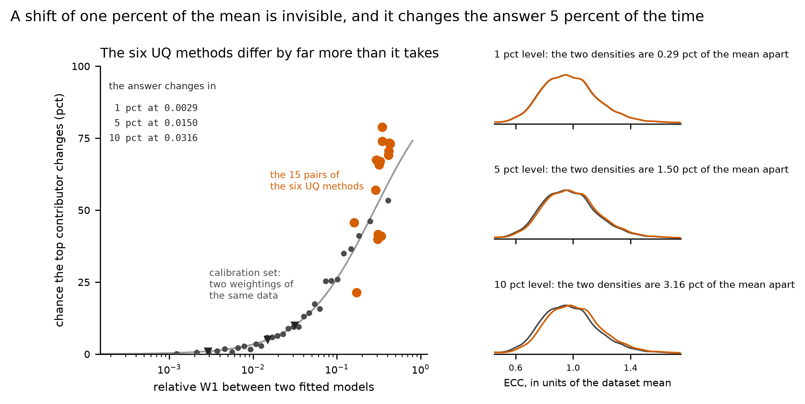
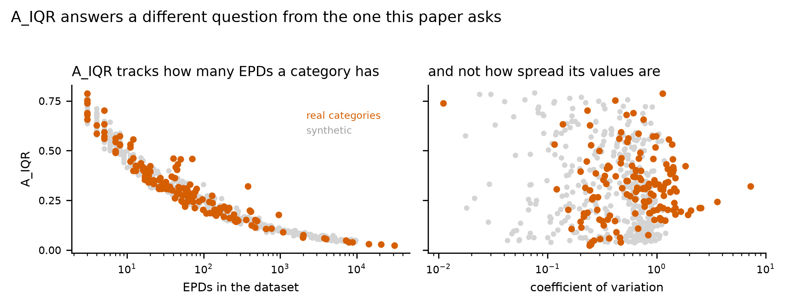
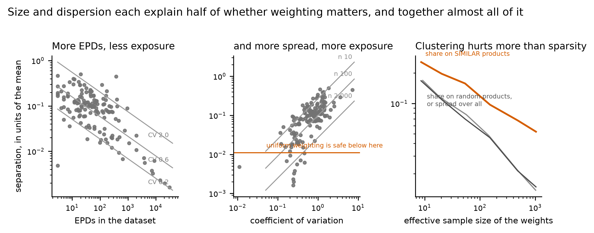

# HANDOFF stage-2d - The weighting measures and the flip threshold

US spelling throughout, as in every file this project writes.

**HOW TO READ THIS FILE. Its reader does NOT have this repository** -- no
CLAUDE.md, no other report, no table, no figure, no source. Every claim below is
therefore stated in full where it is made, and a trailing `decision N` or
`entry N` is a citation into the project's decision log or its manuscript
discrepancy log, never the substance of the sentence. Where a file has to be
opened, the instruction is addressed to the NEXT CLAUDE CODE SESSION and says so.
If a sentence here cannot be understood on its own, that is a defect in this
file.

# IF YOU READ ONE PAGE, READ THIS ONE

Everything below is the working record. **These eleven sentences are what Stage
2d contributes to the manuscript.** Each is a claim the paper can make, with the
number that supports it. Nothing else in this file needs to reach the paper.

**On the method comparison**

1. Choosing among the six UQ methods changes which material is named the largest
   contributor in **56 percent** of probabilistic LCAs; every pair of the six
   sits far past the distance at which the answer starts to change.
2. The probability that the answer changes crosses **1 percent at a relative W1
   of 0.0018, 5 percent at 0.011 and 10 percent at 0.025** -- so the study's
   goodness-of-fit scale can now be read as a consequence rather than as a
   ranking.

**On weighting, which is the stage's main contribution**

3. The distance between uniform and variable weighting is about **three quarters
   a shift of the mean** (median location share 0.725 on real data), so the
   practitioner question needs a weighted mean, not a distribution.
4. Whether weighting matters is predicted almost exactly by two numbers a
   practitioner already has: **separation is about 0.73 * CV * n^-0.43**, R2 =
   0.99 on both arms.
5. Uniform weighting is therefore safe only when the coefficient of variation is
   below about **0.015 * n^0.43** -- 0.046 at 10 EPDs, 0.120 at 100, 0.315 at
   1,000 -- and the median real category does not clear it.
6. **For 91 percent of real ECC categories, a plausible market-share allocation
   has at least a 5 percent chance of changing which material ranks first.**
   Uniform weighting is defensible only above roughly a thousand EPDs.
7. Every one of those numbers is a **lower bound**, because a flat Dirichlet
   understates the separation by **1.5 to 3.1 times** when share clusters on
   similar products, which is how real market share behaves.
8. This is the one place in the whole study where **dispersion matters as much as
   dataset size**; everywhere else size is the only mechanism.

**On method, which the paper owes as method rather than as findings**

9. A_IQR, the measure from the companion paper, turns out to be **a measure of
   dataset size** here (R2 0.94 against log n, 1.5 percent added by dispersion),
   so it is reported for consistency and is not the instrument for this question.
10. Comparing two UQ methods under independent random streams changes the answer
    **5.33 percent** of the time with no model difference at all; the estimates
    are converged and the argmax of a near-tie is not, so common random numbers
    are required rather than more draws.
11. The plausibility ceiling's inventory citation is withdrawn as unverifiable;
    the ceiling stands on the arithmetic that 100 kgCO2e per kg would require
    burning **27.3 kg of pure carbon per kilogram shipped**.

**What the paper must state as conditional, in the same paragraph as the
number, not in a footnote.** Every flip probability here assumes four materials
of equal material use intensity, which makes the ranking as fragile as it can be
made and therefore makes these numbers upper bounds on how often a modeling
choice changes a real building's answer.

---

---

## REVIEW SECTION -- FOR THE AUTHOR, AND TO BE DELETED BEFORE THIS FILE SHIPS

The three figures this stage produced, inline so they need no folder digging,
with what to check in each. **The handoff's real reader has no repository, so
these links are useless to them; this whole section comes out when the stage
closes.** Everything below section 0 stands on its own without them.

**A note on what changed after your first pass.** All three figures were
rebuilt to `FIGURE_STYLE.md`, which did not exist when you reviewed them:
titles now carry the finding, annotations were moved out of the data, the
saturated A_IQR panel was deleted, and the calibration figure shows the whole
distribution of method-to-method distances rather than one summary marker.

### 1. The deliverable: what a given W1 costs

What to check. The dark points are the observed flip rate in equal-count bins
and the grey curve is a **logistic regression**: it models a yes/no outcome as a
probability rising smoothly from zero to one with the logarithm of the distance,
and the three crossings are read off it. An **isotonic fit** would impose no
shape at all, assuming only that the probability never FALLS as two models
separate; it gives 0.0026, 0.0129 and 0.0271 for the same three levels, which is
close enough that the shape is not doing the work. It is in
`TABLE_FlipCrossings.csv` and is no longer drawn, because a second curve saying
the same thing is the clutter the style guide forbids.

**The orange rug along the top is every pair of the six UQ methods**, at your
request: the star alone binned away how common each distance is. The bar beneath
it is the median and the 5th to 95th percentile. The point of the figure is that
the entire distribution sits far to the right of every marked threshold.

The full-ordering panel has been deleted. Its Monte Carlo noise floor alone is
34 percent, so it is not a usable criterion, and a panel with no message is a
panel the style guide removes.

### 2. A_IQR against what it was supposed to measure

What to check. Left panel: A_IQR against dataset size is a tight monotone curve,
and the two arms lie on top of one another. Middle panel: the same A_IQR against
dispersion is a formless cloud. **That contrast is the whole finding** -- A_IQR
is a measure of how many EPDs a category has.

The third panel that was here has been deleted. You were right that it carried no
takeaway: the risk saturates near 1.0 for three quarters of categories, so the
panel showed a ceiling rather than a relationship. Figure 3 carries the
unsaturated version of the same question.

### 3. What actually decides whether weighting matters

What to check, and this is the one to spend time on.

Left and middle: the same data twice, against size and against dispersion, with
the fitted law drawn at three fixed values of the other variable. The points
should sit between the guide lines rather than scattering across them -- that is
what an R2 of 0.991 looks like. The red line in the middle panel is the 5 percent
flip threshold, so **everything above it is a category where uniform weighting is
not safe**, and you can see how few fall below.

Right panel answers the clustering question directly. `scatter` (share
concentrated on random products) lies on top of `flat` at every effective sample
size, so concentration alone behaves exactly like having fewer points. `blocks`
(share concentrated on products with adjacent coefficients) sits clearly above
and the gap widens. **If those two lines had coincided, the flat Dirichlet would
have been vindicated; they do not.**

---

## 0. STATUS

**What the stage was asked for.** Decompose the distance between the
uniform-weighted and the variable-weighted version of a dataset into a location
part and a shape part; define and verify a named relative measure; build the
per-dataset statement "assuming uniform weights has an X percent chance of
changing which material ranks first", using A_IQR from the author's own
published paper as the instrument; and calibrate that X against the downstream
decision, giving the relative W1 at which the flip probability crosses 1, 5 and
10 percent. Plus two housekeeping items.

**All of it was delivered. Several things did not come out as expected, and each
is stated plainly below rather than smoothed into the story.** Two further
results came out of the author's review of the first draft and are the most
useful things here for a practitioner: a closed form for when weighting matters,
and a measured limit on the weight model this whole study rests on.

### The six results, in the order they matter

**1. THE STUDY'S OWN pLCA CANNOT ANSWER "DID THE ANSWER CHANGE".** Its Monte
Carlo loop gives every uncertainty-quantification method its own stretch of one
random stream, so any two methods are compared under two different sets of random
numbers. Running the SAME method twice, with the SAME fitted models and two
independent streams, over 400 probabilistic LCAs: **the identity of the
top-contributing material changes in 5.33 percent of cases and the full rank
ordering in 34.2 percent, with no model difference whatever.** Two of the three
levels the stage was asked to resolve sit below that floor. The calibration
therefore runs on common random numbers -- one uniform variate per material per
iteration pushed through every method's inverse CDF -- where two identical models
produce identical draws and the floor is exactly zero. **No pLCA result was
written or replaced.** Decision 91.

**2. THE CURVE, which is the deliverable.** The probability that the
top-contributing material changes crosses **1 percent at a relative W1 of
0.0018** (95 percent interval 0.0013 to 0.0023), **5 percent at 0.011** (0.0091
to 0.0126) and **10 percent at 0.025** (0.0217 to 0.0277). An isotonic fit, which
assumes only that the probability does not fall as two models separate, gives
0.0026, 0.0129 and 0.0271. **Quote two significant figures and no more**: an
independent run of the same calculation on a different random stream gave
0.0015, 0.0099 and 0.0233, every one inside the other run's interval and every
one differing in the third figure. Decision 95.

**What that says about the six methods under test is blunt: they are all far
past every one of those thresholds.** The smallest relative W1 between any two of
the six, over 37,500 comparisons, is 0.00022, but the average is 0.30 and the
average flip rate is **56.1 percent**. Choosing between these six methods changes
which material is named the largest contributor more often than not.

**3. THE UNIFORM-TO-VARIABLE DISTANCE IS MOSTLY A SHIFT OF THE MEAN**, which is
the good outcome the author named in advance. Median location share **0.725 on
the 147 real datasets and 0.804 on the 10,000 synthetic ones**, above half on 69
and 72 percent of datasets respectively. It is highest where datasets are
smallest -- 0.96 at 3 to 9 EPDs -- because with that few values there is barely
any shape for reweighting to change. **So the practitioner rule collapses to a
weighted mean**: compute one, see how far it moves, compare against the
thresholds above. No distributional machinery. Decision 92.

**4. A_IQR DOES NOT MEASURE WHAT IT WAS ADOPTED TO MEASURE.** The stage was told
to use A_IQR -- the area between the pointwise 75th and 25th percentile density
curves over an ensemble of Dirichlet-weighted fits, from Torres, Lupton, Marsh,
Srubar and Allen (2026) -- on the expectation that it would track dispersion,
because an earlier probe found dispersion rather than dataset size drives whether
weighting matters. **It tracks dataset size instead**: over the 147 real
categories its rank correlation with the number of EPDs is -0.946 and with the
coefficient of variation +0.042, and across the arm it moves by a factor of 12
from the smallest categories to the largest.

**The mechanism, stated precisely because a first draft of this file got it
wrong.** It is NOT that A_IQR is invariant to rescaling the data. It is, exactly
-- but so is the mean-relative separation that this stage uses instead, so
invariance cannot be what separates them. What A_IQR measures is the uncertainty
of the density curve relative to the curve's OWN height, which is set by how many
points the weight noise is averaged over and by almost nothing else: hold a
lognormal at 60 points and raise its coefficient of variation from 0.22 to 5.83,
a factor of 27, and A_IQR moves from 0.296 to 0.307 while A_IQR times the square
root of the sample size stays between 2.21 and 2.38. The separation over the same
sweep runs 0.030 to 0.664, and **the separation divided by the coefficient of
variation is nearly constant at 0.114 to 0.138** -- it is proportional to
dispersion by construction. Decision 94.

A_IQR is still computed and reported, because it is the right answer to the
published paper's own question -- how confident the uncertainty MODEL is -- and
using it lets this paper cite rather than re-derive. **The practitioner statement
is made on a different quantity**: the distance between the uniform-weighted fit
and the fit under a drawn market share, in units of the dataset's own mean, which
is the axis the flip probability is calibrated on. On that quantity the
dispersion result the stage was sent to confirm does hold, at **+0.731 against
size at -0.545** -- but it is a both-matter result rather than the reversal an
earlier draft of this file claimed. Section 4.5 has the correction and the
within-band numbers, which are the strong form of it.

**5. WHAT DECIDES WHETHER WEIGHTING MATTERS IS BOTH SIZE AND DISPERSION, and
together they give a closed form.** This is the one place in the project where
dispersion is a first-order quantity. Regressing the log of the separation on
log dataset size and log coefficient of variation: size alone explains 48 percent
of the variance, dispersion alone 50 percent, and **both together 99.1 percent**,
with each adding about half on top of the other. They are nearly orthogonal. The
fit is

    log(separation) = -0.32 - 0.434 * log(n) + 1.036 * log(CV)

and the same exponents come out of the synthetic arm, -0.427 and 0.977, so the
practitioner form is **separation is about 0.73 * CV * n^-0.43**.

**Set that against the calibrated 5 percent threshold and the rule needs no
distribution at all**: uniform weighting is safe only when the coefficient of
variation is below about **0.015 * n^0.43** -- 0.046 at ten EPDs, 0.120 at a
hundred, 0.315 at a thousand. The median real category has a coefficient of
variation of 0.63 at 47 EPDs, so almost none of them clears it, which is the same
conclusion the per-dataset probabilities reach by a different route.

**6. A FLAT DIRICHLET UNDERSTATES THE WEIGHTING RISK, AND THE NUMBERS HERE ARE
THEREFORE A LOWER BOUND.** The author asked whether uniformly exploring the
simplex is the right model, given that real market share probably arrives in
clusters, and suggested that a cluster is nearly a dataset with fewer points, so
the effective sample size would already capture it. **Half of that is right, and
the half that is not is the important half.** Comparing three weight schemes at
MATCHED effective sample size: concentrating share on randomly chosen products
gives separations 0.90 to 0.99 times a flat draw, which is no difference --
so the effective sample size does capture concentration. Concentrating the same
share on products with ADJACENT coefficients, which is what clustering means in
practice, gives **1.5 to 3.1 times** the separation at the same effective sample
size.

What the effective sample size misses is coherence. A contiguous block shifts the
whole distribution one way, which lands in the location term that already carries
three-quarters of the uniform-to-variable distance; random concentration moves
mass in directions that partly cancel. **The direction of the error is
conservative for this paper**, whose finding is that uniform weighting is rarely
safe.

### The two housekeeping items

**The ICE figure is unsourced and is withdrawn from the paper.** The physical
plausibility ceiling of 100 kgCO2e per kg, which removes impossible records
before cleaning, was justified partly by a highest building-product coefficient
of about 13 kgCO2e/kg for primary aluminium attributed to the Inventory of Carbon
and Energy database version 3.0. That figure came from an earlier session's own
knowledge; no copy of that database and no other file in the repository contains
it, so the number, the edition and the page are all unverifiable. **Do not cite
it.** The ceiling is unchanged and needs no database: burning pure carbon yields
44.009 / 12.011 = **3.664 kg CO2 per kg of carbon**, so 100 kgCO2e per kilogram
of delivered product would require burning **27.3 kg of pure carbon for every
kilogram shipped**, and even a ceiling of 25 would require 6.8 kg. That is
arithmetic a reviewer checks in one line. Discrepancy entry 81.

**The handoff specification now says who reads a handoff.** It records that the
reader has no repository, that decision and entry numbers are trailing citations
rather than substance, that numbers must appear as text, and that an instruction
to open a file is addressed to the next Claude Code session.

---

## 1. Stage and branch

| | |
|---|---|
| **Stage** | 2d, the weighting measures and the flip threshold |
| **Branch** | `stage-2d-threshold` |
| **Branched from** | `638ffd9`, on branch `stage-2c-target`. Working tree clean at the branch point |

---

## 2. What was asked

Two housekeeping items: verify or withdraw the inventory figure behind the
plausibility ceiling, and write into the project brief that a handoff's reader
has no checkout.

Then: decompose the uniform-to-variable Wasserstein distance into a location
component and a shape residual and report the ratio; define a named relative
measure, verify its invariance by rerunning un-normalized, and compare it with a
robust-scale version; and calibrate the flip probability against relative W1 by
logistic or isotonic regression, reporting the crossings at 1, 5 and 10 percent
with confidence intervals. The per-dataset weighting risk was to use A_IQR as its
instrument, with two construction details to be read off the published paper
rather than reconstructed.

---

## 3. What was done

**New code, both tested.** A module holding the location/shape split, the named
relative measure with its three candidate denominators, and A_IQR with the
ensemble it comes from. A second module holding the common-random-numbers pLCA,
the model-to-model distances, a logistic and an isotonic fit, and a bootstrap
that resamples pLCA groups. Twenty-eight new tests, all passing; the whole suite
is 369 tests and all pass, including the eight regression fixtures, which is the
check that nothing existing moved.

**New notebook sections.** Notebook 1 gained the decomposition on both arms, the
relative measure with its un-normalized verification, A_IQR and the per-dataset
weighting risk at 1,000 Dirichlet draws, a post-stratified aggregate, and a
three-panel figure. Notebook 3 gained the noise floor, the six method pairs under
common random numbers, the calibration set, the crossings, a provenance check,
post-stratified flip rates and the calibration figure. **Notebook 3's new
material writes no pLCA result and replaces nothing above it.**

**Three audit scripts** measure what the settings are: how many grid points and
Dirichlet draws A_IQR needs, the full calibration with its diagnostics, and the
weighting measures end to end. The last of these was stopped part-way through its
final run, when it was competing for processor time with the notebook that
produces the paper's own tables; it writes only to the audit directory, nothing
reported depends on it, and re-running it is a single command. The next Claude
Code session will find it at `audits/weighting_measure.py`.

### Two details read off the published paper, as required

Both were open and both are now settled, from the copy of Torres et al. (2026),
Resources, Conservation and Recycling volume 234, article 109022, held locally.

**The area is NOT normalized.** The paper defines A_IQR as the area of the
interquartile range across all viable probability density functions, "calculated
by subtracting the 25th percentile density curve from the 75th percentile density
curve at each point along the x-axis", and reports bare areas of 0.40, 0.22 and
0.12 for its three scenarios with no divisor. None is needed: the integral of a
difference of densities over x is already dimensionless.

**The ensemble is 1,000 draws.** Stated twice -- "Fig. 3a shows 1000 iterations
illustrating the range of viable solutions and the average PDF", and for the
131-EPD steel proof of concept, "these constraints are incorporated to generate
1000 viable PDFs". This study uses 1,000 for consistency, so that the two papers
report the same measure and not merely the same name.

**One divergence from that paper to state in the text.** Its bandwidth rule is
Silverman's with the interquartile range divided by **1.35**; this study divides
by **1.34** and guards the scale estimate below 20 effective observations. The
difference is immaterial numerically but the paper should not claim the two
computations are identical.

### Two defects the tests caught, both of which would have been silent

**The isotonic regression dropped a point on every merge.** The pool-adjacent-
violators step was written so that a list element was removed before the index of
its destination was computed, which put the merge on the wrong block. The fitted
curve came back shorter than its input and did not preserve the mean. It now
matches a reference implementation to 1.1e-16 over 500 points.

**A_IQR was built from a bare kernel sum rather than the study's own fitted
density**, which is a kernel estimate explicitly truncated at zero and
renormalized, because an embodied carbon coefficient of zero or less is not
admissible. On small datasets with a concentrated weight draw the bandwidth is
wide enough that up to 10 percent of the mass fell below zero and off the grid,
so A_IQR would have been partly a measure of how much mass each draw spilled.

---

## 4. What the measurements say

### 4.1 The Monte Carlo noise floor, and why it decided the design

Same fitted models, two independent random streams, 400 probabilistic LCAs by six
methods, at 10,000 Monte Carlo draws per material:

| method | top contributor changes | full ordering changes |
|---|---|---|
| all six pooled | **5.33 pct** | **34.2 pct** |
| Normal, Variable | 1.00 pct | 6.25 pct |
| Lognormal, Variable | 2.25 pct | 8.25 pct |
| KDE, Variable | 2.75 pct | 11.50 pct |
| Normal, Uniform | 3.75 pct | 37.75 pct |
| KDE, Uniform | 7.00 pct | 68.50 pct |
| Lognormal, Uniform | **15.25 pct** | 73.00 pct |

**Why it is this large, and it is a property of the study's own construction.**
Every dataset is normalized to a mean of 1.0 and every material use intensity is
1.0, so the four materials in a probabilistic LCA are nearly exchangeable: the
frequency with which each is the largest contributor sits near 0.25 for all four,
and 15 percent of cells have a gap between the top two below two Monte Carlo
standard errors.

**WHAT IS AND IS NOT CONVERGED, because "10,000 draws should be enough" is a
reasonable objection and it is half right.** The estimates ARE converged: one
rank-1 frequency has a Monte Carlo standard error of 0.0043 at 10,000 draws.
What is not converged, and cannot be at any sample size, is WHICH of two nearly
equal materials is larger, because the argmax is a discontinuous function of
continuous estimates. **The flips are confined entirely to the near-ties.** At
10,000 draws, groups whose top-two gap exceeds four standard errors flipped in
**0 of 238** cases; groups inside two standard errors flipped about half the
time. So this is not five percent of error smeared across every comparison. It is
near-certainty on four fifths of the groups and a coin toss on the fifth that are
genuinely tied.

**More draws help at square-root cost and never reach zero.** Over 300 groups the
floor is **16.3 percent at 1,000 draws, 6.7 percent at 10,000 and 2.7 percent at
100,000** -- a factor of 2.5 for ten times the compute, against the 3.16 a
square-root law predicts. Half a percent would cost about a hundred times the
current run and still not be exact. Common random numbers reach exactly zero for
nothing, because they remove the COMPARISON noise and not the estimation noise.
That, and not "10,000 is too few", is the argument for them.

Under common random numbers the floor is zero by construction, and the
calibration set carries a control that verifies it: at zero reweighting, across
2,500 groups, the separation is exactly zero and no flip occurs.

### 4.2 The decomposition: mostly location

W1 between two distributions is at least the absolute difference of their means.
Here both are the same values under two weightings, so that bound is the
difference between the weighted and the unweighted mean. Call it the LOCATION
component; the rest is SHAPE.

| arm | median location share | mean | pooled | above half |
|---|---|---|---|---|
| empirical, 147 datasets | **0.725** | 0.673 | 0.728 | 68.7 pct |
| synthetic, 10,000 datasets | **0.804** | 0.695 | 0.799 | 72.4 pct |

**By dataset size, on the real data**, the median location share is 0.96 at 3 to
9 EPDs, 0.65 at 10 to 99, 0.74 at 100 to 999 and 0.54 at 1,000 and above. The
inequality holds throughout: the worst residual across all 10,147 datasets is
-7.0e-14, which is floating point in the quadrature and not a result.

**What it means for the paper.** A practitioner asking whether market shares
matter for their category needs a weighted mean, not a distribution. The residual
is real but secondary, and it grows with dataset size, which is the opposite of
where the weighting question is most urgent.

### 4.3 The relative measure was already there, unnamed

Every dataset in this study is divided by its own unweighted mean before anything
else happens, so **every W1 the study has ever reported is already a W1 divided
by a mean**. Naming it changes no number.

**Verified rather than asserted.** The same quantity was recomputed on the raw
empirical values, in their own kilograms of CO2 equivalent per declared unit,
with dataset means spanning **0.0685 to 910.7 -- a factor of 13,000**. The
relative measure agrees with the normalized run to **6e-15**. The absolute
distance scales by exactly the dataset's own mean, which is the control that the
check is checking something.

**The two robust denominators were computed and are not adopted.** Dividing by
the interquartile range or by the standard deviation separates the flips
essentially as well: the area under the receiver operating curve, on the
top-contributor outcome, is 0.8018 for the mean, 0.8004 for the interquartile
range and 0.8056 for the standard deviation. Half a percent is not a reason to
change the denominator the study already uses, and the mean is the only one of
the three that a practitioner computes without ambiguity. The standard deviation
is better on the full-ordering outcome, 0.794 against 0.761, which is noted and
not acted on because the full ordering is not a criterion this study reports.

**All three are computed with UNIFORM weights, and that is the decision that
matters here.** A denominator taken under the variable weights would move when
the weights move, which is the quantity being measured; and a practitioner
holding a set of environmental product declarations cannot compute a
market-weighted mean without already knowing the market shares, which is exactly
what they lack.

### 4.4 THE CURVE

Fitted on 2,500 probabilistic LCAs by nine reweighting levels, 20,000
observations, under common random numbers. Logistic regression on the logarithm
of the distance, because the separations span four orders of magnitude and all
three levels sit in the lower part of that range. The interval is a percentile
bootstrap that **resamples pLCA groups rather than rows**, because the
comparisons inside a group share four datasets and one set of random variates and
are not independent observations.

| flip probability | relative W1 | 95 percent interval | isotonic fit |
|---|---|---|---|
| 1 percent | **0.0018** | 0.0013 to 0.0023 | 0.0026 |
| 5 percent | **0.011** | 0.0091 to 0.0126 | 0.0129 |
| 10 percent | **0.025** | 0.0217 to 0.0277 | 0.0271 |

**Two significant figures, deliberately.** The interval is about 30 percent of
the estimate wide, and an independent run on a different random stream gave
0.0015, 0.0099 and 0.0233 -- all inside the intervals above, all differing in the
third figure. Five figures would be false precision and would make the number
drift on every rerun.

The levels being read are inside the data rather than extrapolated to: the
observed flip rate in the lowest bins runs 0.005 at a separation of 0.001, 0.015
at 0.0024, 0.021 at 0.0039, 0.034 at 0.0057 and 0.051 at 0.0093.

**The six UQ methods could not supply this curve, and that is itself a result.**
Over 37,500 comparisons the smallest relative W1 between any two of the six is
0.00022, but the flip rate in the lowest 2 percent of separations is already 14.1
percent and the average over all pairs is **56.1 percent** at an average
separation of 0.30. Every level being asked about lies below the observed data;
an isotonic fit on those pairs alone returns the same crossing for all three
levels, because its first block is already above the top of them. The calibration
set therefore adds pairs at controlled separations running continuously to zero:
the same kernel estimate under uniform weights, and under weights moved a
fraction of the way toward a Dirichlet draw.

**The device is checked rather than assumed.** If the curve describes the
DISTANCE rather than how the distance arose, then the six real method pairs --
which are different distribution families -- should fall on a curve fitted from
reweighting pairs. They do over most of the range:

| separation band | calibration set | the six method pairs | pairs in band |
|---|---|---|---|
| 0.012 to 0.021 | 0.064 | 0.028 | 36 |
| 0.021 to 0.036 | 0.109 | 0.063 | 128 |
| 0.036 to 0.064 | 0.176 | 0.180 | 894 |
| 0.064 to 0.124 | 0.281 | 0.288 | 4,595 |
| 0.124 to 0.716 | **0.436** | **0.606** | 29,943 |

The two agree closely in the two bands that hold most of the method pairs. Below
them the method pairs are too few to say anything -- 36 and 128 comparisons, and
fewer than 20 below that.

**They diverge in the top band.** A cross-family difference of a given size is
more consequential than a reweighting difference of the same size, presumably
because the families differ in the tails that decide a ranking. **So the curve
understates the flip probability for large cross-family differences and should be
read as a lower bound there.**

**THE CAVEAT THAT MUST TRAVEL WITH EVERY ONE OF THESE NUMBERS.** Every material
in this study is normalized to a mean of 1.0 and carries a material use intensity
of 1.0, so the four contributions in a probabilistic LCA are nearly exchangeable
and their ranking is as fragile as it can be made. A real building, where
materials differ by orders of magnitude in contribution, is much harder to flip.
**These crossings are an upper bound on how often a modeling choice changes an
answer.** That is the conservative direction for a practitioner rule, but it must
not be quoted as a statement about buildings.

**The full rank ordering is not a usable criterion in this construction**, and is
reported only in order to say so. Its crossings are at 0.00002, 0.00023 and
0.00065, and its Monte Carlo noise floor under independent streams is 34.2
percent.

**Post-stratified**, because the synthetic corpus allocates datasets equally
across four size bands while the real categories do not: the top-contributor flip
rate over the calibration set is **0.1434 at equal allocation and 0.1147
reweighted** to the empirical size mix. Neither is the true one; both are
reported, as every headline in this study is. The unit of a flip is a group of
four materials and therefore has no single size band, so the convention is the
smallest material in the group, on the grounds that the small dataset is where
fitted models differ most. It is stated rather than hidden.

### 4.5 A_IQR, and why it is not the practitioner's number

A_IQR is the area between the pointwise 75th and 25th percentile density curves
over an ensemble of 1,000 Dirichlet-weighted kernel fits. It was adopted because
it is the measure the author's own published paper defines, and because an
earlier probe had found that dispersion rather than dataset size drives whether
weighting matters.

**It does not behave that way here.** Spearman correlations, over the 147 real
categories. Two versions of the risk are shown, and the difference between them
matters:

| against | A_IQR | risk as a probability | risk as a distance |
|---|---|---|---|
| coefficient of variation | **+0.042** | +0.803 | **+0.731** |
| log of the number of EPDs | **-0.946** | -0.106 | **-0.545** |

**Read the third column, not the second.** The probability that a possible
weighting crosses the 5 percent flip threshold is SATURATED: 46 percent of real
categories sit at exactly 1.000 and 74 percent above 0.99, because the calibrated
threshold is far smaller than a typical reweighting. A Spearman correlation on a
variable that is three-quarters tied is carried by the handful of untied points
and should not be quoted as the headline. The median separation over draws, in
units of the dataset mean, has no ceiling and is the honest version.

On the synthetic sample of 400, A_IQR sits at -0.277 against dispersion and
-0.993 against log size.

**THE MECHANISM, AND A FIRST DRAFT OF THIS FILE EXPLAINED IT WRONGLY.** That
draft said A_IQR cannot see dispersion because it is exactly invariant when every
value is rescaled. It is invariant -- verified to ten decimal places over seven
orders of magnitude -- but **so is the mean-relative separation**, so invariance
cannot be what distinguishes them. The claim is withdrawn.

What actually separates them is WHAT EACH DIVIDES BY. A_IQR is the uncertainty of
the density curve measured against that curve's own height and width, so the
data's spread cancels out of both factors and what survives is the sampling noise
in the weights, which is a question of how many points there are. The separation
is a distance along the x-axis divided by the mean alone, so the ratio of spread
to mean survives -- and that ratio IS the coefficient of variation.

Both halves are measurable and both check out. Holding a lognormal at 60 points
and raising its coefficient of variation from 0.22 to 5.83: A_IQR goes 0.296,
0.285, 0.299, 0.307 while A_IQR times the square root of the sample size stays
between 2.21 and 2.38; the separation goes 0.030, 0.099, 0.316, 0.664, and
**divided by the coefficient of variation it is nearly constant at 0.138, 0.119,
0.115, 0.114**.

**A_IQR is not wholly indifferent to dispersion, and the within-band numbers show
where it is not.** Its rank correlation with the coefficient of variation inside
each size band of the real arm is -0.008 at 3 to 9 EPDs, +0.128 at 10 to 99,
+0.644 at 100 to 999 and +0.405 above 1,000 -- monotone but small in magnitude. A
five- to tenfold change in the coefficient of variation within a band moves
A_IQR by a factor of 1.07 to 1.87, against a factor of 12 across the size range.
So the accurate sentence is that A_IQR is DOMINATED by size, not that it is blind
to spread.

**THE PROBE'S FINDING SURVIVES, BUT IT IS NOT A REVERSAL AND SHOULD NOT BE
WRITTEN AS ONE.** The earlier probe put dispersion at +0.693 and size at -0.569;
the honest measure here gives **+0.731 and -0.545**, which reproduces the probe
almost exactly. **Both drive the risk.** Dispersion is marginally the stronger of
the two, and that alone is remarkable in a study where dispersion predicts
nothing else -- but it does not displace size, and a sentence claiming it does
would be overreaching.

**Where dispersion genuinely dominates is WITHIN a size band**, and there it is
close to deterministic. Spearman of the separation against the coefficient of
variation, computed inside each band of the real arm: **+0.940** at 3 to 9 EPDs
(20 datasets), **+0.888** at 10 to 99 (78), **+0.955** at 100 to 999 (38) and
**+0.833** above 1,000 (8). The mirror image also holds: among the 38 categories
that are NOT saturated, size explains almost everything (-0.726) and dispersion
almost nothing (+0.040).

So the paragraph the paper owes is this. **Every question in this study about
which METHOD fits best is driven by the number of EPDs and by nothing else.
Whether WEIGHTING matters is driven by BOTH -- by size across categories and by
dispersion within a size band.** That is the one place in the project where
dispersion is a first-order quantity, and a reader who has absorbed "it is all
about n" will otherwise carry that assumption into a question where it is only
half the answer.

### What the risk actually says, and it is not reassuring

The per-dataset probability that a possible market-share allocation moves the
fitted density past the 5 percent flip threshold, on the real categories:
**0.909 at equal allocation across size bands and 0.928 reweighted** to the mix
of sizes the real categories actually have. By size band the means run 0.945 at
3 to 9 EPDs, 0.992 at 10 to 99, 0.919 at 100 to 999, and **0.310 above 1,000**.

**So uniform weighting is not safe for most real ECC categories.** For all but
the largest, nearly every allocation the study considers possible is far enough
from uniform to carry at least a 5 percent chance of changing which material is
named the largest contributor. Only above about a thousand EPDs does the
assumption become defensible, and that is a handful of concrete strength classes
and asphalt.

The reason the probability is so high is worth stating so it is not mistaken for
an error: the calibrated 5 percent threshold is a relative distance of
0.011, while the typical distance between a uniform-weighted fit and a
Dirichlet-weighted one is an order of magnitude larger. The threshold is small
because the study's four materials are near-exchangeable, and the separations are
large because a flat Dirichlet over few points is a violent reweighting.

**A_IQR is still reported**, because it is the right answer to the published
paper's own question -- how confident the uncertainty model is -- and because
reporting it lets this paper cite rather than re-derive. Mean A_IQR is 0.318 at
equal allocation and 0.324 reweighted on the real categories; by size band, 0.615
at 3 to 9 EPDs falling to 0.059 above 1,000. It should be presented as a property
of dataset size, which is what it measures.

---

## 5. What is still open

### Owned by a later stage

| Item | Owner |
|---|---|
| **Install common random numbers in the STUDY's pLCA.** Stage 2d measured what their absence costs -- 5.33 percent of top-contributor comparisons and 34.2 percent of orderings flip with no model difference -- and left a tested implementation. Every downstream number moves when it is installed | 2e |
| Dependent sampling; materials per pLCA swept over 2 to 12; resampled groupings; bootstrap intervals on every headline percentage | 2e |
| **Run the pLCA against the TRUE parent distributions**, which Stage 2c called the most valuable single experiment available. It converts every score from "how close is the fitted CDF" to "how wrong is the answer" | 2e, then 2g |
| Shapiro-Wilk versus Shapiro-Francia; the full reduction of the characteristic set to three to five survivors | 2f |
| The `(1-capecc)` divisor; magnitude-based companion metrics; sensitivity of the headline rank-1 frequency | 2g |
| The profile-likelihood guard sweep, reporting the fitted-model spread ratio at every value; the Dirichlet concentration sweep; multiple weight realizations; the deduplicated variant | 2h |
| **A smoke run reached a commit in this stage.** It was caught and restored within the session and cost nothing, but the rule against it is a sentence in a document rather than a check. The fix is for the notebook to refuse to write its main table when the smoke environment variable is set, or for a test to assert the group count in the run metadata | 3 |
| Figure rebuilds and the figure manifest; one results table is 96 MB | 3 |

### Text the manuscript owes, from this stage

| | |
|---|---|
| The inventory citation | Withdrawn. State the plausibility ceiling with the stoichiometric justification and no database citation. If corroboration is wanted, someone must open the Inventory of Carbon and Energy version 3.0 and record an edition and a page |
| The relative measure | Say once, explicitly, that every reported distance is relative to the dataset's own unweighted mean. It moves no number |
| The decomposition | Report that the uniform-to-variable distance is roughly three quarters a shift of the mean, and give the practitioner rule in those terms |
| A_IQR | Cite the published paper for it, state that it is computed with no normalization over 1,000 draws, and say plainly that in this study it is a property of dataset size. Also state the bandwidth divergence from that paper, 1.34 against 1.35 |
| The curve | New result and new figure. Report the crossings with their intervals, and report the caveat about exchangeable materials in the same paragraph, not in a footnote |
| The noise floor | Say which comparisons in the study are paired and which are not. Any difference between two methods' downstream results currently carries a 5.33 percent floor |

### Known and accepted

The calibration curve understates the flip probability for large cross-family
separations, as section 4.4 shows and states. The flip levels are an upper bound
because the study's four materials are near-exchangeable. The synthetic arm of
the A_IQR table is a stratified sample of 400 rather than the whole corpus,
because 1,000 Dirichlet draws per dataset costs about a second and 10,000
datasets would be hours; the sample size is reported beside every number taken
from it.

---

## 6. Numbers that moved

**No previously published number moved.** The full test suite, including the
eight regression fixtures that pin the empirical metrics, the synthetic metrics
and all six goodness-of-fit scores, passes unchanged. Everything this stage
produced is new.

The one file that changed and changed back is the main pLCA results table, which
a smoke run overwrote and which was restored from the previous commit and
verified at 60,001 lines. See the open item above.

---

## 7. Inputs and outputs

**Read.** The frozen raw empirical extract and its record metadata; the synthetic
corpus; the existing pLCA results table, for the gap analysis only; and the
published KL2 paper, for the two A_IQR construction details.

**Written.** Two source modules and their two test files; three audit scripts;
new sections in notebooks 1 and 3; thirteen new result tables; two new figures, one
showing what drives the weighting risk and one showing the calibration curve;
five new decisions in the project brief's decision log, numbered 91 through 95,
and its handoff specification; manuscript discrepancy entries 81 to 87; and this
file.

**Not touched.** The generator, the synthetic corpus, the empirical extract, the
fitting methods, the scoring criterion, and the manuscript.

---

## 8. Next stage

**Stage 2e**, the pLCA construction, and it should start with common random
numbers rather than treating them as one item among several. This stage measured
what their absence costs and the number is large: 5.33 percent of top-contributor
comparisons and 34.2 percent of rank orderings change with no model difference at
all. Every comparison the study currently makes between two methods' downstream
results carries that floor. A tested implementation is already in the repository
and the next Claude Code session should read `src/flip.py` before writing a new
one.

**The second thing 2e should do is the experiment Stage 2c identified and nobody
has run**: the probabilistic LCA against the TRUE parent distributions, on the
same common random numbers, reporting how far each method's answer sits from the
truth rather than how far its fitted curve sits from a target. It may show that
the differences do not matter, which would be the cleanest result this paper
could report.

**One thing 2e should NOT do** is re-derive the flip threshold. It is calibrated,
it is recorded as a constant in the code with its provenance, and notebook 3
prints the recomputed crossings beside the stored ones on every run so that drift
is visible.
