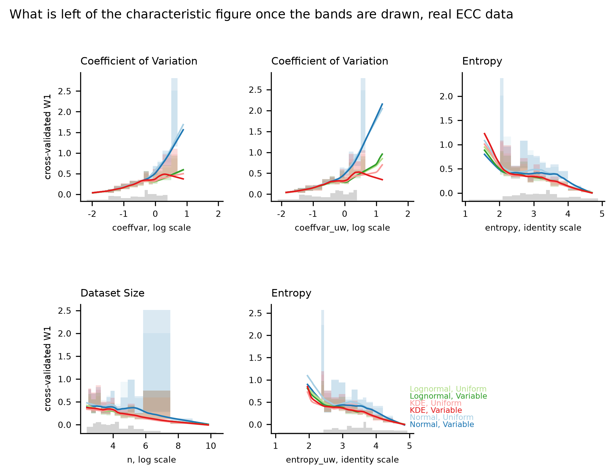
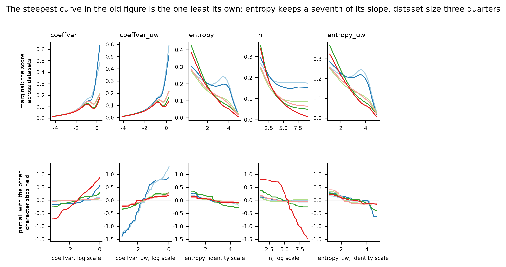

# HANDOFF stage-2f - The metric reduction

US spelling throughout, as in every file this project writes.

**HOW TO READ THIS FILE. Its reader does NOT have this repository** -- no
CLAUDE.md, no other report, no table, no figure, no source. Every claim below
is therefore stated in full where it is made, and a trailing `decision N` or
`entry N` is a citation into the project's decision log or its manuscript
discrepancy log, never the substance of the sentence. Where a file has to be
opened, the instruction is addressed to the NEXT CLAUDE CODE SESSION and says
so. The two figures are embedded and their captions carry the numbers, so a
reader whose copy does not render the images loses nothing.

# IF YOU READ ONE PAGE, READ THIS ONE

**Stage 2f asks which of the statistical characteristics of an ECC dataset
actually carry information, and cuts the figure that shows them from 21 panels
to five.** Each claim carries the number behind it and a plain-language **so
what** for a reader who builds buildings rather than statistical models.

## The answer is two quantities, not twenty-one

1. **The 21-panel figure is worth five panels, and the five are two
   quantities: how SPREAD the data are and HOW MANY EPDs there are.** Ranked
   by how much each characteristic independently helps predict the results --
   pooled over both arms, all six UQ methods, two kinds of target and two
   kinds of model, which is 96 models in all -- the survivors are the
   coefficient of variation under both weightings, entropy under both, and
   dataset size. Everything else, including every measure of multimodality,
   every measure of skewness and both normality statistics, ranks below them
   and is in the top five of at most 15 percent of models.

   **So what:** of the ten things this study measures about a set of
   environmental product declarations, two matter. How widely the declared
   values scatter, and how many declarations you have. The rest can be left
   out of the paper's main figure without losing anything a reader could act
   on.
2. **Those five collapse to two because entropy IS dataset size.** Entropy
   here is computed over a 256-bin histogram, so it counts how many bins the
   data fill: a spline fit on the logarithm of the EPD count alone explains
   **92.4 percent** of it on the synthetic corpus and **83.9 percent** on the
   real categories, at a rank correlation of **+0.88 and +0.90**. And the
   uniform-weighted coefficient of variation is the variable-weighted one, at
   a correlation of **0.979**. Spread and count are themselves nearly
   independent of each other, correlating **+0.11** on the real arm and
   **+0.30** on the corpus, which is why neither looked like the whole answer
   on its own.

   **So what:** entropy sounds like it measures something else and does not.
   It is a slower way of counting your declarations.
3. **The correlation structure says the same thing before any model is
   fitted.** The effective dimension of all 23 candidate characteristics --
   which would be 23 if they were independent of one another and 1 if they
   were all the same quantity -- is **4.33 on the real categories and 5.43 on
   the corpus**. Seven pairs on the real arm correlate above 0.9.

   **So what:** twenty-one panels were always showing about four or five
   independent things. A reader looking at them had no way to know that.

## The two targets disagree, and the old figure weighted the wrong things

4. **Dataset size matters MORE for the error in the answer than for the
   goodness of fit, and the shape statistics matter less.** The reduction was
   run twice: once against how far a fitted curve sits from its target, and
   once against how wrong the probabilistic LCA's answer is, which is possible
   because the previous stage ran the whole study against the true
   distributions the synthetic data was drawn from. Dataset size moves from
   rank **6.90 on the fit to 4.42 on the answer**, the largest such shift of
   any characteristic; the weight of statistical outliers moves the other way,
   **13.25 to 17.29**, and the normal-fit statistic **9.88 to 13.85**.

   **So what:** the figure this stage replaces was ranking characteristics by
   how well a curve fits, which is not the same as how wrong the final answer
   is. Judged on the answer, the number of declarations you have matters more
   than any measure of the shape of their distribution.
5. **One output is almost unpredictable from the data, and it is the ranking
   one.** The models reach an out-of-sample R2 of **0.62 to 0.66** for the
   error in a material's estimated contribution, 0.52 to 0.54 for its 95th
   percentile and 0.54 for its share of total variance -- and **0.085 to
   0.096** for the error in its chance of being the largest contributor.

   **So what:** you can tell from a category's own statistics roughly how
   wrong your estimate of its carbon will be. You cannot tell how wrong your
   statement about which material ranks first will be, because that depends on
   the other materials in the building and not on this one. It is a third
   independent reason to lead with magnitudes rather than rankings.

## Modality, open since Stage 2a-2, answered

6. **The three modality measures do not agree, the only one that predicts
   anything is Silverman's critical bandwidth, and all of its signal is
   dispersion under another name.** Rank correlation between the continuous
   modality index and the count of visible modes is **+0.168 on the real arm
   and +0.018 on the corpus**; between the critical bandwidth and that count,
   **+0.283 and -0.115**. Offered on its own over dataset size, the critical
   bandwidth adds **0.210 and 0.175** of explained variance, significant every
   time, while the mode counts add **0.012** and on the real arm are not
   significant in any of twelve models. **But in the full model the critical
   bandwidth ranks 14th of 22 and is in the top five of ZERO of 96 models**,
   because it correlates **+0.54 and +0.60 with the coefficient of variation**.

   **So what:** "is this category multimodal" turns out not to be one question
   with three answers -- the three ways of asking it barely agree, and one
   pair of them disagrees outright. The version that looks informative is
   really telling you how spread the data are, which you already knew from a
   simpler number.

## How far the study generalizes

7. **The corpus has room to spare on the characteristics that do not matter
   and none on the three that do.** Measured as how far the synthetic range
   reaches past the largest real value, in units of the real range: the
   coefficient of variation **-0.629**, its uniform-weighted twin **-0.656**,
   dataset size **-0.678** -- all negative, meaning the corpus does not reach
   the real maximum at all -- against skewness **+7.19**, the modality index
   **+6.86** and kurtosis **+5.25**. Median margin **-0.63 for the five that
   matter and +0.51 for the other seventeen**.

   **So what:** the synthetic datasets do cover the real ones -- 98 to 100
   percent of real categories sit inside the synthetic range on every
   measure -- so the study's conclusions hold across the range of real data.
   What they do not do is reach beyond it on the two things that turn out to
   drive the results. So the paper can say its findings hold for categories
   like the ones in the database, and should not claim they hold for
   categories more extreme than any it has seen.

## The normality statistic, which was two statistics

8. **The two normality columns were computed by two different tests and the
   figure compared them as one.** For equal weights the code returned the true
   Shapiro-Wilk statistic and for unequal weights a Shapiro-Francia statistic.
   Both columns are now Shapiro-Francia, which is the only one of the two that
   accepts weights at all. On the real categories the uniform column moves by
   a median of **0.0103** where there are 3 to 9 EPDs, 0.0062 at 10 to 99,
   0.0029 at 100 to 999 and 0.00005 above 1,000.

   **So what:** two panels of the paper's main figure were comparing a
   measurement taken one way against the same measurement taken another way,
   and calling the difference a result about weighting. They now use one test.

**What must travel with these numbers.** The survivor SET is stable -- two
independent runs on different random streams return the same five -- but the
ORDER within it is not, the second and third places swapping between runs, so
the paper states a set and never a ranking within it. And the out-of-sample
reduction on the real categories cannot speak about the smallest datasets at
all: a cross-validated score needs at least ten values, so 20 of the 147
categories are absent from it, and those claims rest on the in-sample score.

---

## The two figures

**Figure: what is left of the characteristic figure once the uncertainty is
drawn, on the real ECC categories.** In one sentence for a designer:
goodness-of-fit gets worse as the declared values scatter more and better as
you collect more declarations, and almost nothing else about the data matters.
Five panels replace twenty-one. Each line is one of the six UQ methods, each
shaded ribbon is a bootstrap interval computed within equal-count bins, and the
grey bars along the bottom are a density rug -- the count of datasets divided by
the bin width, so a narrow bar means a crowded region and a wide flat one means
a sparse one. **The two things the rolling average it replaces did not show are
exactly these**: how uncertain each part of the curve is, and how many datasets
it is drawn from. The vertical axis is logarithmic because the intervals span
two orders of magnitude; on a linear axis a single honest interval, the one
around the normal fit where dispersion is highest, set the scale for every panel
and flattened the rest. The two panels headed (Var) and (Uni) are the same
characteristic computed under market-share weights and under equal weights, and
keeping both tags is what makes the weighting comparison visible at all.

**Figure: the characteristic with the steepest curve is the one that survives
least.** In one sentence for a designer: some of what the old figure showed was
real and some of it was a characteristic borrowing the effect of another, and
this separates the two. The top row is the marginal view a reader has always
been shown -- the score across datasets that differ in this characteristic, and
in everything correlated with it. The bottom row is the partial dependence: what
the characteristic is worth once the others are held fixed. **Dataset size keeps
0.73 to 0.82 of its marginal slope and the coefficient of variation 0.43 to
0.66, while entropy -- which has the steepest marginal curve of the five, 4.05
in log units -- keeps 0.15.** Where the bottom panel is flat under a sloping top
panel, the apparent effect belonged to something else. Both rows carry all six
methods; the bottom row shares one vertical scale so the comparison between
panels is positional. **The caveat that travels with this figure:** two strongly
correlated characteristics SPLIT an effect rather than one taking it, because no
model can tell which of them the target depends on, so a small partial
dependence is evidence that a characteristic carries nothing while a moderate
one is not evidence that it carries something of its own.

---

## 1. Stage and branch

| | |
|---|---|
| **Stage** | 2f, the metric reduction |
| **Branch** | `stage-2f-multivariate` |
| **Branched from** | `1e8c884` on branch `stage-2e-plca`, working tree clean |

Twenty-two commits, in logical units so any moved number can be bisected. The
number-moving ones are named in section 6.

---

## 2. What was asked

Resolve the Shapiro-Wilk versus Shapiro-Francia inconsistency and fix the
Royston p-value. Then replace the rolling-average presentation of
goodness-of-fit against the statistical characteristics -- 21 panels per arm,
no uncertainty band, no data density, and a set of characteristics correlated
with each other so that the marginal views overstate how many independent
effects exist. Fit a multivariate model of the fit score and, separately, of
which method wins, on every characteristic at once, using an interpretable
model alongside a flexible one with permutation importance and partial
dependence; rank the characteristics by independent contribution and say which
small subset carries the signal. Run the reduction TWICE, once against the fit
score and once against the error in the ANSWER, and report what survives one
and not the other. Treat dataset size as a first-class predictor and a
confound; handle the characteristics that are undefined in the smallest size
stratum explicitly; report every aggregate at equal allocation and reweighted
to the real size mix; treat the three modality measures as three candidates;
and say whether the characteristics that predict are the ones where the
synthetic corpus is densest, which would narrow the generalization claim.

---

## 3. What was done

**One new source module with 30 tests**, holding the candidate set and its
modeling scales, the missingness and rows-used reports, the size-confound
measurement, two model families ranked by permutation importance on held-out
folds, the tautology guard, partial dependence, the empirical size-mix
resample, the three-way modality comparison, and the binned and smoothed curves
that replace the rolling averages. Sixteen new cells at the end of the third
notebook are each one call into it.

**IT IS IN THE THIRD NOTEBOOK AND NOT THE SECOND, deliberately.** The reduction
is run against two kinds of target and the second -- the error in the answer --
exists only after the probabilistic LCA has been run against the true
distributions. Putting the reduction in the second notebook would make it read
a table the third one writes and break the run order from a clean checkout.

**The whole test suite is 487 and all pass**, including the eight regression
fixtures that pin the characteristics and all six goodness-of-fit scores.

**Five defects were found by running the work**, each fixed with a test: a
crash that killed the first full reduction part-way through, a unimodal share
divided by the wrong denominator, a cached file that failed the second notebook
nineteen minutes into a run, a comparison made in two different units, and a
figure cell that would have run for hours. They are described in section 5.

---

## 4. What the measurements say

### 4.1 The survivors

Pooled over both target families, both arms, all six methods and both model
families -- 96 models -- ranked by mean permutation-importance rank on the
held-out fold, with the definitional candidate of section 4.2 removed:

| characteristic | mean rank | share of models it is top-five in |
|---|---|---|
| coefficient of variation, variable | **3.09** | 84 pct |
| coefficient of variation, uniform | **3.80** | 78 pct |
| entropy, variable | **3.93** | 83 pct |
| dataset size | **5.06** | 70 pct |
| entropy, uniform | **5.24** | 70 pct |
| the dataset mean | 6.79 | 49 pct |
| ... | | |
| Silverman's critical bandwidth | 13.2 | **0 pct** |
| visible mode count | 19.5 | **0 pct** |

The five reduce to two quantities: entropy is dataset size (spline R2 of 0.924
on the corpus, 0.839 on the real arm) and the uniform coefficient of variation
is the variable one (correlation 0.979). Decision 129.

**THE SET IS STABLE AND THE ORDER IS NOT.** A separate run on an independent
random stream returns the same five, with mean ranks agreeing to 0.03 to 0.25,
and the second and third places swap. The paper states a SET.

### 4.2 A characteristic that IS part of the score

Every model in this study is scored against the market-share-weighted empirical
distribution of the data, including the three equal-weighted fits, so an
equal-weighted model carries a distance no estimation method can remove. That
distance is exactly the uniform-to-variable Wasserstein distance, which the
study reports as one of its characteristics.

**Its rank correlation with that irremovable part is 1.000000 for all three
equal-weighted methods on both arms.** On that identity alone it reaches a
correlation of **0.966** with the in-sample score of the kernel estimate. Any
sentence of the form "the fit gets worse as the uniform-to-variable distance
grows" is, for an equal-weighted method, a restatement of the definition.

**Its standing on the downstream error is real**: the market-weighted methods
have an irremovable part of exactly zero, and it still correlates **0.72, 0.72
and 0.57** with the error in a material's estimated contribution. So every
survivor ranking is reported with and without it. Decision 130, entry 118.

### 4.3 The two targets

| characteristic | rank on the FIT | rank on the ANSWER | shift |
|---|---|---|---|
| dataset size | 6.90 | **4.42** | **-2.48** |
| skewness, uniform | 15.02 | 12.65 | -2.38 |
| kurtosis, uniform | 14.35 | 12.04 | -2.31 |
| entropy, uniform | 7.13 | 4.90 | -2.23 |
| coefficient of variation, uniform | 3.38 | 5.40 | +2.02 |
| lognormal fit statistic | 14.13 | 16.35 | +2.23 |
| normal fit statistic | 9.88 | **13.85** | **+3.98** |
| weight of outliers | 13.25 | **17.29** | **+4.04** |

Size and its proxy rise when the target becomes the answer; the shape
statistics fall. Decision 131.

**And the error in a material's rank-1 frequency is 0.085 to 0.096 predictable
from its dataset's characteristics**, against 0.62 to 0.66 for the error in its
contribution. A rank-1 frequency is a property of the group of four materials,
not of the dataset, so the dataset's own characteristics cannot carry it.

### 4.4 Which method wins IS predictable, and size is what predicts it

Asked within a weighting scheme, which is the only valid form of the question,
with the majority-class baseline beside every accuracy because on a question one
method wins 70 percent of the time an accuracy of 0.70 has learned nothing:

| target | arm | weighting | accuracy | baseline | lift |
|---|---|---|---|---|---|
| cross-validated | real | equal | **0.827** | 0.504 | **+0.323** |
| cross-validated | real | market | 0.771 | 0.575 | +0.197 |
| against the known parent | corpus | equal | 0.695 | 0.566 | +0.129 |
| against the known parent | corpus | market | 0.738 | 0.644 | +0.094 |

**The strongest single predictor of which method wins is dataset size**, at a
mean importance of 0.084 against 0.051 for the next. That CONFIRMS what an
earlier stage found by a completely different route -- regressing one method's
score against another's on the logarithm of the count -- and the confirmation is
worth stating because the two computations share nothing but the data.

### 4.5 Modality

| measure | adds over size alone, real arm | corpus | significant on |
|---|---|---|---|
| Silverman's critical bandwidth, variable | **0.210** | **0.175** | every model |
| Silverman's critical bandwidth, uniform | 0.205 | 0.171 | every model |
| the continuous modality index, variable | 0.128 | 0.042 | every model |
| visible modes at the fitted bandwidth | 0.012 | 0.013 | **none of 12 on the real arm** |
| visible modes at Scott's bandwidth | 0.033 | 0.004 | 9 of 12 |

And in the full model the critical bandwidth is 14th of 22 and top-five in zero
of 96 models, correlating +0.54 and +0.60 with the coefficient of variation.
Decision 132, entry 119.

### 4.6 What the models were told about missing data

**Two different things remove the smallest datasets and neither announces
itself.** Excess kurtosis is undefined below four values -- 6 of the 20 real
categories with 3 to 9 EPDs, and 612 of 2,500 synthetic ones -- and a visible
mode count needs eight, which removes 17 of 20 and 2,026 of 2,500. Every other
size band is complete on every characteristic. **A model that dropped incomplete
rows would discard 85 percent of the real 3-to-9 band and 81 percent of the
synthetic one** and leave the rest untouched, which is precisely the regime
where a parametric family is expected to beat a kernel estimate. Both models
keep every row instead: the interpretable one fills a missing value and adds a
column saying it was missing, the flexible one splits on missingness directly.

**And the cross-validated target on the real arm is undefined below ten
values**, because half of a nine-value dataset is four values. That reduction
uses 127 of 147 categories and **0 of the 20** in the smallest band. Entry 122.

### 4.7 Post-stratification

Reweighting the corpus to the real size mix -- 13.6, 53.1, 25.9 and 7.5 percent
across the four bands, giving 4,712 datasets -- roughly halves the importance of
dataset size, **0.134 to 0.064**, and of entropy, 0.110 to 0.075, while the
coefficient of variation barely moves, 0.270 to 0.253. **The survivor set and
its ordering do not change.** So the reduction is robust to the allocation, and
under the real size mix dispersion dominates size by more than equal allocation
suggests. Both are reported, as every headline in this study is.

### 4.8 Coverage against importance

Median margin beyond the real maximum: **-0.629 for the five survivors and
+0.509 for the other seventeen**; rank correlation between importance and margin
**+0.484**. The corpus does not reach the real maximum on the coefficient of
variation under either weighting or on dataset size, and has five to seven real
ranges of headroom on skewness, kurtosis and the modality index.

This sharpens the existing coverage limitation rather than reversing it: that
limitation was argued on WHICH categories are uncovered, and this adds that the
shortfall sits on the most predictive characteristic in the study. **Generation
stays closed.** Decision 133, entry 120.

---

## 5. What is still open

### Owned by a later stage

| Item | Owner |
|---|---|
| The `(1-capecc)` divisor, partly resolved in the previous stage and still to be reviewed; magnitude-based companion metrics; the sensitivity of the headline rank-1 frequency. **This stage adds a third independent argument for demoting the ranking metrics: the error in a rank-1 frequency is only 9 percent predictable from a dataset's own characteristics, because it is a property of the group** | 2g |
| The profile-likelihood guard sweep; the Dirichlet concentration sweep, which should vary the block structure and not only the parameter; multiple weight realizations; the deduplicated variant; the mode-share coupling; **and the pedigree matrix**, which is what connects this paper to the practice most readers use | 2h |
| Every figure brought to the style guide. **This stage found that the guide's own clash detector had never checked a single panel title** and fixed it, so a session doing that work now has a tool that works. The older figures still carry a Unicode minus | 3 |
| **The reduced figure is what the manuscript's metric count should describe.** The full candidate set belongs in the supplement and the survivors in the main text | manuscript |
| A real-building anchor, if citing the staircase paper is not enough | 2i, optional |
| An industry-average EPD as a direct estimate of the market-weighted mean | unowned |

### Known and accepted

**The survivor ORDER is not stable across random streams** and the set is; the
paper must state a set. **The out-of-sample reduction on the real arm excludes
the 20 smallest categories** and those claims rest on the in-sample score.
**Partial dependence splits an effect between two strongly correlated
characteristics** rather than assigning it to one, so a moderate partial
dependence is not evidence of an independent effect; read it beside the
correlation table. **The empirical Silverman multimodality share carries a few
points of estimator noise** -- 49.3 percent at 100 bootstrap replicates against
45.6 at 60 -- and the table that reports it is computed at 60 and now carries
its replicate count as a column, so no figure drawn from it can quote a share
without its provenance.

**One item for the NEXT CLAUDE CODE SESSION, not for the manuscript reader:**
the two derived replay caches are now excluded from version control, this
stage's own pair having been removed from it; the pair belonging to the
previous corpus is still tracked and removing it belongs to the deposit stage.

---

## 6. Numbers that moved

**Three changes moved a committed number and no fit, score or probabilistic LCA
result is among them.**

**The normality statistic.** Only the two EQUAL-WEIGHTED columns; the
market-weighted ones were already Shapiro-Francia and are bit-identical on both
arms. Median absolute change on the real categories: **0.0103** at 3 to 9 EPDs,
0.0062 at 10 to 99, 0.0029 at 100 to 999, 0.00005 above 1,000; arm mean 0.7862
to 0.7834. Largest single change on either arm 0.0358. On the corpus, 9,388 and
9,387 of 10,000 rows move.

**Everything the statistic does NOT reach, checked rather than assumed.** No
goodness-of-fit score moves on either arm. The 60,000-row probabilistic LCA
results table is identical column for column. Nine previously committed
compressed tables -- the run against the truth, the design comparison, the
oracle weights, the flip calibration -- are byte-identical. The generator's
calibration is unchanged to the last digit, because the objective it is tuned on
reads only market-weighted columns. The corpus was RECOMPUTED and not
regenerated: its values, its parent record, its groupings and both replay caches
are byte-identical to the corpus it came from, and only the two columns above
differ.

**The visible-mode counts** were computed on a 500-dataset sample of the corpus
and are now computed on all of it, which was under a minute of work. The
synthetic share with one visible mode moves by sampling error only; at the
bandwidth the study fits it reads **75.9 percent against a real-arm 68.5**, over
7,974 synthetic datasets and 130 real categories with at least eight values.

**The smoothed curves** gained a bound: restricting the smooth to the span the
binned summary covers removes every fitted value at or below zero, **24 of
15,000 rows**, and the minimum fitted distance goes from **-0.0119 to +0.0065**.
A negative Wasserstein distance is not a quantity. The binned rows, which carry
the uncertainty and the counts, are identical.

**The three regression fixtures were re-frozen in the commit that moved them**,
with the delta recorded there and in the fixture README, and all eight
regression tests pass.

### The five defects, each now with a test

1. **A crash killed the first full reduction part-way through.** The function
   that measures what a characteristic adds over dataset size took size from
   the candidate list rather than from the data, so calling it with a list that
   does not name size -- which the three-way modality comparison does -- asked
   for a column the caller never supplied.
2. **The unimodal share was divided by the whole arm** rather than by the
   datasets the measure is defined on, counting an undefined dataset as
   multimodal. It read 0.605 on the real arm against a true 0.685.
3. **A cached file failed the second notebook nineteen minutes into a run.**
   The recompute path copies a replay cache that records which corpus it was
   built for, and the loader correctly refused it. The guard stays and is
   tested; the copy is now relabelled with its origin recorded.
4. **A comparison was made in two different units.** The partial dependence is
   fitted on the logarithm of the target and the marginal curve was drawn on
   the target's own scale, so the ratio of the two was meaningless and returned
   "fractions surviving" of 2.5 to 7.9.
5. **A figure cell would have run for hours.** Bootstrapping the smoother 400
   times over five characteristics, six methods and three targets is some
   12,000 fits at 600 ms each. Turning off the smoother's robustifying
   iterations is 255 times faster and is NOT available -- measured, it moves the
   curve by 54 percent of its own range, six times the width of the band it
   would be drawn inside -- so the uncertainty now comes from the binned
   bootstrap, which is exact and cheap, and the smoother is fitted once. The
   cell takes seventeen seconds.

**And one defect in the tooling.** The clash detector written two stages ago to
stop figure labels colliding had never checked a single panel TITLE: the
plotting library keeps a separate text object for a left-aligned title, the
detector read the centred one, and this project sets every title left-aligned.
It reported no overlap on a five-column figure whose titles plainly overlapped.

---

## 7. Inputs and outputs

**Read.** The frozen raw empirical extract; the synthetic corpus and the
parents and mode labels recovered from it; the goodness-of-fit and
cross-validated scores; and the previous stage's run of the probabilistic LCA
against the true distributions, which is what makes the second target exist.

**Written.** One source module and its test file; one more test file for the
corpus recompute; one audit script; sixteen new cells in the third notebook;
eighteen new result tables and seven new figures; nine decisions in the
project's decision log, numbered 125 through 133; manuscript discrepancy
entries 114 through 122, with entries 9 and 11 marked resolved; and this file.

**Not touched.** The generator, the corpus's values, the empirical extract, the
fitting methods, the scoring criterion, the published flip thresholds, the
probabilistic LCA, and the manuscript.

---

## 8. Next stage

**Stage 2g**, the metric set: the sensitivity of the headline rank-1 frequency,
magnitude-based companions, and the `(1-capecc)` divisor.

**What this stage hands it.** A third independent argument for demoting the
ranking metrics, and this one is about predictability rather than fragility: the
error in a material's chance of leading is only **9 percent** predictable from
its dataset's own characteristics, against **62 to 66 percent** for the error in
its estimated contribution, because a rank-1 frequency is a property of the
group of materials and not of the dataset. The previous stage recommended
reporting five kinds of statement with the uncertainty index added; nothing here
contradicts that and this strengthens the case for leading with magnitudes.

**And what it should NOT redo.** The reduction is done and the survivor set is
stable. If a later stage wants a characteristic back in the figure, the question
to ask is whether it earns a place once dispersion and dataset size are already
there, which is what the partial-dependence table answers.

### Habits, added by this stage

12. **Ask whether a predictor is part of the thing it predicts.** The strongest
    apparent result in the first reduction was an identity with a correlation of
    exactly 1.000000.
13. **Look at the figure.** Three defects survived every table and every test
    and were visible in one glance at the rendered image, including one in the
    tool whose job was to catch them.
14. **A speed-up that changes the answer is not a speed-up.** Measure what the
    fast path costs before taking it; here it was 255 times faster and moved the
    curve by six times the width of its own uncertainty band.
