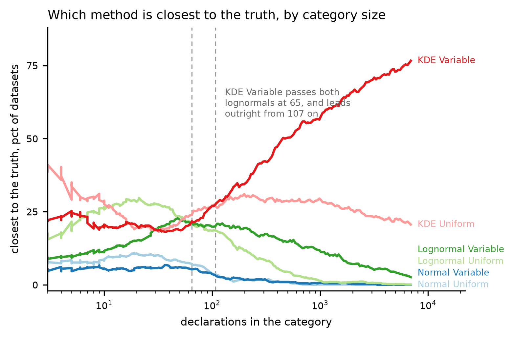

# HANDOFF stage-2f - The metric reduction

US spelling throughout, as in every file this project writes.

**HOW TO READ THIS FILE. Its reader does NOT have this repository** -- no
CLAUDE.md, no other report, no table, no figure, no source. Every claim below
is therefore stated in full where it is made, and a trailing `decision N` or
`entry N` is a citation into the project's decision log or its manuscript
discrepancy log, never the substance of the sentence. Where a file has to be
opened, the instruction is addressed to the NEXT CLAUDE CODE SESSION and says
so. The two figures are embedded and their captions carry the numbers, so a
reader whose copy does not render the images loses nothing.

# IF YOU READ ONE PAGE, READ THIS ONE

**Stage 2f asks which statistical characteristics of a material's declaration
set actually tell you which uncertainty method to use, and turns the answer
into a rule somebody can follow.** Each claim carries the number behind it and
a plain-language **so what** for a reader who builds buildings rather than
statistical models.

**THIS PAGE HAS BEEN REWRITTEN TWICE AND BOTH EARLIER VERSIONS WERE WRONG IN
THE SAME WAY: they ranked characteristics using a statistic that rewards
adding terms, computed on 127 real material categories.** What survives that
correction is below. Two specific claims are withdrawn and are named in claim
8, because a reader who saw the earlier version needs to know which sentences
to stop repeating. **A third item is not withdrawn but handed on:** the two
arms of the study draw market-share weights by different rules, which is a
structural inconsistency on the quantity the paper is built on. Nothing in this
stage depends on it and no number here moves because of it; claim 11 states it
and the next stage owns it.

## 1. The cutoff above which a kernel estimate beats a lognormal is 59 to 134 declarations

Above that many environmental product declarations in a category, fit a kernel
density estimate, and use market-share weights if you know the market shares.
Below it, fit a three-parameter lognormal. **The interval is the result** --
the lowest cost sits at 75 declarations and every threshold from 59 to 134 is
indistinguishable from it, so the paper should print the range rather than a
point inside it. Measured against the best
choice that could possibly be made for each dataset individually -- a standard
nobody can reach, because it requires knowing the answer first -- that rule
costs **38.4 percent** more error at its best setting, against **53.6 percent**
for always using a kernel estimate and **178.5 percent** for always using a
lognormal.

**That range is the result, and it should be quoted as a range rather than
rounded.** The lowest cost is at 75 declarations and every threshold from
**59 to 134** is indistinguishable from it, so the honest statement is the
interval, not a point inside it. The worst case halves across the same region: a category where
the rule goes badly wrong costs 26.6 times the best possible below a threshold
of 53, and 13.1 times above it.

> **So what.** If a material category in your model has more than roughly sixty
> to a hundred and thirty declarations behind it, the flexible method is worth
> using and it is worth paying attention to which products actually sell. Below
> that, a simple skewed curve fits better, because there is not enough data to
> learn a shape from. Anywhere in that interval performs identically, so it is
> a range you can sit inside rather than a threshold to hit precisely.

## 2. No single method is best regardless, and the leader changes twice

Share of the 10,000 synthetic datasets on which each method comes closest to
the true distribution the data were drawn from:

    declarations   KDE      KDE      Lognormal  Lognormal  Normal   Normal
                   market   equal    equal      market     equal    market
    3 to 9          22.5     33.8      20.9        9.9       7.6      5.4
    10 to 99        20.0     22.5      25.2       17.9       8.8      5.6
    100 to 999      42.8     28.8       8.8       16.8       1.3      1.4
    1000 and up     69.6     23.5       0.6        6.1       0.0      0.2

**Normal distributions are never the answer**, at 0.0 to 8.8 percent in every
band, which is the strongest negative result the study has.

**THE EQUAL-WEIGHTS LEAD AT SMALL SIZES IS PROVISIONAL AND THE NEXT STAGE MAY
OVERTURN IT.** That equal weighting beats market-share weighting below about a
hundred declarations is the one result in this stage the author does not accept
on its face, and the objection is well founded: it rests on a weight model that
differs between the two arms, and on 20 percent of the synthetic datasets
having only one component, for which the market population and the sampled
population are the same distribution and weighting has nothing to find. **Claim
11 sets this out and Stage 2h owns it. Do not build a recommendation about
weighting at small sizes on this row until that stage reports.** Everything
about the choice of FAMILY -- kernel estimate against lognormal against normal
-- is unaffected, because it is measured within a weighting scheme.

> **So what.** There is no method you can adopt once and stop thinking about.
> But there is one you can stop using: fitting a normal curve to embodied
> carbon data is the worst choice at every dataset size, and it is what most
> practice does today.

## 3. The advantage is U-shaped, and the dip is real rather than noise

A kernel estimate is closer to the truth on **62.6 percent** of datasets with
three to nine declarations, falls below half between about 10 and 55, and then
climbs to **86.5 percent** under equal weights and **96.8 percent** under
market-share weights at the top of the range.

The dip has a mechanism. With three to nine values there is no shape to
estimate and both families do equally badly, so the flexible one is nominally
ahead on a coin flip. Between ten and fifty, the lognormal's built-in shape
assumption is worth more than the kernel's freedom to follow the data. Above
that the data outweigh the assumption. **The figure draws the dip rather than
smoothing it**, because a clean monotone curve there would be the conclusion
and not the measurement.

> **So what.** More declarations are always better -- every method fits better
> with more data, and nothing here should discourage collecting it. What
> changes with the count is WHICH method to use. There is a genuinely awkward
> middle, roughly ten to fifty declarations, where a simple assumed shape beats
> trying to learn one from the data, and that is where a great many real
> material categories sit.

## 4. Nothing except dataset size gives a usable threshold, multimodality least

Every candidate characteristic was swept for a value at which the kernel
estimate overtakes the lognormal. Only dataset size produces one.
**Multimodality runs the wrong way**: as the modality index rises, the kernel
estimate's win share falls from 60.9 to 55.9 percent under equal weights, and
under market-share weights it crosses downward, 67.0 to 46.5 percent. Holding
dataset size fixed does not rescue it. Silverman's critical bandwidth is flat,
77.5 to 76.0 percent.

This confirms an earlier finding of this project on far stronger evidence:
10,000 datasets measured out of sample, where the earlier version had 127
measured in sample.

> **So what.** The intuition that lumpy, multi-peaked data is where a flexible
> method earns its keep is wrong, and it is wrong in the interesting direction.
> A kernel estimate's advantage comes from matching the general shape of a
> distribution -- its skew and its tail -- not from resolving separate humps.
> Counting peaks in your data will not tell you which method to use.

## 5. The one large non-size effect is a property of the weights, not the data

The biggest single effect anywhere in this analysis is the amount by which
market-share weighting shifts a category's average. It changes the kernel
estimate's win share from 31.5 to 67.5 percent under equal weights, and from
81.5 to 34.7 percent under market-share weights, as it goes from below to above
its crossing value.

**It cannot be used in a rule**, because computing it requires already knowing
the market shares, which is exactly what a practitioner does not have. It is
noted and set aside.

> **So what.** The single most informative thing about a material category is
> not a property of the numbers at all -- it is how different the market-weighted
> average is from the plain average. Nobody can compute that without production
> volumes that are not published, which is the strongest argument this study
> produces for publishing them.

## 6. Market-share weighting pays when shares are CONCENTRATED, not when even

Inside a single size band, splitting by how concentrated the weight vector is,
the share of datasets where the market-share fit beats its own equal-weighted
twin:

    weights spread over...        kernel estimate   lognormal
    the fewest products  (0.23)        74.4            79.4
                         (0.33)        70.7            76.0
                         (0.42)        61.6            66.1
    the most products    (0.51)        29.8            37.9

**This inverts the usual intuition.** Concentration is normally read as a
shrunken sample and therefore a cost. That is only the variance half. A nearly
even weight vector carries no information about the market, so the
market-share fit is the equal-weighted fit plus noise and it loses.

At three to nine declarations the same split is flat -- 41.4, 36.5, 36.3, 41.9
percent -- and market-share weighting loses regardless, on 39.0 percent of
datasets with an interval of 37.2 to 40.9. The reason is a different one: a
flat spread of market shares over three to nine points leaves a **median
effective sample size of 2.7**, with 93.1 percent of those categories below
five effective observations. Nothing about the weights rescues that, because
the problem is the point count.

> **So what.** Market-share weighting is worth the trouble when a few products
> dominate the market, which is the normal situation in construction materials
> -- one published figure has a single steel route at 64 percent of world
> production. If the market is genuinely fragmented and every product has a
> similar share, weighting adds noise and no information. And below about ten
> declarations, do not bother at all.

## 7. This could only be measured on the synthetic data, and that is the finding
## that justifies having built it

**The 127 real material categories cannot answer this question, and the way
that shows up is worth stating precisely.** The baseline model -- dataset size
and dispersion, nothing else -- was refitted 20 times, changing only which
categories fall into which cross-validation fold:

    arm                  datasets   median R2    range across reshuffles
    synthetic, equal       10,000     +0.280     +0.279 to +0.280
    synthetic, market      10,000     +0.524     +0.523 to +0.525
    real, equal               127     +0.326     -0.442 to +0.370
    real, market              127     -0.952     -2.605 to +0.337

**The corpus reproduces its own answer to three decimal places on every
reshuffle. The real arm does not reproduce its own sign.** A negative value
means the model predicts worse than simply guessing the average. So any single
number quoted from the real categories -- including a flattering one -- is one
draw from a three-point-wide distribution rather than a measurement.

On the synthetic arm the effects are real and small: under market-share weights
17 of 23 candidates clear their own noise, because that noise is only 0.003 on
10,000 datasets, but the largest effect is 0.034 against a baseline of 0.525.

> **So what.** This is what the synthetic datasets are for. There are only
> about 150 real material categories with enough declarations to analyze, and
> that is too few to answer "which method should I use, and when" with any
> stability at all. Generating ten thousand datasets whose statistical
> character matches the real ones is what makes the answer hold up.

## 8. Two claims from the earlier version of this stage are withdrawn

**The author's modality index is NOT the second-best predictor of which method
to use.** That claim came from an in-sample statistic on 127 categories.
Measured out of sample on 10,000, the index adds 0.0015 and 0.0027 -- not
distinguishable from zero -- while the visible mode COUNT, which the same
earlier version called the worst of all candidates, is the modality measure
that survives selection. **What does stand is the underlying defect it found**:
the index had been computed at a smoothing bandwidth the study abandoned four
stages earlier, and correcting that was right.

**The corpus is NOT the weaker arm for this question.** The earlier version said
its effects were an order of magnitude smaller than the real arm's because it
fails to span the real range. Both halves are wrong. The real arm's larger
numbers were overfitting, and the range shortfall is a **single category** --
`Aggregates`, a contaminated database bin with a coefficient of variation of
6.93 where the rest of the arm reaches 2.4. Removing every real category above
the corpus's range moves the kernel estimate's win share from 40.2 to 40.5
percent and the size crossover from 124 to 122 declarations.

> **So what.** The synthetic data covers what real material categories look
> like. The one thing it does not reach is a database category that is not a
> material at all -- a bin holding sinks, worktops and gravel together -- and
> that is a statement about the database's filing rather than a limit on the
> conclusions.

## 9. How significance is decided here, since it is not by p-value

No p-value appears in any figure, table or claim of this stage. Each
characteristic's contribution is measured as the improvement in prediction on
data the model has not seen, reported beside the spread of that improvement
across folds, and **the statistic that ranks them is the ratio of the two** --
the gain in units of its own fold-to-fold spread. That is a test statistic in
the sense that matters: it is directly comparable across characteristics, across
weighting schemes and across the two arms, and it does not move when the sample
size changes the way a p-value does. **An effect smaller than its own spread is
not reported as an effect**, however small its p-value would have been.

Redundancy is handled by selection rather than by discarding correlated
columns. Skewness, kurtosis and the two normality statistics are four views of
one underlying shape, so a table that tests each one alone credits the same
effect four times. A characteristic enters the reported set only if it still
improves prediction once everything already chosen is in the model.

> **So what.** The usual way of deciding what matters -- a significance test on
> each characteristic in turn -- would have produced a longer list, counted the
> same effect several times over, and rewarded the analysis for adding terms.
> What is reported instead is how much each characteristic actually improves a
> prediction of data it has not seen.

## 10. The synthetic data was NOT regenerated, and that was tested rather than assumed

Widening the corpus's dispersion was investigated at the author's instruction
and is not adopted. The generator can reach further than an earlier stage
concluded -- that stage's audit never swept the parameter that actually binds,
the truncation width -- but the price is the quantity the paper is about: the
best widening halves the dispersion mismatch and **multiplies the
uniform-to-market-share distance mismatch by 2.4**, while worsening the overall
calibration by 6.3 times its own seed-to-seed noise. It still does not reach
the real maximum. Since the gap is one contaminated category and removing it
changes nothing (claim 8), generation stays closed.

Dataset size was also left alone: the choice curve flattens to a slope of
-0.233 per tenfold increase above 1,000 declarations, the kernel estimate
already wins 96 percent there, and the three real categories larger than the
corpus's maximum behave like the band below them.

> **So what.** Nothing downstream was invalidated and no number in the paper
> moved. The limitation to state is narrow and specific, rather than a general
> caveat about synthetic data.

## 11. The two arms weight their data by different rules, and the next stage owns it

This stage did not set out to look at market-share weighting and found
something in it that has to be written down. **The real material categories get
their market shares from a flat draw over their individual declarations; the
synthetic ones get theirs attached to the humps of the distribution and split
inside each hump.** So on one arm the shares are correlated with the carbon
coefficients and on the other they are not, and that is the dimension the paper
is built on.

The consequence is measurable. Weights drawn independently of the values must
wash out as a category grows -- that is what independence means -- while
correlated weights do not. Median distance between the equal-weighted and
market-share-weighted versions of the same data:

    declarations    real categories    synthetic
    3 to 9              0.083            0.138
    10 to 99            0.109            0.125
    100 to 999          0.074            0.071
    1000 and up         0.005            0.050

The decline with size is **-0.397 on the real categories against -0.167 on the
synthetic ones**, and above a thousand declarations the synthetic arm shows ten
times the effect. Reweighting the synthetic arm's own values by the real arm's
rule reproduces the real arm's behaviour, which is what proves the gap is the
rule rather than the data. The two agree in the middle, at ten to ninety-nine
declarations, and 78 of the 147 real categories sit there -- which is why
nothing caught it.

**The fix is one rule on both arms, and it must not be a fitted mixture model.**
A mixture cannot be estimated at three to nine declarations, mode counts on
real data swing from 95 percent unimodal to 68 percent depending on one
smoothing choice, and it would place a modeling decision inside the paper's
central quantity. Cutting the sorted values into contiguous blocks achieves the
same correlation with none of that.

**And the choice of how strongly shares cluster is not avoidable by declining
to choose.** Assuming no clustering is not neutrality: it asserts that market
share is unrelated to carbon intensity, and the published production volumes
say otherwise, with 63.75 percent of world steel on the higher-carbon route and
the lower-carbon route small. Saying "weighting stops mattering once you have
enough declarations" would be reporting a property of the weight model rather
than a fact about markets.

> **So what.** Two of the paper's claims about market-share weighting rest on a
> modeling choice that differs between its two halves, and the half that says
> weighting fades away as data accumulates is the half whose assumption we can
> already see is wrong. Nothing in this stage's results depends on it, and no
> number in this stage moved because of it, but the weighting claims elsewhere
> in the paper should not be finalized until the next stage settles the rule.

## The two figures

**Figure A.** The share of the 10,000 synthetic datasets on which each of the
six methods comes closest to the true distribution, against how many
declarations the category holds, on a continuous size axis rather than in
bands. Each curve is a local share over a sliding window holding the same
number of datasets at every position, so it does not get noisier where the data
thin out. **A kernel estimate under equal weights leads below about twelve
declarations; a lognormal under equal weights leads from there to about fifty;
the kernel estimate with market-share weights passes both lognormals at 65 and
takes the lead outright from 107 on, reaching 77 percent at the top of the
range.** The two dashed lines mark those crossings and are read directly off
the curves. **Both normal fits run flat along the bottom, under 12 percent
everywhere and effectively zero above a few hundred declarations** -- the
clearest negative result in the study.

**Figure B.** How much each characteristic adds to predicting which of the
kernel estimate and the lognormal fits better, **once the number of
declarations is already known**. The orange line is what the count achieves on
its own: **0.23 under equal weights and 0.47 under market-share weights**, as a
share of the variation explained on datasets the model was not fitted to. Bars
are the extra each characteristic buys on top of it, with the spread across
folds. **Under market-share weights nothing reaches a seventh of the orange
line** -- the best is dispersion at 0.054 -- so counting declarations is most
of the answer and the practitioner rule stays one number. **The single large
bar under equal weights, 0.153, is a property of the WEIGHTS and not of the
data**: it is how far market weighting moves the category's distribution, which
needs the market shares, which is precisely what a practitioner does not have.

## 1. Stage and branch

| | |
|---|---|
| **Stage** | 2f, the metric reduction |
| **Branch** | `stage-2f-multivariate` |
| **Branched from** | `1e8c884` on branch `stage-2e-plca`, working tree clean |

Twenty-two commits, in logical units so any moved number can be bisected. The
number-moving ones are named in section 6.

---

## 2. What was asked

Resolve the Shapiro-Wilk versus Shapiro-Francia inconsistency and fix the
Royston p-value. Then replace the rolling-average presentation of
goodness-of-fit against the statistical characteristics -- 21 panels per arm,
no uncertainty band, no data density, and a set of characteristics correlated
with each other so that the marginal views overstate how many independent
effects exist. Fit a multivariate model of the fit score and, separately, of
which method wins, on every characteristic at once, using an interpretable
model alongside a flexible one with permutation importance and partial
dependence; rank the characteristics by independent contribution and say which
small subset carries the signal. Run the reduction TWICE, once against the fit
score and once against the error in the ANSWER, and report what survives one
and not the other. Treat dataset size as a first-class predictor and a
confound; handle the characteristics that are undefined in the smallest size
stratum explicitly; report every aggregate at equal allocation and reweighted
to the real size mix; treat the three modality measures as three candidates;
and say whether the characteristics that predict are the ones where the
synthetic corpus is densest, which would narrow the generalization claim.

---

## 3. What was done

**One new source module with 30 tests**, holding the candidate set and its
modeling scales, the missingness and rows-used reports, the size-confound
measurement, two model families ranked by permutation importance on held-out
folds, the tautology guard, partial dependence, the empirical size-mix
resample, the three-way modality comparison, and the binned and smoothed curves
that replace the rolling averages. Sixteen new cells at the end of the third
notebook are each one call into it.

**IT IS IN THE THIRD NOTEBOOK AND NOT THE SECOND, deliberately.** The reduction
is run against two kinds of target and the second -- the error in the answer --
exists only after the probabilistic LCA has been run against the true
distributions. Putting the reduction in the second notebook would make it read
a table the third one writes and break the run order from a clean checkout.

**The whole test suite is 487 and all pass**, including the eight regression
fixtures that pin the characteristics and all six goodness-of-fit scores.

**Five defects were found by running the work**, each fixed with a test: a
crash that killed the first full reduction part-way through, a unimodal share
divided by the wrong denominator, a cached file that failed the second notebook
nineteen minutes into a run, a comparison made in two different units, and a
figure cell that would have run for hours. They are described in section 5.

---

## 4. What the measurements say

**READ THIS BEFORE THE SUBSECTIONS BELOW. Sections 4.1 to 4.4 are the stage's
FIRST pass and their rankings are superseded.** They rank characteristics by
permutation importance and by an in-sample incremental R2, both computed with
the 127 real material categories carrying equal standing with the 10,000
synthetic ones. That was wrong in a way the numbers themselves could not show:
adding five spline terms to 127 observations raises an in-sample R2 by about
0.043 for free, and the real arm's out-of-sample baseline does not reproduce
its own sign across fold assignments. **The corrected rankings are the ones on
the headline page and in section 4.9.** The subsections are kept because the
contrast between the three targets -- the level of a score, the choice between
two methods, and the error in the answer -- is itself a finding, and because a
later session needs to see what was measured and why it was set aside.

### 4.9 The corrected ranking, out of sample and on the synthetic arm

Out-of-sample gain over a baseline of dataset size and dispersion, on 10,000
synthetic datasets, with the spread of each gain across folds beside it. A gain
smaller than its own spread is not an effect.

| characteristic | equal weights | market-share weights |
|---|---|---|
| distance between the equal- and market-share-weighted dataset | **+0.170** (sd 0.027) | cancels |
| the market-share-weighted mean | +0.012 | **+0.034** (sd 0.007) |
| weight carried by outliers | small | **+0.026** (sd 0.009) |
| visible mode COUNT, at the fitted bandwidth | -0.002 | **+0.019** (sd 0.010) |
| kurtosis | small | +0.018 (sd 0.012) |
| the author's modality INDEX, at the fitted bandwidth | +0.0015 (sd 0.007) | +0.0027 (sd 0.011) |
| Silverman's critical bandwidth | +0.005 | +0.008 |

Baseline R2 0.280 and 0.525. Forward selection, which admits a characteristic
only if it still helps once everything already chosen is present, keeps six
under each weighting and raises the R2 to **0.581** and **0.634**.

**Under market-share weights 17 of 23 candidates clear their own fold spread**,
because that spread is only 0.003 on 10,000 datasets; under equal weights only
1 of 23 does. So the honest statement is that the effects are real and small,
not that they are absent, and the count of characteristics clearing a noise
floor is not a measure of how much they matter.

### 4.1 The survivors

Pooled over both target families, both arms, all six methods and both model
families -- 96 models -- ranked by mean permutation-importance rank on the
held-out fold, with the definitional candidate of section 4.2 removed:

| characteristic | mean rank | share of models it is top-five in |
|---|---|---|
| coefficient of variation, variable | **3.09** | 84 pct |
| coefficient of variation, uniform | **3.80** | 78 pct |
| entropy, variable | **3.93** | 83 pct |
| dataset size | **5.06** | 70 pct |
| entropy, uniform | **5.24** | 70 pct |
| the dataset mean | 6.79 | 49 pct |
| ... | | |
| Silverman's critical bandwidth | 13.2 | **0 pct** |
| visible mode count | 19.5 | **0 pct** |

The five reduce to two quantities: entropy is dataset size (spline R2 of 0.924
on the corpus, 0.839 on the real arm) and the uniform coefficient of variation
is the variable one (correlation 0.979). Decision 129.

**THE SET IS STABLE AND THE ORDER IS NOT.** A separate run on an independent
random stream returns the same five, with mean ranks agreeing to 0.03 to 0.25,
and the second and third places swap. The paper states a SET.

### 4.2 A characteristic that IS part of the score

Every model in this study is scored against the market-share-weighted empirical
distribution of the data, including the three equal-weighted fits, so an
equal-weighted model carries a distance no estimation method can remove. That
distance is exactly the uniform-to-variable Wasserstein distance, which the
study reports as one of its characteristics.

**Its rank correlation with that irremovable part is 1.000000 for all three
equal-weighted methods on both arms.** On that identity alone it reaches a
correlation of **0.966** with the in-sample score of the kernel estimate. Any
sentence of the form "the fit gets worse as the uniform-to-variable distance
grows" is, for an equal-weighted method, a restatement of the definition.

**Its standing on the downstream error is real**: the market-weighted methods
have an irremovable part of exactly zero, and it still correlates **0.72, 0.72
and 0.57** with the error in a material's estimated contribution. So every
survivor ranking is reported with and without it. Decision 130, entry 118.

### 4.3 The two targets

| characteristic | rank on the FIT | rank on the ANSWER | shift |
|---|---|---|---|
| dataset size | 6.90 | **4.42** | **-2.48** |
| skewness, uniform | 15.02 | 12.65 | -2.38 |
| kurtosis, uniform | 14.35 | 12.04 | -2.31 |
| entropy, uniform | 7.13 | 4.90 | -2.23 |
| coefficient of variation, uniform | 3.38 | 5.40 | +2.02 |
| lognormal fit statistic | 14.13 | 16.35 | +2.23 |
| normal fit statistic | 9.88 | **13.85** | **+3.98** |
| weight of outliers | 13.25 | **17.29** | **+4.04** |

Size and its proxy rise when the target becomes the answer; the shape
statistics fall. Decision 131.

**And the error in a material's rank-1 frequency is 0.085 to 0.096 predictable
from its dataset's characteristics**, against 0.62 to 0.66 for the error in its
contribution. A rank-1 frequency is a property of the group of four materials,
not of the dataset, so the dataset's own characteristics cannot carry it.

### 4.4 Which method wins IS predictable, and size is what predicts it

Asked within a weighting scheme, which is the only valid form of the question,
with the majority-class baseline beside every accuracy because on a question one
method wins 70 percent of the time an accuracy of 0.70 has learned nothing:

| target | arm | weighting | accuracy | baseline | lift |
|---|---|---|---|---|---|
| cross-validated | real | equal | **0.827** | 0.504 | **+0.323** |
| cross-validated | real | market | 0.771 | 0.575 | +0.197 |
| against the known parent | corpus | equal | 0.695 | 0.566 | +0.129 |
| against the known parent | corpus | market | 0.738 | 0.644 | +0.094 |

**The strongest single predictor of which method wins is dataset size**, at a
mean importance of 0.084 against 0.051 for the next. That CONFIRMS what an
earlier stage found by a completely different route -- regressing one method's
score against another's on the logarithm of the count -- and the confirmation is
worth stating because the two computations share nothing but the data.

### 4.5 Modality

| measure | adds over size alone, real arm | corpus | significant on |
|---|---|---|---|
| Silverman's critical bandwidth, variable | **0.210** | **0.175** | every model |
| Silverman's critical bandwidth, uniform | 0.205 | 0.171 | every model |
| the continuous modality index, variable | 0.128 | 0.042 | every model |
| visible modes at the fitted bandwidth | 0.012 | 0.013 | **none of 12 on the real arm** |
| visible modes at Scott's bandwidth | 0.033 | 0.004 | 9 of 12 |

And in the full model the critical bandwidth is 14th of 22 and top-five in zero
of 96 models, correlating +0.54 and +0.60 with the coefficient of variation.
Decision 132, entry 119.

### 4.6 What the models were told about missing data

**Two different things remove the smallest datasets and neither announces
itself.** Excess kurtosis is undefined below four values -- 6 of the 20 real
categories with 3 to 9 EPDs, and 612 of 2,500 synthetic ones -- and a visible
mode count needs eight, which removes 17 of 20 and 2,026 of 2,500. Every other
size band is complete on every characteristic. **A model that dropped incomplete
rows would discard 85 percent of the real 3-to-9 band and 81 percent of the
synthetic one** and leave the rest untouched, which is precisely the regime
where a parametric family is expected to beat a kernel estimate. Both models
keep every row instead: the interpretable one fills a missing value and adds a
column saying it was missing, the flexible one splits on missingness directly.

**And the cross-validated target on the real arm is undefined below ten
values**, because half of a nine-value dataset is four values. That reduction
uses 127 of 147 categories and **0 of the 20** in the smallest band. Entry 122.

### 4.7 Post-stratification

Reweighting the corpus to the real size mix -- 13.6, 53.1, 25.9 and 7.5 percent
across the four bands, giving 4,712 datasets -- roughly halves the importance of
dataset size, **0.134 to 0.064**, and of entropy, 0.110 to 0.075, while the
coefficient of variation barely moves, 0.270 to 0.253. **The survivor set and
its ordering do not change.** So the reduction is robust to the allocation, and
under the real size mix dispersion dominates size by more than equal allocation
suggests. Both are reported, as every headline in this study is.

### 4.8 Coverage against importance

Median margin beyond the real maximum: **-0.629 for the five survivors and
+0.509 for the other seventeen**; rank correlation between importance and margin
**+0.484**. The corpus does not reach the real maximum on the coefficient of
variation under either weighting or on dataset size, and has five to seven real
ranges of headroom on skewness, kurtosis and the modality index.

This sharpens the existing coverage limitation rather than reversing it: that
limitation was argued on WHICH categories are uncovered, and this adds that the
shortfall sits on the most predictive characteristic in the study. **Generation
stays closed.** Decision 133, entry 120.

---

## 5. What is still open

### Owned by a later stage

| Item | Owner |
|---|---|
| The `(1-capecc)` divisor, partly resolved in the previous stage and still to be reviewed; magnitude-based companion metrics; the sensitivity of the headline rank-1 frequency. **This stage adds a third independent argument for demoting the ranking metrics: the error in a rank-1 frequency is only 9 percent predictable from a dataset's own characteristics, because it is a property of the group** | 2g |
| The profile-likelihood guard sweep; the Dirichlet concentration sweep, which should vary the block structure and not only the parameter; multiple weight realizations; the deduplicated variant; the mode-share coupling; **and the pedigree matrix**, which is what connects this paper to the practice most readers use | 2h |
| Every figure brought to the style guide. **This stage found that the guide's own clash detector had never checked a single panel title** and fixed it, so a session doing that work now has a tool that works. The older figures still carry a Unicode minus | 3 |
| **The reduced figure is what the manuscript's metric count should describe.** The full candidate set belongs in the supplement and the survivors in the main text | manuscript |
| A real-building anchor, if citing the staircase paper is not enough | 2i, optional |

### Opened by the author's review and handed to a later stage

| Item | Owner |
|---|---|
| **THE WEIGHT MODEL, and it is the largest open item this stage produced.** The two arms draw market-share weights by different rules -- a flat Dirichlet over points on the real categories, mode-coupled weights on the synthetic ones -- so the paper's central quantity decays with dataset size on one arm and not the other. Decay slope on log(n): **-0.397 real against -0.167 synthetic**, and above 1,000 declarations the median separation is **0.0049 real against 0.0501 synthetic**, a factor of ten. Reweighting the corpus's own values flat gives 0.0116, which is what proves the gap is the rule rather than the data. The fix is one rule on both arms with a swept coherence parameter, controlling separately for how concentrated the shares are. **Nothing was changed here and no number moved** | 2h, first item |
| Drawing mode SIZES from a flat Dirichlet instead of at concentration 10, which the author proposes and which is more realistic -- at two modes the largest holds 0.52 to 0.97 of the points instead of 0.51 to 0.71. It measured 5.0 seed standard deviations worse on the calibration, but that comparison used the mismatched weight rules above and must be redone once the arms agree | 2h |

### Closed by the author's review, and recorded so they are not reopened

| Item | How it was settled |
|---|---|
| Whether to widen the synthetic datasets' dispersion | **No.** Measured: the widening is reachable, costs 2.4x on the quantity the paper is about, and the gap it closes is one contaminated database category whose removal moves every headline by under half a percentage point. Decision 138 |
| Whether to extend the synthetic dataset size past 9,999 | **No.** The advantage curve flattens, the answer is already unanimous above 1,000, and the three real categories above the cap behave like the band below. Decision 137 |
| Which arm the analysis rests on | **The synthetic one**, by author decision and by measurement: the real arm's baseline ranges -2.605 to +0.337 across fold assignments while the corpus reproduces +0.524 every time. Decision 136 |
| How significance is decided | **Cross-validated gain against its own fold spread.** No p-value appears in any figure, table or claim. Decision 136 |
| An industry-average EPD as a direct estimate of the market-weighted mean | unowned |

### Known and accepted

**The survivor ORDER is not stable across random streams** and the set is; the
paper must state a set. **The out-of-sample reduction on the real arm excludes
the 20 smallest categories** and those claims rest on the in-sample score.
**Partial dependence splits an effect between two strongly correlated
characteristics** rather than assigning it to one, so a moderate partial
dependence is not evidence of an independent effect; read it beside the
correlation table. **The empirical Silverman multimodality share carries a few
points of estimator noise** -- 49.3 percent at 100 bootstrap replicates against
45.6 at 60 -- and the table that reports it is computed at 60 and now carries
its replicate count as a column, so no figure drawn from it can quote a share
without its provenance.

**One item for the NEXT CLAUDE CODE SESSION, not for the manuscript reader:**
the two derived replay caches are now excluded from version control, this
stage's own pair having been removed from it; the pair belonging to the
previous corpus is still tracked and removing it belongs to the deposit stage.

---

## 6. Numbers that moved

**Three changes moved a committed number and no fit, score or probabilistic LCA
result is among them. The author's review added no fourth: it changed which
numbers are REPORTED, not what any of them are.** The corpus, the empirical
extract, the fitting, the scoring criterion and the probabilistic LCA are all
untouched by it, and the one regenerated table was verified identical in every
numeric column across all 16,800 rows.

**What the review withdrew rather than moved.** The claim that the author's
modality index is the second-best predictor of which method to use, at an
incremental R2 of 0.1114; the claim that five further characteristics add 0.10
to 0.14 to the choice; and the claim that the corpus is the weaker arm for this
question. All three rest on in-sample fits to 127 categories. The replacements
are in section 4.9.

**The normality statistic.** Only the two EQUAL-WEIGHTED columns; the
market-weighted ones were already Shapiro-Francia and are bit-identical on both
arms. Median absolute change on the real categories: **0.0103** at 3 to 9 EPDs,
0.0062 at 10 to 99, 0.0029 at 100 to 999, 0.00005 above 1,000; arm mean 0.7862
to 0.7834. Largest single change on either arm 0.0358. On the corpus, 9,388 and
9,387 of 10,000 rows move.

**Everything the statistic does NOT reach, checked rather than assumed.** No
goodness-of-fit score moves on either arm. The 60,000-row probabilistic LCA
results table is identical column for column. Nine previously committed
compressed tables -- the run against the truth, the design comparison, the
oracle weights, the flip calibration -- are byte-identical. The generator's
calibration is unchanged to the last digit, because the objective it is tuned on
reads only market-weighted columns. The corpus was RECOMPUTED and not
regenerated: its values, its parent record, its groupings and both replay caches
are byte-identical to the corpus it came from, and only the two columns above
differ.

**The visible-mode counts** were computed on a 500-dataset sample of the corpus
and are now computed on all of it, which was under a minute of work. The
synthetic share with one visible mode moves by sampling error only; at the
bandwidth the study fits it reads **75.9 percent against a real-arm 68.5**, over
7,974 synthetic datasets and 130 real categories with at least eight values.

**The smoothed curves** gained a bound: restricting the smooth to the span the
binned summary covers removes every fitted value at or below zero, **24 of
15,000 rows**, and the minimum fitted distance goes from **-0.0119 to +0.0065**.
A negative Wasserstein distance is not a quantity. The binned rows, which carry
the uncertainty and the counts, are identical.

**The three regression fixtures were re-frozen in the commit that moved them**,
with the delta recorded there and in the fixture README, and all eight
regression tests pass.

### The five defects, each now with a test

1. **A crash killed the first full reduction part-way through.** The function
   that measures what a characteristic adds over dataset size took size from
   the candidate list rather than from the data, so calling it with a list that
   does not name size -- which the three-way modality comparison does -- asked
   for a column the caller never supplied.
2. **The unimodal share was divided by the whole arm** rather than by the
   datasets the measure is defined on, counting an undefined dataset as
   multimodal. It read 0.605 on the real arm against a true 0.685.
3. **A cached file failed the second notebook nineteen minutes into a run.**
   The recompute path copies a replay cache that records which corpus it was
   built for, and the loader correctly refused it. The guard stays and is
   tested; the copy is now relabelled with its origin recorded.
4. **A comparison was made in two different units.** The partial dependence is
   fitted on the logarithm of the target and the marginal curve was drawn on
   the target's own scale, so the ratio of the two was meaningless and returned
   "fractions surviving" of 2.5 to 7.9.
5. **A figure cell would have run for hours.** Bootstrapping the smoother 400
   times over five characteristics, six methods and three targets is some
   12,000 fits at 600 ms each. Turning off the smoother's robustifying
   iterations is 255 times faster and is NOT available -- measured, it moves the
   curve by 54 percent of its own range, six times the width of the band it
   would be drawn inside -- so the uncertainty now comes from the binned
   bootstrap, which is exact and cheap, and the smoother is fitted once. The
   cell takes seventeen seconds.

**And one defect in the tooling.** The clash detector written two stages ago to
stop figure labels colliding had never checked a single panel TITLE: the
plotting library keeps a separate text object for a left-aligned title, the
detector read the centred one, and this project sets every title left-aligned.
It reported no overlap on a five-column figure whose titles plainly overlapped.

---

## 7. Inputs and outputs

**Read.** The frozen raw empirical extract; the synthetic corpus and the
parents and mode labels recovered from it; the goodness-of-fit and
cross-validated scores; and the previous stage's run of the probabilistic LCA
against the true distributions, which is what makes the second target exist.

**Written.** One source module and its test file; one more test file for the
corpus recompute; one audit script; a fourth notebook holding the whole
reduction; result tables and figures as listed below; fifteen decisions in the
project's decision log, numbered 125 through 140; manuscript discrepancy entries
114 through 129, with entries 9 and 11 marked resolved; a rewritten README; and
this file.

**Added by the author's review**, after the first version of this stage was
found to have ranked characteristics on an in-sample statistic computed on 127
real categories: six tables named `TABLE_Reduction*` covering the
cross-validated gains, the forward selection, the baseline stability across
fold assignments, the best method by size band, the policy cost curve, and the
weight-concentration split; two rebuilt figures; and twelve tests.

**Not touched.** The generator, the corpus's values, the empirical extract, the
fitting methods, the scoring criterion, the published flip thresholds, the
probabilistic LCA, and the manuscript.

---

## 8. Next stage

**FIRST, WHAT THE NEXT SESSION MUST NOT REPEAT.** Three claims from this
stage's first version are withdrawn and are recorded as withdrawn in the
project's decision log, as decisions 134, 135 and 136: that the author's modality
index is the second-best predictor of which method to use (it is an in-sample
result on 127 categories and does not survive out of sample), that five further
characteristics add 0.10 to 0.14 of explained variance to the choice (the same
defect), and that the corpus is the weaker arm for this question because of its
range (it is not; the shortfall is one contaminated category). **Any ranking of
characteristics must be cross-validated and must be taken from the synthetic
arm**, because the real arm's baseline does not reproduce its own sign across
fold assignments.

**Stage 2g**, the metric set: the sensitivity of the headline rank-1 frequency,
magnitude-based companions, and the `(1-capecc)` divisor.

**What this stage hands it.** A third independent argument for demoting the
ranking metrics, and this one is about predictability rather than fragility: the
error in a material's chance of leading is only **9 percent** predictable from
its dataset's own characteristics, against **62 to 66 percent** for the error in
its estimated contribution, because a rank-1 frequency is a property of the
group of materials and not of the dataset. The previous stage recommended
reporting five kinds of statement with the uncertainty index added; nothing here
contradicts that and this strengthens the case for leading with magnitudes.

**And what it should NOT redo.** The reduction is done and the survivor set is
stable. If a later stage wants a characteristic back in the figure, the question
to ask is whether it earns a place once dispersion and dataset size are already
there, which is what the partial-dependence table answers.

### Habits, added by this stage

12. **Ask whether a predictor is part of the thing it predicts.** The strongest
    apparent result in the first reduction was an identity with a correlation of
    exactly 1.000000.
13. **Look at the figure.** Three defects survived every table and every test
    and were visible in one glance at the rendered image, including one in the
    tool whose job was to catch them.
14. **A speed-up that changes the answer is not a speed-up.** Measure what the
    fast path costs before taking it; here it was 255 times faster and moved the
    curve by six times the width of its own uncertainty band.
15. **An in-sample fit statistic is not a measurement, and on a small sample it
    is not even close.** Adding five spline terms to 127 observations raises
    in-sample R2 by about 0.043 for free, which was most of what this stage
    first reported as signal. Everything is now scored on data the model has not
    seen.
16. **Before quoting a number, refit it on a different fold assignment.** The
    same model on the same data returned a baseline R2 of -0.724 and -2.441 on
    two runs differing only in a random seed. Reporting either would have been
    reporting a draw. The instability was the real finding and it is what
    settled which arm the stage rests on.
17. **A ranking of one-at-a-time tests counts the same effect several times.**
    Skewness, kurtosis and two normality statistics are four views of one shape.
    Selection against everything already chosen is the fix; pruning correlated
    columns by a threshold is not, because it throws away the choice of which
    view to keep.
18. **When a helper silently changes a figure, fix the helper.** `finish` was
    thinning tick locators on categorical axes, so a panel came back with two of
    four band names showing and no error anywhere. A test now pins it.
