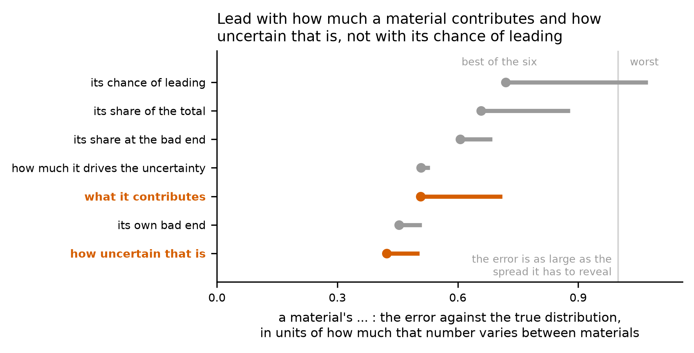
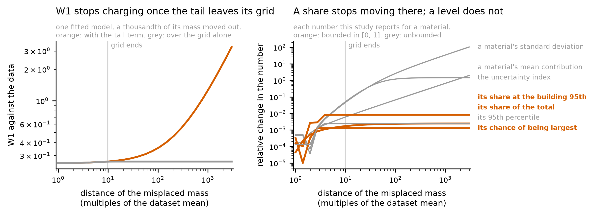

# HANDOFF stage-2g - Which metric the paper leads with

US spelling throughout, as in every file this project writes.

**HOW TO READ THIS FILE. Its reader does NOT have this repository** -- no
CLAUDE.md, no other report, no table, no figure, no source. Every claim below is
therefore stated in full where it is made, and a trailing `decision N` or
`entry N` is a citation into the project's decision log or its manuscript
discrepancy log, never the substance of the sentence. Where a file has to be
opened, the instruction is addressed to the NEXT CLAUDE CODE SESSION and says
so. The two figures are embedded and their captions carry the numbers, so a
reader whose copy does not render the images loses nothing.

---

# IF YOU READ ONE PAGE, READ THIS ONE

**Stage 2g asks which of the numbers a probabilistic LCA produces the paper
should lead with, and it is the first stage that could answer by measurement
rather than by argument.** Every earlier discussion of the headline metric was
about whether it was STABLE. Since the previous stage ran every probabilistic
LCA a second time against the true distributions the synthetic data was drawn
from, the question becomes whether a fitted model gets the metric RIGHT, and
that is a different and better question.

Each claim below carries the number behind it and a plain-language **so what**
for a reader who builds buildings rather than statistical models.

## 1. The number this study leads with is the one its methods get most wrong

For each candidate metric, take the distance between the answer a fitted model
gives and the answer the true distribution gives, and divide it by how much that
metric actually varies between materials. Below 1 the error is smaller than the
differences the number exists to show. At or above 1 it is not, and the number
cannot tell two materials apart at all.

    metric                                     best method to worst
    spread of a material's contribution            0.42 to 0.50
    the 95th percentile of its contribution        0.45 to 0.51
    its estimated contribution                     0.51 to 0.71
    the uncertainty index                          0.51 to 0.53
    its share at the BUILDING's 95th percentile    0.61 to 0.69
    its mean share of the building total           0.66 to 0.88
    ITS CHANCE OF BEING THE LARGEST CONTRIBUTOR    0.72 to 1.07

**The study's own headline is last on both ends, and under a normal fit it goes
past 1.0** -- 1.037 with equal weights and 1.074 with market-share weights. On
that metric a normal fit's error is larger than the entire spread of true values
across materials.

This is a fourth independent argument for demoting it, and the first one that is
about accuracy. The other three were that it is fragile when four materials
contribute equally, that it carries a 3.67 percent noise floor from an arbitrary
tie-break, and that it is only 9 percent predictable from a material's own data
because it is a property of the GROUP the material sits in.

> **So what.** "There is a 30 percent chance this material is your biggest
> source of carbon" is the least trustworthy sentence a probabilistic LCA
> produces. How much the material contributes, and how uncertain that is, are
> both recovered far better. Lead with those.

## 2. Which method looks best depends on which number you report

Share of 10,000 materials on which each method comes closest to the truth:

    metric                              leader                  share
    chance of being largest             kernel, market shares   0.221
    95th percentile of contribution     kernel, market shares   0.258
    spread of contribution              kernel, market shares   0.296
    estimated contribution              lognormal, market       0.236
    mean share of the total             lognormal, market       0.215
    share at the building's 95th pct    lognormal, market       0.186
    the uncertainty index               lognormal, equal        0.209

**Three different methods lead across seven metrics.** The rank correlation
between the six methods' ordering on one metric and their ordering on the chance
of being largest runs from **+1.00** down to **-0.54**: on three of the six
companions the methods come out in nearly the opposite order.

> **So what.** A paper that reports one number and names a best method is
> reporting the number, not the method. Any recommendation has to say which
> statement it is a recommendation about.

## 3. "Never use a normal distribution" is about attribution, not about everything

How much worse the better of the two normal fits is than the best of the four
non-normal methods:

    a material's chance of being largest      44.2 pct    normal is worst
    its estimated contribution                36.5 pct    normal is worst
    its mean share of the total               27.6 pct    normal is worst
    the spread of its contribution            17.9 pct    normal is worst
    the 95th percentile of its contribution    4.4 pct    normal is NOT worst
    its share at the building's 95th pct       2.8 pct    normal is NOT worst
    the uncertainty index                      1.0 pct    normal is NOT worst

**On three of the seven the normal is not the worst method and is within four
percent of the best.**

**What does survive every metric is the BIAS, and that is the part that matters
for a whole building.** On the three metrics where a signed error means
something, the normal is the most biased of the six on all three -- **+0.21,
-0.26 and -0.44** in units of the metric's own spread, against the kernel
estimate's +0.01, -0.11 and -0.22. Bias adds across the materials of a building
while random error cancels.

**One warning about reading that column.** On a share or a rank frequency the
signed error is identically zero for every method, because the four values sum
to one. That is arithmetic, not evidence of unbiasedness, and it must not be
quoted as though a method were unbiased on those metrics.

> **So what.** The advice to stop fitting normal curves stands where it was
> made: for saying which material dominates, and for anything a building total
> is added up from. For describing the high end of a single material, or for
> deciding where to collect better data, a normal is about as accurate as
> anything else. It just leans the same way every time, and that lean is what
> accumulates.

## 4. The five statements, in the order the results section should take

Each is a statement a probabilistic LCA makes; the study reported one and a half
of them.

1. **The comparison, which leads, because it is the decision a designer makes
   and the answer is a null.** Over 800 pairs of designs differing in one
   material, the choice of method changes the stated probability that the
   substitution is an improvement by at most **0.020**, and every method lands
   within **0.026** of the truth. At a claimed 5 percent saving the truth is
   **0.629** and the six methods span 0.630 to 0.642.
2. **The safe-lead rule.** The chance that the choice of method changes which
   material leads crosses 1 percent at a top-two contribution ratio of **2.13**
   (95 percent interval 2.09 to 2.17). The one real building element available,
   the Concrete-Precast staircase of Marsh, Lewis, Hattam and Allen (in press),
   sits at **1.02**.
3. **The building total and the budget statement.** Every method understates the
   total's 90th percentile, by **0.087 to 0.356** on a building whose total
   averages about 4.0, and at a budget the truth meets 90.0 percent of the time
   the six report **86.8 to 91.3** percent.
4. **The specification result, where the choice costs most.** Against a true
   mean saving of **5.39 percent** of the building from capping a material at
   the 75th percentile of the declarations held, the six report **4.88 to 6.19**
   percent; asked for the chance of achieving at least a 5 percent saving, the
   truth is **23.2** percent and the six span **22.9 to 30.5**.
   **And beside it the contrast that explains the whole stage:** a QUANTITY
   reduction delivers **0.0625** of the building under every method and under
   the truth, identical to four decimal places, because it is a deterministic
   fraction of a material's own contribution and no distributional assumption
   enters at all.
5. **Where the uncertainty sits**, which is claim 5 below.

> **So what.** Choosing between two designs is safe under any of these methods.
> Saying which material is biggest is safe only if it leads the next by about a
> factor of two, and real designs do not always. Saying what a
> low-carbon-specification policy will buy you is where the method you picked
> shows up in the answer.

## 5. The steadiest number a probabilistic LCA produces is reported nowhere, and no method gets it right

The uncertainty index -- which material's uncertainty drives the uncertainty in
the whole building -- has the lowest disagreement between methods of any main
output, **0.5035** against **1.042** for a material's chance of being largest.
Asked which material's uncertainty dominates, the best method names the truth's
answer **58.4 percent** of the time against a one-in-four chance level, the
highest of any candidate.

**And every one of the six methods is out by about half the metric's own spread
between materials**, 0.508 to 0.531, a span of only 4.4 percent from best to
worst. So the choice of method genuinely does not matter for it, and no method
gets it right.

**That pairing is the general lesson of this stage.** A number the methods agree
about and are all wrong about is the one thing a study must not present as
reliable, and the two statistics are reported side by side so that case is
visible.

It is also the fourth carbon-reduction strategy under another name: three
strategies reduce the expected impact -- use less, specify better, substitute --
and this one reduces the VARIANCE of the answer, which is exactly what obtaining
a supplier-specific declaration buys.

> **So what.** "Where should I spend my next hour of data collection" is both
> the most useful thing a probabilistic LCA tells a designer and the answer
> least affected by how the uncertainty was modelled. It should be in the paper.
> It should also carry the warning that every method is roughly equally
> imprecise about it.

## 6. The goodness-of-fit score cannot see how far out a bad tail goes

A distance between two cumulative curves charges for how much mass a model
misplaces; a Monte Carlo simulation samples from the model and is wrecked by how
FAR out that mass sits. A model with a thin enormous tail would therefore score
well and dominate any simulation it entered.

Measured, by moving a thousandth of one fitted model's mass out to 10, 100 or
1,000 times the dataset's mean and holding everything else: the score taken over
the study's evaluation grid alone reads **0.262242, 0.262571 and 0.262571**. The
grid ends just past the data, so **beyond it the criterion cannot tell a hundred
times the mean from a thousand to six decimal places.** With the correction the
previous-but-one stage added, which integrates the model's remaining tail
analytically, the same three read **0.262718, 0.353166 and 1.257643**.

**And the metrics split by whether they have a ceiling.** Relative change under
the same contamination, at ten times the mean and at a thousand:

    spread of a material's contribution       0.047  ->  34.3
    the uncertainty index                     0.051  ->   1.45
    its estimated contribution                0.006  ->   0.66
    its share at the building's 95th pct      0.0082 ->  0.0082
    its mean share of the total               0.0017 ->  0.0024
    its chance of being largest               0.0013 ->  0.0013

A share and a rank frequency saturate: once a material's draw is enormous it
holds the whole share and takes first place, and making it a thousand times more
enormous changes neither to the last digit. A mean, a standard deviation and a
variance share have no such ceiling; the spread moves by a factor of 115 in the
worst case measured.

**This creates a tension the paper has to state rather than resolve.** The
metrics that recover the truth best are levels, and levels are exactly what a
thin far tail wrecks; the ones that are immune are shares, and they recover
worse. What makes the levels safe to report is that the study's own criterion
now charges for the thing that wrecks them, which it did not two stages ago.

> **So what.** A curve that looks like a good fit can still hide a rare,
> enormous value, and the simulation you run afterwards will be dominated by it.
> The check is worth running on any goodness-of-fit number before trusting it.

## 7. A metric with a comment saying its numbers look wrong, settled

One reported quantity -- which material is the best one to cap, as a frequency
over simulation iterations -- carried a fudge factor and an inline comment
conceding that "percentages look off because not all reduction strategies apply
in all scenarios". The comment named the right problem; the fudge factor was the
wrong fix.

**The correct denominator is the iterations in which capping something helps at
all.** In an iteration where no material's cap binds there is no best material
to cap, and counting those iterations against all four made the column depend on
how often the strategy applies rather than on which material is the right one.
The frequencies now sum to **exactly 1.0** across the four materials, like every
other such frequency in the study.

**And how often the strategy applies is now reported rather than assumed, which
is where the signal was.** The share of iterations in which any cap binds runs
from **0.727** under a lognormal with equal weights to **0.838** under a normal
with equal weights -- a method that puts more mass above the cap finds the cap
binding more often. The old fudge factor forced that number to 0.25 for every
material and every method.

> **So what.** "Cap the carbon of your worst-performing material" is worth more
> under some ways of modelling uncertainty than others, because they disagree
> about how often any product would actually exceed the cap. That disagreement
> was previously invisible by construction.

---

## The two figures

**Figure A: the number this study leads with is the one its methods recover
worst, and which method looks best depends on which number is reported.** Both
panels share the same seven rows, so the comparison between them is positional.
**Left:** for each metric, a bar from the best of the six methods to the worst,
measured as the error against the true distribution divided by how much that
metric varies between materials. A material's chance of being the largest
contributor, in orange at the top, runs from **0.72 to 1.07**; the grey line at
1.0 marks the point at which a method's error is as large as the whole spread
the metric exists to reveal, and only that metric crosses it. The spread of a
material's contribution is best at **0.42 to 0.50**. **Right:** the share of
materials on which each method comes closest to the truth, six grey points per
row with the leader in orange and named. **Three different methods lead across
the seven rows** -- a kernel estimate with market-share weights on three, a
lognormal with market-share weights on three, and a lognormal with equal weights
on the uncertainty index -- against a chance level of one in six.

**Figure B: the goodness-of-fit score charges for the mass a model misplaces,
not for how far out it puts it, and a share survives that while a level does
not.** One material of a real probabilistic LCA has a thousandth of its fitted
model's mass moved out to 10, 100 or 1,000 times the dataset mean; everything
else is held. **Left:** taken over the evaluation grid alone the score is flat
at about **0.2626** whatever the distance, against an uncontaminated
**0.2545** -- the grid ends just past the data, so beyond it the criterion
cannot tell a hundred times the mean from a thousand. With the tail correction
added two stages ago it rises to **1.258**. **Right:** what the same
contamination does to each reported metric, on a logarithmic scale. In orange,
the shares and the rank frequency are flat: a share saturates, because once a
material's draw is enormous it holds all of it. In grey, the spread of a
material's contribution moves by a factor of **34**, the uncertainty index by
**1.45** and the estimated contribution by **0.66**. The 95th percentile of a
material's own contribution is flat here only because the contamination is
thinner than 5 percent of the mass; above that it moves too.

---

## 1. Stage and branch

| | |
|---|---|
| **Stage** | 2g, the metric set |
| **Branch** | `stage-2g-metric` |
| **Branched from** | `dff34fb` on branch `stage-2f-multivariate`, working tree clean |

Commits, in order: the source module and its tests; the notebook changes; the
decisions and the mechanics documentation; the manuscript discrepancy entries;
and the run.

---

## 2. What was asked

Report the five statements a probabilistic LCA makes, in a specified order, with
the design comparison leading. Add the uncertainty index, which is the steadiest
output measured and appears in no table, figure or section, and evaluate it
against the run-against-the-truth like any other candidate. Finish the fudge
factor on the cap rank frequencies: confirm the new definition is the one the
paper wants and that nothing downstream still assumes the old one. Judge every
candidate headline metric by how closely it reproduces the run against the true
distributions, which is the comparison that arrives from the previous stage and
changes the question from "is this metric sensitive" to "does this metric
recover the right answer". Add magnitude-based companions -- each dataset's mean
share of the total and its share at the 95th percentile of the total -- and
check whether the conclusions hold under those as well as under the rank metric.
Build a win-share view. Check any recommended metric against the failure mode in
which a model scores well while carrying a thin enormous tail. And fix the one
notebook cell still explaining probabilistic LCA outcomes with an evaluation
target that was retired three stages ago.

---

## 3. What was done

**One new source module with 22 tests.** It holds the recovery statistic and the
argmax agreement, the corrected normalization for the cap rank frequencies, and
the tail stress test with its contaminated-model wrapper. The new magnitude
companion lives beside the other outputs in the probabilistic LCA module,
because the function that computes every output has to compute it too.

**Eleven new cells at the end of the third notebook**, each one call into that
module, plus four edits inside existing cells: the two magnitude companions, the
corrected cap normalization, and the retired target replaced.

**The whole test suite is 575 tests and all pass**, including the eight
regression fixtures that pin the dataset characteristics and all six
goodness-of-fit scores. That is the check that the fitting, the corpus and the
empirical arm were not touched.

**The third notebook was run end to end twice**, once to produce the tables and
once with the figure cells added. **The second run reproduced every table
byte-identically**, which is the determinism check the figure work paid for.

---

## 4. Numbers that moved

**One change moved a committed number, and it is a change of definition rather
than of substance.**

**The cap rank frequencies.** Only the four `capecc_rank_*` columns of the
60,000-row results table; **36 of the 40 shared columns are bit-identical** to
the previous run, which is the check that the fitting, the common random numbers
and everything else were untouched. The rank-1 column's mean goes from
**0.1929 to 0.2500**, which is exactly one over four and is the partition
property the correction restores; rank 2 from 0.0922 to 0.1167, rank 3 from
0.0238 to 0.0294, rank 4 from 0.00255 to 0.00306.

**Three columns were added and none of them moved anything.** A material's share
of the building total at the total's 95th percentile, the share of iterations in
which any cap binds, and the share in which this material's own cap binds.
Adding an output consumes no randomness; the safe-lead crossing of **2.132671**
is identical to the last digit across the two runs, and a test recomputes every
other output from the same draws to assert nothing else changed.

**Everything else is unchanged and that was checked rather than assumed.** The
run against the true distributions, the design comparison, the flip calibration,
the sweep over group size and material use intensity, and the eight regression
fixtures all reproduce.

---

## 5. What is still open

### Owned by a later stage

| Item | Owner |
|---|---|
| **THE WEIGHT MODEL, carried forward from the previous stage and still the largest open item.** The two halves of the study draw market-share weights by different rules -- a flat draw over individual declarations on the real categories, weights attached to the humps of the distribution on the synthetic ones -- so the weights are correlated with the carbon coefficients on one and independent of them on the other, which is the dimension the paper is built on. Measured decay with category size: **-0.397 on the real categories against -0.167 on the synthetic**, and above a thousand declarations the median effect is **0.0049 real against 0.0501 synthetic**, a factor of ten. **Nothing in this stage depends on it and no number here moved because of it.** The fix is one rule on both halves with a swept coherence parameter, controlling separately for how concentrated the shares are | 2h, first item |
| The profile-likelihood guard sweep. **This stage adds a binding constraint on it:** the guard against a runaway tail is the only thing making the level metrics safe to report, so the tail term must stay in force and the fitted-model spread ratio must be reported at every value swept | 2h |
| Drawing the sizes of the distribution's humps from a flat draw rather than at concentration 10; multiple weight realizations; the deduplicated variant; **and the pedigree matrix**, which is what connects this paper to the practice most readers use | 2h |
| Every figure brought to the style guide; the figure manifest; the older figures still carry a Unicode minus. **The two figures added here follow the guide and pass its own clash detector** | 3 |
| A real-building anchor, if citing the staircase paper is not enough | 2i, optional |
| An industry-average declaration as a direct estimate of the market-weighted mean | unowned |

### Opened here

| Item | |
|---|---|
| **The corpus's characteristic list omits the modality measure the paper should report.** The label file names it and the stored characteristics carry it, but the list that hands characteristics to the third notebook does not, so that notebook's exploratory correlation scan cannot see it. Adding it would change the shape of a table that is also a regression fixture and would need the second notebook rerun and the fixture re-frozen. **Nothing depends on it**: the analysis that uses that measure lives in the fourth notebook and reads the stored characteristics directly. Owned by whichever stage next reruns the second notebook |
| **The tension between accuracy and tail-robustness is stated and not resolved.** The metrics that recover the truth best are levels and levels are what a far tail wrecks; the immune ones are shares and they recover worse. The paper should say so; there is no measurement that settles it |
| **The reports directory holds four handoffs where the project brief says one.** The brief's rule is that only the current stage's handoff is kept, and the handoffs for the stages through 2a-3 were deleted on that basis; the four since then were not. **This stage did not delete them**, because removing three files the author may be working from is their call and not a defect this stage found. Everything in them that is still outstanding is carried in the decision log and the discrepancy log, so deleting them loses nothing |

### Closed here

The fudge factor on the cap rank frequencies, open since Stage 0 as manuscript
discrepancy entry 7. The last use of the retired evaluation target. The
magnitude-based companions and the sensitivity of the headline rank frequency.
The win-share view. And the tail failure mode, checked rather than assumed.

### Known and accepted

The recovery statistic is measured against the market-weighted true
distribution, which exists only on the synthetic half of the study; the real
categories have no known truth and are not part of this comparison. The
decision-agreement column is an argmax and therefore inherits the fragility the
stage is about, which is why it is reported beside the continuous statistic
rather than instead of it. The 95th percentile of a material's own contribution
is immune to the tail test only for contamination thinner than 5 percent of the
mass, which is stated where it is reported.

---

## 6. Inputs and outputs

**Read.** The synthetic corpus and the true distributions recovered from it by
replaying the generator; the goodness-of-fit and cross-validated scores the
second notebook writes, which is where the replacement for the retired target
comes from; and the frozen extract of real declarations.

**Written.** One source module and its test file; eleven new cells and four
edited ones in the third notebook; nine new result tables; two new figures;
eight decisions in the project's decision log, numbered 143 through 150; eight
manuscript discrepancy entries, numbered 131 through 138, with entry 7 marked
resolved; the mechanics documentation; and this file.

**Not touched.** The generator, the corpus's values, the extract of real
declarations, the fitting methods, the scoring criterion, the published flip
thresholds, the run against the true distributions, and the manuscript.

---

## 7. Next stage

**Stage 2h**, the sweeps, and its first item is the weight model rather than
anything this stage produced.

**What this stage hands it.** One constraint and one caution.

**The constraint.** The guard that stops a fitted lognormal running away into a
far tail is the only thing making the level metrics this stage recommends safe
to report. When that guard is swept, the tail correction in the scoring
criterion must stay in force and the fitted-model spread ratio must be reported
at every value tried, because the criterion without that correction cannot see
the failure at all -- it returns the same number to six decimal places whether
the misplaced mass sits at a hundred times the dataset mean or a thousand.

**The caution.** Every claim of the form "method X is best" in this project is a
claim about one metric. Three different methods lead across the seven candidates
measured here, and on three of the six companions the methods come out in nearly
the opposite order from the study's own headline. A sweep that reports a winner
should name the metric it won on.

### Habits, added by this stage

19. **A metric that every method agrees about is not therefore a good metric.**
    The uncertainty index has the lowest disagreement between methods of any
    output in the study and every method is out by about half its own spread.
    Report the agreement and the accuracy together or neither.
20. **Check whether a divisor is a constant that used to be a measurement.** The
    fudge factor here was exactly right under a construction that had already
    been replaced, and the comment beside it had been conceding the problem for
    four stages.
21. **When a stage adds a companion, re-read the paper's existing claims against
    it.** Three of them did not survive, and finding that out was worth more
    than the companion.
22. **Run the notebook before assuming it runs.** The first full run died twenty
    minutes in on a defect an earlier stage had left: a cell iterating a label
    file rather than the frame's own columns, after that stage added a label
    without adding the column.
