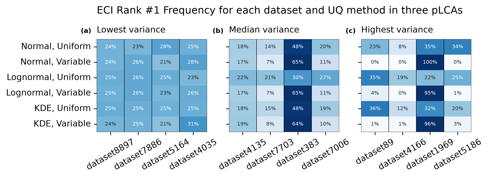

# Manuscript narrative: takeaways, arc, figures

**Version 3, 2026-10-05.** Version 2 answered the author's first review; this
answers the second. What changed: the journal limits are now the author's
numbers rather than an unverified search; **Figure 8 is built**; the cut figures
are embedded for the author to overrule; Figures 6 and 7 are answered on the
substance rather than defended; the mini case study is argued both ways with a
recommendation; a graphical abstract is proposed; and
**`reports/WRITING_STYLE.md` now exists** and is binding on the drafting.

Every number is from the tables on disk, on `corpus_2026-09-25` at
`weight_rho = 0.5`. **The repository is committed**: `4eec09f` for the
scorecard-cost correction that was already in the tree, `ab12066` for decision
252 and the eleven staleness fixes.

**The journal, from the author:** 10,000 words excluding references, **15
figures, 5 tables**. Seven figures and one table is less than half the figure
allowance, so the binding constraint is the word count. There is room for an
eighth figure if it earns its place.

---

## 1. What the study now says, against what the draft says

| The draft's contribution | What the rework makes of it |
|---|---|
| **1. KDE fits better than normal or lognormal** | Only above about 100 declarations. Below about 50 the three-parameter lognormal is better, and the switch between them IS the recommendation. **And there is now a one-line reason why**, section 2 takeaway 2 |
| **2. W1 predicts when weighting matters and predicts pLCA differences** | Survives, narrowed twice. Whether weighting matters has a closed form in two numbers a reader already has. And a fit advantage ATTENUATES by about an order of magnitude before it reaches a pLCA claim |
| **3. UQ method selection is important and substantially affects reduction strategies** | True, and the emphasis inverts. The choice matters most for a specification cap and least for a design comparison, the normal is the one clear loser, and **most of the error is shared by all six methods and no choice removes it** |

**The one thing the draft cannot do and the rework can.** Every synthetic dataset
has a known parent, and every probabilistic LCA is run twice on the same random
draws, once with fitted models and once with the true parents. So the paper can
say how WRONG a method is, not only how different two methods are.

---

## 2. The takeaways, ranked

### 1. A probabilistic LCA is wrong by about a quarter whatever method you pick, and most of that no choice of method removes

Pooled over the fifteen claims a probabilistic LCA makes, as a percentage of each
claim's own true level: the best available choice **23.9**, the size rule
**24.0**, a kernel estimate everywhere **24.7**, a three-parameter lognormal
everywhere **24.7**, a normal everywhere **32.5**. Per claim, the part of the
error that EVERY method makes together runs from 5.9 percent of the true level
for the chance of meeting a budget to **44.6** for the uncertainty index.

**So what:** if you run a probabilistic LCA today, expect the numbers to be out
by roughly a quarter. Choosing the best available method instead of the worst
sensible one gets about one point of that back. Choosing a normal costs eight.

Decisions 174, 230, 246, 247.
`python -c "import pandas as pd; d=pd.read_csv('outputs/tables/TABLE_ClaimScorecardWithRule.csv'); print((d.pivot(index='claim',columns='method',values='total_error')*100).mean().round(2))"`

**The author's instruction, 2026-10-05: this is to be emphasized throughout.**
It is the reframing the draft most needs, and the draft inverts it.

### 2. The flexible methods win because the rigid ones cannot match spread and skew at the same time, and that is one line of algebra

For a two-parameter lognormal, **skewness = CV^3 + 3 CV**, identically. Match
the spread and the skewness is decided for you. So the two-parameter lognormal
has **no free shape parameter at all** -- the same disability as the normal's
skewness fixed at zero, not a milder version of it. The third parameter escapes
because **skewness is shift-invariant**: sigma sets the skewness and the
threshold then sets the coefficient of variation independently. A kernel
estimate constrains neither.

Measured on the real categories with ten or more declarations: **only 21.3
percent have a skewness within 25 percent of what a two-parameter lognormal of
their own spread must have.** The median category is 0.58 times as skewed as the
curve requires; 23.6 percent are more skewed. Real ECC data misses the curve in
both directions.

And the ladder predicts the study's own ordering before any fit is run. Against
the known parent, median gain over the two-parameter lognormal: at 100-999
declarations the three-parameter lognormal is **22.9 percent** closer and the
kernel estimate **33.2**; above 1,000, **25.0** and **48.1**.

**So what:** a lognormal curve has one dial for how spread out it is and that
same dial also sets how lopsided it is. Real embodied carbon data does not
oblige. Adding a third parameter, or using no curve at all, lets the model match
both at once, and that is the whole reason the flexible methods win.

Decision 252, discrepancy entries 187 and 188.
`python audits/lognormal_variants.py 1500`

**This is new, and it came from the author's question about imposed shape.** The
paper currently asserts the ordering and never explains it.

### 3. The rule a reader can actually follow is one number: count your EPDs

Uniform weights throughout, a kernel estimate at or above the cutoff, a
three-parameter lognormal below. **The cutoff is 40 to 170 declarations** and
every value in that band is indistinguishable from the best. The rule is closest
of the four options a reader can choose on **10 of 15** claims, and pooled it is
as good as knowing in advance which fixed method would win each claim (23.96
against 23.92).

**So what:** count the EPDs you have for a material. Above about a hundred, use a
kernel density estimate; below about fifty, fit a three-parameter lognormal; in
between it does not matter which.

Decisions 204, 216, 217, 220, 224, 225.

**No single-declaration cutoff is published anywhere** (decision 225).

### 4. Knowing market shares is worth four times what the rule is worth, and nobody publishes them

Giving the same rule the true market shares above the cutoff takes the pooled
error from **23.97 to 20.89 percent** of the true level: **3.08 points, or 12.8
percent of what was there.** The rule itself is worth 0.7 points.

**So what:** a probabilistic LCA is wrong by about 24 percent today. Knowing
exactly how much of each product is actually built would take that to 21. That
is four times what any choice of curve is worth.

Decisions 217, 221, 252. Entry 183.

**The author's instruction: the Discussion must go further than reporting this**
and say critically what kinds of data would most improve probabilistic LCA.
Section 3 carries the shape of that argument.

### 5. Market share does not merely fail to help below about eighty declarations; it actively hurts

Share of datasets on which the market-weighted fit is CLOSER to the truth than
its own uniform-weighted twin: **32.8 percent** at 3 to 9 declarations for the
lognormal and 38.5 for the kernel -- so at the bottom it is wrong about twice as
often as it is right -- **53.6 and 52.7** at 81 to 99, **78.7 and 76.2** above a
thousand. The Kish effective sample size has a median of **2.8** at 3 to 9
declarations, with 92.4 percent of such datasets below five effective
observations.

**So what:** with nine EPDs, two of which are the product holding ninety percent
of the market, weighting by market share rests your whole answer on two numbers.
It is aimed at exactly the right question and it is wild. You are better off
ignoring the shares until you have enough declarations inside the products that
dominate the market.

Decisions 212, 215, 219, 222, 252.
`python audits/weighting_location_shape.py --n 2000`

**Three things the paper must get right or a reviewer reads it as a modeling
error.** The crossover is in the MEAN, not the shape. It is not the kernel's
effective sample size -- the lognormal has no bandwidth and shows the same
crossover. And **the synthetic comparison is ignoring a KNOWN share against
using it, not guessing against knowing**: the weight on each product group is
that group's true share to 1.1e-16.

### 6. Do not fit a normal distribution, and say which claim you mean

A normal is **35.8 percent** worse pooled than the best available choice, and
**50.6 percent** worse on a material's chance of being the largest contributor.
It is the worst of the seven policies on 13 of 15 claims. **And on the
uncertainty index it is the best of the four a reader can choose.**

**So what:** fitting a normal curve to embodied carbon data makes your estimate
of which material matters most about half again as wrong. The one question it
does not hurt is which material drives the uncertainty, and no method answers
that one well.

Decisions 109, 148, 198.

### 7. The decision a designer makes is robust; the number they report is not

At a claimed 5 percent saving the truth is **0.599**, the six methods span
**0.609 to 0.622**, and every method is within **0.023** of the truth -- on
average over 2,500 comparisons. On ONE comparison the median absolute error runs
**0.089 to 0.140** and the six disagree about which design is better on **28
percent** of comparisons. A contribution ranking needs the leader to exceed the
next by **2.28 against 2.33** times; the one real building element available
sits at **1.02**.

**So what:** compare two designs many times and any of these methods is right on
average. Compare two designs within a few percent of each other and the method
you picked decides the answer.

Decisions 107, 118, 157, 162, 171, 172, 252.

### 8. A goodness-of-fit result overstates what the better method buys

The kernel estimate overtakes the three-parameter lognormal on fit at **81
declarations**, 68 to 106 indistinguishable. At the claim level the whole band 40
to 170 is flat and the entire sweep from 3 to 10,000 moves the pooled error by
0.78 points. The mechanism: a pLCA picks one method for all four of its
materials, so one material's advantage is averaged against three neighbors.

**So what:** a curve that fits your data better does give a better answer, but
much less of one than the fit statistic suggests.

Decisions 163, 166, 204.

**The author: "this is an important update from the previous manuscript."**

### 9. Which material drives the uncertainty is the one answer every method agrees on and every method gets wrong

NRMSE between methods **0.55**, the lowest of the main outputs, against 1.09 for
a rank-1 frequency. Recovery error against the truth **48.6 to 49.8 percent**,
the worst of the fifteen claims, and **44.6 points of that is error every method
makes together.** The cause is dataset size: a variance estimated from nine
declarations is badly understated, and a variance share has to sum to one.

**So what:** every method tells you the same thing about which material drives
your uncertainty, and all of them are about half wrong. Agreement between methods
is not evidence of accuracy.

Decisions 146, 159. Entry 186.

### 10. What the choice costs, per decision, by question

Mean over method pairs of the absolute difference in ONE decision, as a
percentage of the claim's true level: a specification cap's chance of delivering
**37.3**, how often it binds **36.4**, which material is largest **33.0**, the
uncertainty index **27.3**, down to the chance of meeting a budget **5.5**.

Decision 174, entry 186. **Every one is the error in ONE decision**; the averaged
form is 1.1 to 12.7 times smaller and must never be quoted as "the method is
right" (decision 207).

### 11. A better fit does give a better answer, and not by as much as the fit suggests

Within a material, ranking the six methods by how well they fit and by how wrong
their answer is gives a median rank correlation of **+0.83**, positive on **88.2
percent** of the 10,000 materials; the best-fitting method is also the most
claim-accurate **42.8 percent** of the time against a 16.7 percent chance level.
What does not transfer is the magnitude: a fit threshold of 81 declarations
becomes a claim-level band of 40 to 170 inside which the choice is worth almost
nothing.

**So what:** there is no check you can run on your own data to find out whether
your choice of method is going to matter for your building. Follow the rule
precisely because you cannot tell.

**The author proposed this takeaway and it is a summarizing one**, which is what
they guessed: it connects takeaways 8, 9 and 10 and it is where the draft's
retired second contribution lands rather than being quietly dropped. **It goes
last in the Results and feeds the Conclusion.** Full numbers, the correction to
decision 166 and the reproduce command are in section 6.

---

## 3. The narrative arc, section by section

**Introduction.** The gap it names changes: not "nobody has compared UQ methods"
but **"nobody has been able to say how wrong a UQ method is, only how different
two of them are, because nobody has had the right answer."** The pedigree
paragraph gains a measured fact: the matrix spans a geometric standard deviation
of 1.02 to 1.59 while a median real ECC category sits at 1.87, so **61.9 percent
of real categories are more dispersed than its worst possible score** (decision
194). It quantifies a different thing and the paper should say so.

**Methods.** Six methods; 147 real EC3 categories holding 116,766 declarations;
10,000 synthetic datasets stratified over four size bands whose **true parent is
known**; two evaluation levels -- fit against the known parent, and every pLCA
run a second time against the true parents on the same uniform draws. The
fifteen claims are introduced here, grouped by the five questions a reader asks.
**The shape algebra of takeaway 2 belongs here or at the head of the results.**

**Results 1: what a probabilistic LCA gets wrong, and how much of it the method
choice owns.** Takeaways 1, 6, 9, 10. The scorecard.

**Results 2: which method to use, and why.** Takeaways 2, 3, 8.

**Results 3: what not knowing market shares costs.** Takeaways 4 and 5.

**Results 4: what survives to the decision.** Takeaway 7.

**Discussion.** Six drafted limitations invert into findings; CLAUDE.md carries
that table row by row. Then the three the rework ADDS. **Then the data-collection
argument the author asked for, which the measurements now support in a specific
order:**

1. **Market-share data is worth 3.08 of the 24 points** (takeaway 4). The
   largest single lever measured, and it is not a method.
2. **It only pays above about eighty declarations** (takeaway 5), so publishing
   shares without also deepening the declaration count for the dominant products
   would not help and could hurt.
3. **Grouped shares are a far more realistic information state than full shares**
   and close part of the gap; KL2's group weight constraints are the instrument
   and the corpus can bracket the question (decision 226). Future work, stated in
   generalities.
4. **An industry-average EPD would be the one published production-weighted
   number**, and the frozen extract contains none -- all 120,280 records are
   product EPDs (decision 176). That is a concrete ask of the EPD programs.
5. **More declarations alone has a floor.** A uniform-weighted fit flattens at
   0.084 against a floor of 0.099, which is the distance between the population
   that publishes and the population that gets built. **No quantity of EPDs takes
   it below that floor** (decision 219). Only share information does.

Plus the two remedies the paper names without adopting: upper truncation
(decision 199) and the mixed policy's own limits (decision 205).

**Conclusion.** The rule, the value of market-share data, and the sentence about
agreement not being accuracy.

---

## 4. The figure selection, with the topic sentences each one carries

**Seven figures and one table**, against an allowance of 15 and 5. Topic
sentences are written to the advisor's stated preference and to
`reports/WRITING_STYLE.md` principle 1: a claim with a number, first sentence of
the paragraph.

### Figure 1 -- the six methods on one real category
`FIG_PDFandCDFofUQMethods`

- "Each of the six UQ methods turns the same set of declarations into a
  different probability distribution, and the differences are largest in the
  upper tail where a carbon budget is written."
- "The three probability estimation methods differ in how much shape they are
  free to take: a normal distribution fixes the skewness at zero, a lognormal
  ties it to the spread, and a kernel density estimate constrains neither."

**Two author decisions taken.** It will be rebuilt on a REAL EC3 category rather
than `dataset2569`, so the methods section is concrete for the reader the paper
is trying to reach. And **the advisor's comment 369 is declined** -- he asked for
separate uniform and market panels; the figure stays as one panel per view,
because the family contrast is what the paper turns on and splitting by weighting
would bury it. **That declining is a deliberate disagreement and should be worth
one line in the response letter rather than silently dropped.**

### Figure 2 -- where the real categories sit inside the synthetic cloud
`FIG_MetricCoverage`

- "The 10,000 synthetic datasets span the statistical characteristics of the 147
  real EC3 categories on every characteristic tested, leaving four uncovered
  dataset-metric pairs out of 1,470."
- "Generating datasets rather than relying on the categories EC3 happens to hold
  is what lets this study measure accuracy against a known answer, and it is why
  the findings generalize past the 147 categories available."

**The author's question -- why these pairs, and why does CV appear twice --
already has an answer in the cell and not in the caption.** The six pairs are
the leading characteristics of the principal components computed earlier in the
notebook, paired so that each panel shows two characteristics that are NOT
redundant with each other, plus two pairs of direct interest to the study:
dataset size against the effect of weighting, and the two goodness-of-fit
statistics against each other. The coefficient of variation appears twice
because it loads on two different components. **That justification moves into
the caption.** The title is descriptive rather than a takeaway and is rewritten
when the figure is finalized.

### Figure 3 -- the centerpiece
`FIG_ClaimScorecard`

- "Across the fifteen claims a probabilistic LCA makes, the best method a
  practitioner can choose is still wrong by 23.9 percent of the quantity being
  claimed, and the choice between the three reasonable methods accounts for less
  than one point of that."
- "Fitting a normal distribution is the one choice that carries a real penalty,
  costing 35.8 percent of the pooled error and 50.6 percent on the question of
  which material contributes most."
- "What the choice of method costs depends entirely on which claim is being
  made, running from 5.5 percent of the true level for the chance of meeting a
  carbon budget to 37.3 percent for what a specification cap will deliver."
- "Which method is closest to the truth inverts at about a hundred declarations
  on both axes at once, from a lognormal with uniform weights below to a kernel
  estimate with market weights above."

**Seven layout fixes the author asked for, all mechanical and all cheap at 27
seconds a render:** lower the title and subtitle to cut the white space; left
justify "what a reader can choose" and "what market shares would buy" to the
left edge of their heatmap blocks; add "(%)" to the bar label; break the title
after "available" or shift the whole figure left to use the space the y tick
labels create; and drop the leading "and" from the lower panel's title, which
continues a sentence that is not there.

**One substantive change, and the author is right that it is a missed
opportunity.** The bar currently draws `pair_mean`, a mean over method pairs of
the per-decision difference -- a binned mean where the underlying quantity is a
distribution over 2,500 buildings. **Replacing it with that distribution is both
better and cheap**: the per-pair per-decision differences already exist row by
row in the truth run, and `TABLE_ClaimChoiceCost.csv` already carries
`pair_best`, `pair_mean` and `pair_worst` as a three-point summary of it. A
horizontal strip or a ridgeline per claim would show that on the uncertainty
index the typical pair differs by 27 percent and the worst by 40, and that on
the chance of meeting a budget the whole distribution sits under 9. **That is a
new figure panel and needs a notebook cell; it is the single highest-value
figure change outstanding.**

**And on the phrasing**: "what the choice costs in one decision" is doing two
jobs badly. It means "if you had picked a different one of these methods for
this one building, how different would this number have been". Candidate
replacement: **"how much the answer moves if you pick a different method (%)"**.

### Figure 4 -- the rule, and what market-share data would buy
`FIG_MixedPolicy`

- "Switching distribution family by dataset size beats using either family
  everywhere, at any cutoff between 40 and 170 declarations."
- "Where exactly the cutoff sits is worth a fifth of what having the rule at all
  is worth: the entire sweep from 3 to 10,000 declarations moves the pooled error
  by 0.78 points, of which 0.70 is the rule beating the best fixed method."
- "Knowing the true market share of every product would reduce the error of a
  probabilistic LCA by 3.08 points of the 24 it carries, which is four times what
  any choice of fitting method is worth and is an argument for collecting
  production volumes rather than for a better curve."

### Figure 5 -- which method is closest, by category size
`FIG_WhenToUseWhich`

- "No single UQ method is closest to the truth across the range of dataset sizes
  that real ECC categories span, and which one leads changes twice."
- "The kernel estimate overtakes the three-parameter lognormal at 68 to 106
  declarations on goodness of fit, and that crossing is much less sharp once the
  fit is carried through to a probabilistic LCA claim."

**First candidate for cutting if the word count binds**, because Figure 3's lower
panel carries the same inversion at the claim level.

### Figure 6 -- when a ranking claim is safe
`FIG_MaterialDominance`

- "A contribution ranking is only safe to report once the leading material's mean
  contribution exceeds the next by a factor of about 2.3, and the one real
  building element available in the literature sits at 1.02."
- "A dominant material protects the ranking and does nothing for the magnitude:
  the error in a material's estimated contribution is unchanged across the whole
  range of dominance."

**The author's complaints are all correct and the figure is salvageable.** The
shouting capitals go; the super title gains a break before "leaves"; the two
faint gray notes come out entirely -- "the two vertical lines are the deliberate
10:1 and 100:1 test cases" and "1.0% of groups lie further right" are both
apparatus rather than message; and the y labels become **"pLCAs whose leader
changes (%)"** and **"change in a material's contribution"** instead of the
two-line sentences they are now.

**But the real question is whether it earns a slot, and here is the case each
way.** FOR: the safe-lead ratio is the paper's second practitioner rule, it is
the only result that tells a reader when a contribution ranking is trustworthy,
and the 1.02 anchor from Marsh et al. is the paper's single piece of real
building evidence. AGAINST: the top panel is a monotone decline to zero that a
sentence states exactly as well, and the bottom panel's message -- that the
magnitude does not improve -- is a flat line, which is an expensive way to draw
"nothing happens". **Recommendation: cut the figure and keep both findings as
two sentences with the numbers in them.** A flat line and a monotone decline are
the two shapes that do not need a figure. The author's instinct is right.

### Figure 7 -- which categories can assume uniform weights
`FIG_WeightingDrivers`

**THE AUTHOR'S QUESTION EXPOSES A REAL CONTRADICTION IN THE FRAMING, AND
ANSWERING IT PRODUCES A BETTER RESULT THAN THE FIGURE CURRENTLY CARRIES.**

The apparent contradiction: this figure says uniform weights are unsafe for 134
of 147 categories, and takeaway 5 says market weights actively hurt below about
80 declarations. Both are true and they measure different things.

- This figure measures **sensitivity**: how far the fitted distribution moves
  when market weights are applied instead of uniform ones. For 134 categories it
  moves by more than the amount that changes which material leads 5 percent of
  the time.
- Takeaway 5 measures **accuracy**: whether applying the weights gets you closer
  to the truth. Below about 80 declarations it does not.

**So "safe" is the wrong word and it invites exactly the wrong inference.** As
drawn, a reader concludes "uniform is unsafe down here, so I should weight down
here", which is the opposite of the recommendation.

**The honest joint statement is stronger than either piece, and it is a number
nobody had computed:**

    of the 134 real categories where market shares matter enough to change
    the answer, 93 -- 69 percent -- hold too few declarations for using a
    drawn share to help

For those 93 categories the uncertainty from missing market-share data is
**irreducible by modeling**. Only more declarations in the products that dominate
the market, or published shares, closes it. **That is the strongest version of
the data-collection argument in the whole paper** and it belongs in the
Discussion as section 3 item 2.

**The redesign that follows from it**, which answers every one of the author's
objections at once: keep the same axes, which are already n and coefficient of
variation; keep the fitted line, which is decision 96's law
`log(separation) = -0.318 - 0.434 log(n) + 1.035 log(CV)` at R2 = 0.991 and
should be stated in the caption rather than left mysterious; **add a horizontal
line at n = 80** and label the four quadrants with their counts. Drop the
colorbar entirely -- it encodes a third variable the quadrants now carry, its
label "how far the fit moves" is vague, and `viridis_r` is multi-hue for a single
variable, which the author is right to object to. And **use one word for the
count**: the figure currently says "ECCs" on one axis and "EPDs" on the other for
the same thing, which `WRITING_STYLE.md` section 5 now forbids.

**Recommendation: keep the figure and rebuild it as that 2x2.** It is the only
figure carrying the weighting result on real materials, and the rebuilt version
makes a claim the current one cannot.

### Figure 8 -- why the rigid families lose. NEW, BUILT 2026-10-05
`FIG_ShapePlane`

- "A two-parameter lognormal has no freedom to choose its shape: once its spread
  is matched to the data, its skewness is fixed at CV^3 + 3 CV, so every dataset
  it can represent exactly lies on a single curve."
- "Only 27 of 127 real ECC categories sit within 25 percent of that curve, and
  the median category is 0.58 times as skewed as a lognormal of its spread
  requires, so the family is systematically the wrong shape for this data."
- "The third parameter escapes the constraint because skewness is shift
  invariant: the threshold moves the coefficient of variation and leaves the
  skewness alone, so a three-parameter lognormal can match both at once and a
  kernel density estimate constrains neither."

**The author expected not to like it.** What it is doing well: the points sit
visibly BELOW the curve at low spread, the constraint is a single clean line, and
the title states the finding rather than describing the plot. What a reader has
to be told: the dark points are the 27 on the curve, and the y axis is symmetric
log because eight categories are left skewed. **If it is cut, the algebra and the
21.3 percent survive as two sentences and lose little** -- the equation is the
finding, and the figure is an illustration of it rather than evidence for it.

### What is cut, with the figures, so the author can overrule

**`FIG_W1DistanceAndRank` -- the draft's Figures 2 and 3 merged.**

It scores every method against the variable-weighted empirical CDF **of the data
it was fitted to** -- the training data, and the variable-weighted curve, so
"market weighting improves fit" is close to true by construction. The author has
ruled it does not go to the supplement either: there is no before and after.
**This is the biggest single loss in the figure set** -- it is handsome, it
covers both arms, and it is what the draft leads with. It is also the circular
result.

**`FIG_W1VsSurvivors_Synthetic` -- the draft's Figure 4, rebuilt.**

The reduction says twenty-one marginal panels are worth about two quantities, and
comments 675, 766, 767 and 772 all say the figure is unreadable. It is also
in-sample. Note it has no x axis labels on any panel, which is a defect in itself.

**`FIG_ScatterPlot_UQResults_Subset` -- the draft's Figure 5.**

Method against method, which the run against the true parents supersedes: it can
show that two methods disagree and never which one is right.

**The three-pLCA case study -- the draft's Figures 6 and 7. CUT BY AUTHOR
DECISION.**

Two of the three groups are extremes selected out of 2,500 -- the lowest and
highest variance -- which are the least representative groups available. See the
next section for what replaces the teaching job they were doing.

---

## 4b. The mini case study: the argument both ways

**The author reopened this and asked for both sides and a recommendation.**

**FOR.** The paper is abstract from end to end: 10,000 synthetic datasets, every
material normalized to a mean of 1.0, every intensity 1.0. A building designer
has nothing concrete to hold. The advisor's covering instruction is to teach and
to add a sentence where meaning is at risk, and a worked example is the strongest
teaching device available. Building and Environment's readership will not follow
a scorecard of fifteen claims without one instance of what a claim IS. And every
ingredient already exists.

**AGAINST.** The three-pLCA version was cut because two of its three groups were
maxima out of 2,500. The word count is 10,000 including figures and tables, and a
case study costs perhaps 800 words and a figure. The paper's central claim is a
distribution over 2,500 probabilistic LCAs and one example cannot support it,
while looking as though it does. **And the decisive objection: a worked example
on REAL materials has no known parent, so it can show what the six methods
disagree about and cannot show which one is right** -- which is the author's own
6.5 caution applied here.

**RECOMMENDATION: yes to a worked example, no to a case study section, and the
two differ in exactly one way -- the example never carries an accuracy claim.**

Thread one real four-material building through the paper rather than giving it a
section. The materials are available and a designer names all four:
`ReadyMix [4000-4999 psi]` at 31,025 declarations, `Gypsum` at 771,
`RebarSteel` at 204, `BlanketInsulation [mineral wool]` at 184. Introduce it in
the Methods as the thing Figure 1 draws, and refer back to it once in each
Results subsection -- what the six methods say its total is, which material each
names as largest, what a specification cap would deliver. **Every accuracy claim
stays on the synthetic arm where the truth exists**, and the text says so once.

**It costs no separate section, no separate figure, and about 250 words**,
because Figure 1 is already being rebuilt on a real category and this makes that
choice carry the whole paper instead of one panel. A reader gets a thread; the
paper gives up nothing.

**One gap to close before writing it:** those four categories all sit above the
cutoff, so the size rule would not bite on this particular building. Either pick
a fourth material below 40 declarations, or use the building to illustrate the
claims and make the rule's bite a separate sentence. **Author's call, and it is
the only open question in this proposal.**

---

## 4c. The graphical abstract

**The existing one is `image1.png` inside the docx and reads cleanly**: three
panels, STEP 1 generate 10,000 synthetic ECC datasets, STEP 2 apply 6 UQ methods,
STEP 3 compare goodness-of-fit and pLCA results.

**Its third panel is the problem.** It asserts "KDE has the best mean fit", which
is the in-sample circular result the paper no longer reports, and "Key results
differ between UQ methods", which the advisor says is hard to interpret (comment
139) and which is no longer the headline. Panels one and two need units and a
legend (comments 137, 138).

**Proposed replacement, same three-panel structure because it works:**

| | Now | Proposed |
|---|---|---|
| **1** | three strip plots of synthetic datasets, no x axis | **"We generate 10,000 datasets whose true distribution we know"** -- one dataset drawn from a parent, with the parent curve behind it, x axis labeled ECC / mean ECC. The known truth is the paper's whole method and panel 1 should say so |
| **2** | the six fits in a 3x2 grid | **Keep, with the retired vocabulary fixed** -- "uniform weights" and "market weights", not "Uniform Weighting" and "Variable Weighting" |
| **3** | two bar/heat charts with retired claims | **"A probabilistic LCA is wrong by about a quarter, and here is what you can control"** -- a single stacked bar: the error the best available method still makes, plus what the choice of method adds, plus what market-share data would buy. Three segments, three numbers, one message |

**Panel 3 is the paper in one picture** and is a simplification of Figure 3's
own logic rather than a new analysis. It is a PowerPoint rebuild, not a notebook
figure, so it does not touch the repository.

## 5. The eleven stale places: fixed

All eleven are closed. Recorded as **decision 252** and discrepancy entries
**187** and **188**. What moved:

| | What was wrong | What was done |
|---|---|---|
| 1 | The safe-lead ratio was 2.13 in decisions 107 and 144; the tables say 2.28 against 2.33 at four materials | Superseding notes on both entries; current values in decision 252 |
| 2 | Every pooled figure in the log is over SIXTEEN claims; the scorecard is fifteen | Decision 252 restates them; entry 183 corrected to 23.97 / 20.89 / 3.08 points |
| 3 | The "CURRENT CANONICAL NUMBERS" block says it beats anything below it, and is pre-regeneration | Header added saying it is a dated record, not a live reference |
| 4 | The two-parameter lognormal comparison was on the superseded corpus and unstamped | **Re-run. It got stronger**: 33 to 48 percent above 100 declarations, against decision 167's 31 to 41. The script now stamps corpus and weight rule |
| 5 | Decision 218's known-share band of 50 to 100 predates the band-rule fix | Note added: it is 50 to 110; the published range is the feasible rule's 40 to 170 either way |
| 6 | Seven tables in `outputs/tables/` had **no producer anywhere in the repository** and were dated 2026-09-17 to 09-21 | Deleted, per decision 56's own precedent. `CONTEXT.md` attributed five of them to notebooks that do not write them; the inventory now names `audits/metric_reduction.py` and points at the `AUDIT_*` copies in the right directory. **No table in `outputs/tables/` now predates the regeneration** |
| 7 | `FIG_PLCATruth` printed the retired word "Variable" in its row labels | Cell now maps through `fitting.display_method`; figure redrawn in 7 seconds with the renderer |
| 8 | `TABLE_FiveStatements.csv` called the quantity reduction "method-independent" with no qualifier | Cell note corrected. **The table on disk keeps the old wording until notebook 3 next runs** -- it is a prose column, not a number, so nothing was re-run for it |
| 9 | Decision 65 forbids comparing weighting schemes cross-validated, and its exchangeability premise died with decision 190 | Recorded in decision 252 as an open question. No number moves |
| 10 | The empirical arm's headline moved and now contradicts the draft | Recorded: the lognormal is closest on 53.6 percent of the 127 categories against the kernel estimate's 26.0 |
| 11 | Decision 2 said 98 comments from named third parties | Corrected: 97, all from one author |

**The full test suite passes after every change: 632 passed in 200 seconds**,
including the notebook, renderer and figure-manifest guards that would fail on an
orphaned file or an undeclared second Generator.

    python -m pytest tests/ -q

---

## 6. Author decisions: what is settled, what is left

### Settled

- **The feasible rule is the recommendation**; the known-share rule reports what
  knowing market shares would buy, and ties to the data-collection argument.
- **The three-pLCA case study is cut**, and a running real-material example
  replaces the teaching job it was doing (section 4b).
- **The in-sample W1 figure is cut outright**, not moved to the supplement.
- **No specific certification credit is cited.** The paper says green building
  certifications ask for percentage reductions and that the probabilistic
  extension is a percentage reduction at a stated likelihood.
- **The graphical abstract is rebuilt** (section 4c).
- **Figure 1 moves to a real category and the advisor's comment 369 is
  declined.**
- **The eleven stale places are fixed** and committed.
- **Journal: 10,000 words excluding references, 15 figures, 5 tables.**
- **6.1 is Option C**, and the author is right that it is not an either/or:

  > "The choice of UQ method changed what a probabilistic LCA reported by up to
  > 37 percent of the quantity claimed, and which choices matter is now measured
  > rather than assumed. Fitting a normal distribution costs 36 percent of the
  > error; switching family by dataset size buys 3 percent; and the largest lever
  > is not a method at all but market-share data, worth 13 percent. What no
  > choice of method removes is the remaining three quarters of the error."

  Both halves are in it. The paper says the choice matters AND that it is
  bounded, in that order, because the bound is only interesting once the reader
  believes the choice matters.

- **6.3: the demotion of W1 as a predictor is confirmed.** W1 stays as the
  criterion the study scores on and loses its billing as a predictor of
  downstream consequence. **And the author's follow-up is right that this wants
  its own takeaway**, which is now takeaway 11 below.
- **6.5: report the empirical size-rule result briefly, qualified.** It beats
  always-using-a-kernel-estimate by 8 percent and ties always-using-a-lognormal
  at every cutoff from 40 to 300. **The qualification travels in the same
  sentence: the empirical arm has no known parent, so it shows the comparison is
  not an artifact of synthetic data and it cannot validate the rule.**
- **6.6: the three-parameter advantage is a result to write**, 22.9 and 25.0
  percent closer than the two-parameter fit above 100 declarations.
- **6.11: the citations are recorded.** Torres, M. I., Lupton, R., Marsh, E.,
  Srubar III, W. V., & Allen, S. (2026), RC&R 234,
  `https://doi.org/10.1016/j.resconrec.2026.109022`; software
  `https://doi.org/10.5281/ZENODO.19246154`. **One thing to check:** CLAUDE.md
  decision in the project brief carries the KL2 code DOI as
  `10.5281/zenodo.19246153`, one digit different from the author's
  `...19246154`. Zenodo mints a concept DOI and a version DOI that differ by
  one, so both are probably real and refer to different things; **the paper
  should cite the one the author gave.** The project brief is updated to match
  and to flag the pair.
- **Comments 528, 541, 592, 74, 98 and 491 are closed by author ruling**: 528,
  541 and 592 rest on superseded results, so take the style point and not the
  content; 74 and 98 are not worth the attention during a rewrite this large;
  491 is covered by writing the section properly.
- **The style guide exists**: `reports/WRITING_STYLE.md`, binding.

### The new takeaway the author proposed, which is takeaway 11

The author: *"Since W1 distance didn't end up mattering as a way to predict how
good your fit was or how much that would matter for the pLCA, should one of our
takeaways be something along the lines of 'it's hard to know how much your choice
will matter, but here's our best guidance'?"*

**Yes, and it is a summarizing takeaway rather than a separate finding, which is
what the author guessed.** It is the one sentence that connects takeaways 8, 9
and 10, and it is honest in a way the draft is not:

> **11. A better fit does give a better answer, and not by as much as the fit
> suggests -- so you cannot tell in advance how much your choice will matter.**
> Within a material, ranking the six methods by how well they fit and by how
> wrong their answer is gives a median rank correlation of **+0.83**, positive on
> **88.2 percent** of the 10,000 materials, and the best-fitting method is also
> the most claim-accurate **42.8 percent** of the time against a 16.7 percent
> chance level. What does NOT transfer is the magnitude: a fit threshold of 81
> declarations becomes a claim-level band of 40 to 170 inside which the choice is
> worth almost nothing, and a dataset's own characteristics explain almost none
> of the error in its chance of leading, because that is a property of the group
> of four. **So the guidance is a rule that does not require knowing in advance:
> count the declarations, switch family at the cutoff, never fit a normal, and
> treat every number as carrying about a quarter of relative error.**

**These three figures are recomputed on the shipped corpus and are stronger than
the ones in the decision log.** Decision 166 records +0.600, 82.2 percent and
39.0 percent from a Stage 2g measurement on the superseded corpus whose table was
one of the seven orphans deleted in decision 252. Quote these.

    python -c "
    import pandas as pd, numpy as np
    from scipy.stats import spearmanr
    sc = pd.read_csv('outputs/tables/TABLE_MethodScores.csv')
    sc = sc[sc.arm == 'synthetic'][['dataset', 'method', 'w1_market']]
    t = pd.read_csv('outputs/tables/TABLE_PLCATruth.csv.gz',
                    usecols=['dataset', 'method', 'truth_parent', 'eci_mean__error'])
    m = t[t.truth_parent == 'market'].merge(sc, on=['dataset', 'method'])
    m['claim'] = m.eci_mean__error.abs()
    r = [spearmanr(g.w1_market, g.claim).statistic for _, g in m.groupby('dataset')]
    b = [g.loc[g.w1_market.idxmin(), 'method'] == g.loc[g.claim.idxmin(), 'method']
         for _, g in m.groupby('dataset')]
    print(np.median(r), 100 * np.mean(np.array(r) > 0), 100 * np.mean(b))"

**So what:** there is no diagnostic you can run on your own data to find out
whether your choice of method is going to matter for your building. The rule is
worth following precisely because you cannot tell.

**It goes last in the results and feeds the conclusion**, and it is where the
retired second contribution lands rather than being quietly dropped.

### Still open

1. **The worked example's fourth material.** All four recognizable candidates sit
   above the cutoff, so the size rule would not bite on that building. Pick a
   fourth below 40 declarations, or keep the example for the claims and make the
   rule's bite a separate sentence. Section 4b.
2. **Figure 6: cut, as recommended, or rebuild?** The recommendation is to cut it
   and keep both findings as sentences, because a flat line and a monotone
   decline are the two shapes that do not need a figure.
3. **Figure 8: keep?** The author expected not to like it. It is built and
   embedded in section 4 so the judgment can be made on the thing rather than the
   description.
4. **The Figure 3 distribution panel**, which is the highest-value figure change
   outstanding and needs a notebook cell.
5. **Figure 5: keep at seven figures, or cut to six?** It overlaps Figure 3's
   lower panel at a different level.

---

## 7. The advisor's markup, and what was built from it

All 97 comments are from Wil V. Srubar III, 2026-08-21 to 2026-08-31.
**`reports/WRITING_STYLE.md` is the durable product of reading them** and is
binding on the drafting the way `FIGURE_STYLE.md` is binding on figures. It
carries the nine consolidated principles, the voice convention that retires
"this study" as a subject, the advisor's own habits to write toward, the habits
to drop, the controlled vocabulary, the rules for numbers in prose, and a
one-line test to run before any section is handed over.

**The structural asks the rework already answers:**

| Comments | What they ask for | What answers it |
|---|---|---|
| 72, 73, 96, 97, 119 | "not ready to digest this result", "most important for what?" | The five-question frame: every claim named in a reader's words with a number and a true level |
| 282, 316, 542 | "stress generalizability", three times | Figure 2, and the known-parent evaluation |
| 675, 738, 759, 764, 766, 767, 772 | Figure 4 is cluttered; synthesize; order by importance | The reduction: twenty-one panels are worth two quantities. Figure cut |
| 756 | "more important to consider X versus Y" | Takeaway 5 and Figure 7 |
| 409, 439, 464, 468, 473, 474 | "I am getting lost"; "describe these as design scenarios" | The five questions name the actions as actions |
| 829, 867, 905, 911 | "Rank #1 Frequency" is confusing | Demoted to one of five questions |
| 891, 901 | The uncertainty index paragraph repeats itself | Takeaway 9 gives the mechanism |
| 362, 378 | Too much on the goodness-of-fit tests | KS and W2 to the supplement |
| 139, 137, 138 | The graphical abstract is hard to interpret and unlabeled | Rebuilt, section 4c |
| 765 | "harken back to Sabbie's paper" on small datasets | The size rule |

**The largest ask is principle 6** -- reorganize Results by importance of finding
rather than by figure-panel order, and rebuild the figures to match. Section 3's
arc and section 4's selection are that reorganization, and they are the reason
five of the draft's seven figures do not survive.

---

## 8. How to proceed

**This window should not draft prose.** The order from here:

1. **The author closes the five open items in section 6** -- the worked example's
   fourth material, Figures 6, 8 and 5, and the Figure 3 distribution panel.
2. **One window does the figure work**: Figure 1 onto a real category, Figure 3's
   seven layout fixes and its distribution panel, Figure 7's 2x2 rebuild, and
   whatever survives of 6 and 8. All of it is notebook-cell work at 7 to 30
   seconds a render, except the Figure 3 panel which is new code.
3. **Then a drafting window per section**, working from the topic sentences in
   section 4, the arc in section 3, `reports/WRITING_STYLE.md`, and the decision
   log. **Run the section-7 test of the style guide before handing any section
   over**: read only the first sentence of every paragraph, in order, and check
   that the sequence is a complete argument.

**Stay in Claude Code rather than moving to the web.** The reference PDFs are in
`refs/` here and nowhere else, the tables behind every number are here, and the
draft is readable in place from here.

**Two cautions for whoever drafts.**

**Quote the tables, not the decision log.** Section 5 records eleven places where
the two disagreed; the log was the stale side in every one. The log is the
history of how a number was arrived at.

**The advisor stopped editing partway through and said he wants to see how this
version responds before reading more.** The unreviewed final third of the draft
is therefore the real test, because it is the part no reviewer has already
repaired, and it is where the habits in `WRITING_STYLE.md` section 4 will show up
unaltered if they are not deliberately removed.
