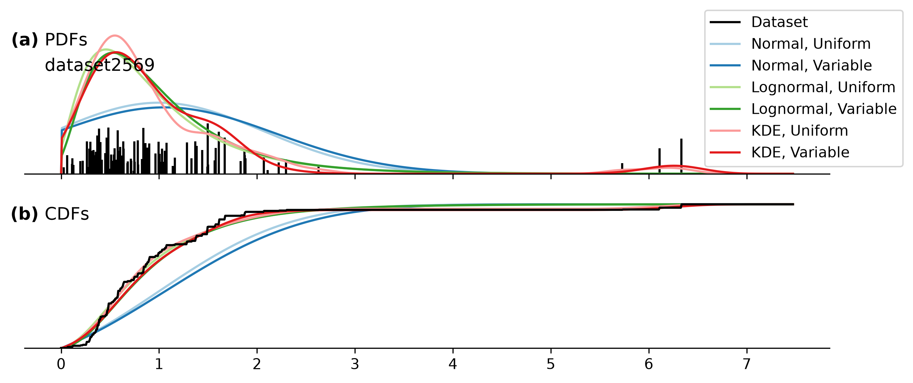
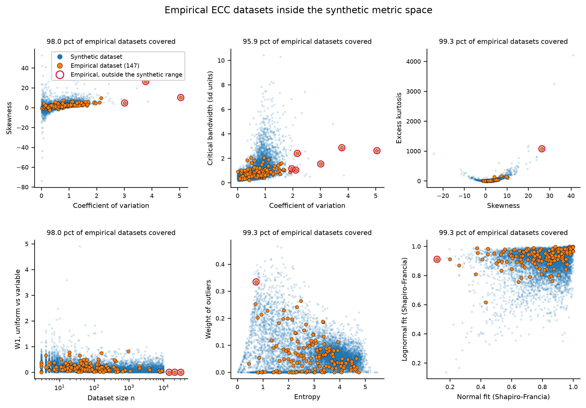

# Manuscript narrative

What the paper says, in what order, on which figures. Written to be read as the
plan itself rather than as a record of how it was arrived at; the history is in
the decision log and in `reports/MANUSCRIPT_discrepancies.md`.

Every number is from the tables on disk, on `corpus_2026-09-25` at
`weight_rho = 0.5`. **Building and Environment allows 10,000 words excluding
references, 15 figures and 5 tables**, so eight figures and one table is less
than half the figure allowance and the binding constraint is the word count.

`reports/WRITING_STYLE.md` is binding on the prose.

---

## 1. The thesis

Nobody has been able to say how *wrong* a UQ method is for building material
emissions -- only how *different* two methods are -- because nobody has had the
right answer to compare against. This study manufactures one: 10,000 synthetic
ECC datasets whose true distribution is known by construction, and a
probabilistic LCA run twice on the same random draws, once with fitted models
and once with the true distributions.

That lets the paper say three things the literature cannot. **A probabilistic
LCA misstates what it reports by about a quarter of the quantity being claimed,
and most of that no choice of method removes.** **Two choices do matter and are
measured: never fit a normal distribution, which costs 36 percent of the error,
and switch distribution family by dataset size, which buys 3 percent.** **And
the largest lever is not a method at all -- it is market-share data, worth 13
percent.**

---

## 2. The takeaways, ranked

### 1. A probabilistic LCA is wrong by about a quarter whatever method you pick, and most of that is shared

**Different claims are wrong by very different amounts and the paper must not
flatten that.** Under the recommended rule, as a percentage of each claim's own
true level, the error runs from **5.2 percent** on the chance of meeting a
carbon budget to **48.8** on the uncertainty index, with a median of 23.7 -- a
nearly tenfold range. The averages: the best available choice **23.9**, the rule
**24.0**, a kernel estimate everywhere **24.7**, a three-parameter lognormal
everywhere **24.7**, a normal everywhere **32.5**. Per claim, the part of the
error that *every* method makes together runs from 5.9 to **44.6**.

**So what:** how badly a probabilistic LCA misses depends far more on what you
ask it than on how you model it. Ask it whether a building meets a budget and it
is out by about 5 percent; ask it which material drives the uncertainty and it
is out by about 49. Choosing the best available method instead of the worst
sensible one gets about one point back on average; choosing a normal costs eight.

**The single "about a quarter" figure is the mean over the fifteen claims and is
a headline, not a result.** Wherever it appears the range goes with it.

Decisions 174, 230, 246, 247.
`python -c "import pandas as pd; d=pd.read_csv('outputs/tables/TABLE_ClaimScorecardWithRule.csv'); print((d.pivot(index='claim',columns='method',values='total_error')*100).mean().round(2))"`

### 2. The flexible methods win because the rigid ones cannot match spread and skew at once

For a two-parameter lognormal, **skewness = CV^3 + 3 CV**, identically. Match
the spread and the skewness is decided for you, so the family has **no free
shape parameter at all** -- the same disability as the normal's skewness fixed
at zero, not a milder version of it. The third parameter escapes because
skewness is shift invariant: sigma sets the skewness and the threshold then sets
the coefficient of variation independently. A kernel estimate constrains
neither.

Only **21.3 percent** of real categories with ten or more declarations have a
skewness within 25 percent of what a two-parameter lognormal of their spread
requires; the median is **0.58** times as skewed as the curve demands and 23.6
percent are more skewed, so the family is the wrong shape in both directions.

And the ladder predicts the study's own ordering. Against the known parent,
median gain over the two-parameter lognormal: at 100-999 declarations the
three-parameter lognormal is **22.9 percent** closer and the kernel estimate
**33.2**; above 1,000, **25.0** and **48.1**.

**So what:** a lognormal curve has one dial for how spread out it is, and that
same dial sets how lopsided it is. Real embodied carbon data does not oblige.

Decision 252, entries 187, 188, 189. `python audits/lognormal_variants.py 1500`

**This is what the field actually uses, and that is now sourced.** ecoinvent's
default is a two-parameter lognormal -- "the geometric mean and the geometric
standard deviation" (Muller et al. 2016, IJLCA 21:1327-1337) -- and the same
authors name "the imposition of the lognormal" as the first of three
limitations of the pedigree approach, and say that other distributions "are more
appropriate when they better represent the uncertainty associated with the
datum. Most often, this will be the case when the basic uncertainty has been
calculated based on available data." **The default is for the no-data case. This
paper is about the case where you have the data.**

### 3. The rule a reader can follow is one number: count your EPDs

Uniform weights throughout, a kernel estimate at or above the cutoff, a
three-parameter lognormal below. **The cutoff is 40 to 170 declarations**, every
value in that band indistinguishable from the best. The rule is closest of the
four options a reader can choose on **10 of 15** claims, and pooled it is as
good as knowing in advance which fixed method would win each claim (23.96
against 23.92).

**So what:** count the EPDs you have. Above about a hundred use a kernel density
estimate, below about fifty fit a three-parameter lognormal, in between it does
not matter which.

Decisions 204, 216, 217, 220, 224, 225. **No single-declaration cutoff is
printed anywhere in the paper.**

### 4. Knowing market shares is worth four times what the rule is worth

Giving the same rule the true market shares above the cutoff takes the pooled
error from **23.97 to 20.89 percent** of the true level: **3.08 points, or 12.8
percent of what was there**. The rule itself is worth 0.7 points.

**So what:** a probabilistic LCA is wrong by about 24 percent today. Knowing
exactly how much of each product is actually built would take that to 21 -- four
times what any choice of curve is worth.

Decisions 217, 221, 252. Entry 183.

### 5. Market share does not merely fail to help below about eighty declarations; it actively hurts

Share of datasets on which the market-weighted fit is *closer* to the truth than
its own uniform-weighted twin: **32.8 percent** at 3 to 9 declarations for the
lognormal and 38.5 for the kernel -- wrong about twice as often as right --
**53.6 and 52.7** at 81 to 99, and **78.7 and 76.2** above a thousand. Under
true weights the Kish effective sample size has a median of **2.8** at 3 to 9
declarations, with 92.4 percent of such datasets below five effective
observations.

**So what:** with nine EPDs of which two are the product holding ninety percent
of the market, weighting by market share rests your whole answer on two numbers.
It is aimed at exactly the right question and it is wild. Better to ignore the
shares until enough declarations sit inside the products that dominate the
market.

Decisions 212, 215, 219, 222, 252.

**Two things the paper must say or a reviewer reads this as a modeling error.**
The effect is in the estimate of the **mean**, not in the distribution's shape,
so it is not about kernels or bandwidths -- the three-parameter lognormal has no
bandwidth and shows the same crossover. And **the synthetic comparison is
ignoring a known share against using it, not guessing against knowing**: the
weight on each product group is that group's true share to 1.1e-16.

### 6. Do not fit a normal distribution, and say which claim you mean

A normal is **35.8 percent** worse pooled than the best available choice, and
**50.6 percent** worse on a material's chance of being the largest contributor.
It is the worst of the seven policies on 13 of 15 claims. **And on the
uncertainty index it is the best of the four a reader can choose.**

**So what:** fitting a normal curve to embodied carbon data increases the error
in your estimate of which material contributes most by about half. The one
question it does not hurt is which material drives the uncertainty, and no
method answers that one well.

Decisions 109, 148, 198.

### 7. The decision a designer makes is robust; the number they report is not

At a claimed 5 percent saving the truth is **0.599**, the six methods span
**0.609 to 0.622**, and every method is within **0.023** of the truth -- on
average over 2,500 comparisons. On *one* comparison the median absolute error
runs **0.089 to 0.140** and the six disagree about which design is better on
**28 percent** of comparisons.

A contribution ranking needs the leader to exceed the next by **2.28 against
2.33** times. **In 292 real North American buildings, 73 percent do not**: the
median building sits at 1.65 times, quartiles 1.24 and 2.33 (Benke et al. 2025,
A1-A3). The single staircase the literature previously supplied sits at 1.02,
near the tenth percentile.

**So what:** compare two designs many times and any of these methods is right on
average. Compare two designs within a few percent of each other and the method
you picked decides the answer.

Decisions 107, 118, 157, 162, 171, 172, 252.

### 8. A goodness-of-fit result overstates what the better method buys

The kernel estimate overtakes the three-parameter lognormal on fit at **81
declarations**, 68 to 106 indistinguishable. At the claim level the whole band 40
to 170 is flat and the entire sweep from 3 to 10,000 moves the pooled error by
0.78 points. The mechanism: a pLCA picks one method for all four of its
materials, so one material's advantage is averaged against three neighbors.

Decisions 163, 166, 204.

### 9. Which material drives the uncertainty is the one answer every method agrees on and every method gets wrong

NRMSE between methods **0.55**, the lowest of the main outputs, against 1.09 for
a rank-1 frequency. Recovery error against the truth **48.6 to 49.8 percent**,
the worst of the fifteen claims, and **44.6 points of that is error every method
makes together**. The cause is dataset size: a variance estimated from nine
declarations is badly understated, and a variance share must sum to one.

**So what:** every method tells you the same thing about which material drives
your uncertainty, and all of them are about half wrong. **Agreement between
methods is not evidence of accuracy** -- which is the general lesson of the
paper.

Decisions 146, 159. Entry 186.

### 10. What the choice costs, per decision, by question

Mean over method pairs of the absolute difference in one decision, as a
percentage of the claim's true level: a specification cap's chance of delivering
**37.3**, how often it binds **36.4**, which material is largest **33.0**, the
uncertainty index **27.3**, down to the chance of meeting a budget **5.5**.

Decision 174, entry 186. Every one is the error in **one** decision; the averaged
form is 1.1 to 12.7 times smaller and must never be quoted as "the method is
right".

### 11. A better fit does give a better answer, and not by as much as the fit suggests

Within a material, ranking the six methods by how well they fit and by how wrong
their answer is gives a median rank correlation of **+0.83**, positive on **88.2
percent** of the 10,000 materials; the best-fitting method is also the most
claim-accurate **42.8 percent** of the time against a 16.7 percent chance level.
What does not transfer is the magnitude.

**So what:** there is no check you can run on your own data to find out whether
your choice of method will matter for your building. Follow the rule precisely
because you cannot tell.

This is the summarizing takeaway and where the draft's retired second
contribution lands. **It goes last in the Results and feeds the Conclusion.**
Recomputed on the shipped corpus; decision 166's +0.600, 82.2 and 39.0 are from
a superseded one.

---

## 3. The arc, section by section

**Introduction.** The gap: nobody has been able to say how wrong a UQ method is,
only how different two are. The pedigree paragraph says what the field defaults
to -- a two-parameter lognormal, cited to both Muller et al. (2016) papers --
quotes their own first limitation, and notes that their guidance points away
from the default precisely when data is available, which is this paper's case.
The matrix also spans a geometric standard deviation of 1.02 to 1.59 while a
median real ECC category sits at 1.87, so **61.9 percent of real categories are
more dispersed than its worst possible score**; it quantifies a different thing
and the paper says so.

**Methods.** Six methods; 147 real EC3 categories holding 116,766 declarations;
10,000 synthetic datasets stratified over four size bands whose **true parent is
known**; two evaluation levels -- fit against the known parent, and every pLCA
run a second time against the true parents on the same uniform draws. The
fifteen claims are introduced here, grouped by the five questions a reader asks.
**Takeaway 2's shape algebra belongs here or at the head of the Results.**

**Results 1: what a probabilistic LCA gets wrong, and how much the method choice
owns.** Takeaways 1, 6, 9, 10.

**Results 2: which method to use, and why.** Takeaways 2, 3, 8.

**Results 3: what not knowing market shares costs.** Takeaways 4 and 5.

**Results 4: what survives to the decision.** Takeaway 7, then takeaway 11.
**This is where the 292-building result lands**, and it is the paper's only
measurement on real buildings rather than on real material categories.

**Discussion.** Six drafted limitations invert into findings; CLAUDE.md carries
that table row by row. Then the three the rework adds. **Then the
data-collection argument, which the measurements support in this order:**

1. Market-share data is worth **3.08 of the 24 points** -- the largest single
   lever measured, and not a method.
2. It only pays above about eighty declarations, so publishing shares without
   also deepening the declaration count for the dominant products would not help
   and could hurt.
3. **The median real EC3 category holds 47 declarations and 64 percent hold
   fewer than 80**, so for most real materials a market-share estimate would not
   help even if one existed. The uncertainty missing share data creates is, for
   those categories, irreducible by modeling.
4. Grouped shares are a far more realistic information state than full shares and
   close part of the gap; KL2's group weight constraints are the instrument
   (decision 226). Future work, in generalities.
5. An industry-average EPD would be the one published production-weighted number,
   and the frozen extract contains none -- all 120,280 records are product EPDs
   (decision 176). A concrete ask of the EPD programs.
6. **More declarations alone has a floor.** A uniform-weighted fit flattens at
   0.084 against a floor of 0.099, the distance between the population that
   publishes and the population that gets built. No quantity of EPDs takes it
   below that floor (decision 219). Only share information does.

Plus the remedies the paper names without adopting: upper truncation (decision
199) and the rule's own limits (decision 205).

**Conclusion.** The rule, the value of market-share data, and the sentence about
agreement not being accuracy.

---

## 4. The figures

**Eight figures, and every takeaway in section 2 has one.** The two weak ones
were not cut but REPLACED, because a reader who skips the text and looks only at
the figures should still get every finding. Topic sentences follow
`WRITING_STYLE.md` principle 1 -- a claim with a number, first sentence of the
paragraph.

| # | Figure | The takeaways it carries |
|---|---|---|
| 1 | `FIG_PDFandCDFofUQMethods` | what the methods ARE; 2 |
| 2 | `FIG_MetricCoverage` | generalizability |
| 3 | `FIG_ClaimScorecard` | 1, 6, 9, 10 |
| 4 | `FIG_MixedPolicy` | 3, 4 |
| 5 | `FIG_WhenToUseWhich` | 8, 11 |
| 6 | `FIG_BuildingDominance` | 7 |
| 7 | `FIG_WeightingBySize` | 5 |
| 8 | `FIG_ShapePlane` | 2 |

### Figure 1 -- the six methods on one real category
`FIG_PDFandCDFofUQMethods`

- "Each of the six UQ methods turns the same 204 declarations of reinforcing
  steel into a different probability distribution, and they disagree most about
  the upper tail, where a carbon budget is written."
- "The three probability estimation methods differ in how much shape they are
  free to take: a normal distribution fixes the skewness at zero, a lognormal
  ties it to the spread, and a kernel density estimate constrains neither --
  which is why only the kernel estimate reproduces the second group of
  declarations near twice the mean."

Reinforcing steel rather than a synthetic dataset: a reader cannot picture
`dataset2569`, every structural engineer names rebar, it holds 204 declarations
so the kernel estimate is what the paper recommends for it, and its second hump
near 2.1 makes the families visibly disagree. It is also the thread for the
worked example in section 5.

### Figure 2 -- where the real categories sit inside the synthetic cloud
`FIG_MetricCoverage`

- "The 10,000 synthetic datasets span the statistical characteristics of the 147
  real EC3 categories on every characteristic tested, leaving four uncovered
  dataset-metric pairs out of 1,470."
- "Generating datasets rather than relying on the categories EC3 happens to hold
  is what lets this study measure accuracy against a known answer, and it is why
  the findings generalize past the 147 categories available."

**The caption must say why these six pairs.** They are the leading
characteristics of the principal components of the full characteristic set,
paired so each panel shows two that are *not* redundant with one another, plus
two pairs of direct interest: dataset size against the effect of weighting, and
the two goodness-of-fit statistics against each other. The coefficient of
variation appears in two panels because it loads on two different components.
Without that sentence the pairing looks arbitrary.

### Figure 3 -- the centerpiece
`FIG_ClaimScorecard`

- "Across the fifteen claims a probabilistic LCA makes, the best method a
  practitioner can choose is still wrong by 23.9 percent of the quantity being
  claimed, and the choice between the three reasonable methods accounts for less
  than one point of that."
- "Fitting a normal distribution is the one choice that carries a real penalty,
  costing 35.8 percent of the pooled error and 50.6 percent on the question of
  which material contributes most."
- "How much the answer moves when you pick a different method depends entirely on
  which claim is being made, and on most claims the spread across buildings is
  wider than its own average."
- "Which method is closest to the truth inverts at about a hundred declarations
  on both axes at once, from a lognormal with uniform weights below to a kernel
  estimate with market weights above."

The right-hand bar spans the **10th to 90th percentile of the per-building,
per-method-pair difference** with the median marked, rather than a single
averaged number -- and **the distribution turns out to be strongly right skewed
on every one of the fifteen claims**, which the averaged bar was hiding:

    claim                                  p10    median    p90    mean
    a material: its mean contribution      0.0      5.3     32.1   12.2
    a material: its 95th percentile        0.2      5.6     32.8   12.6
    the chance of meeting a budget         0.3      2.9     14.1    5.5
    a material: its chance of being largest 3.1    24.2     73.9   33.0
    a cap: its chance of saving 5 pct      1.1     25.2     90.5   37.3

**So the honest sentence is not "the choice moves a material's estimated
contribution by 12 percent".** It is that for most buildings it moves it by
about 5 percent and for one in ten by more than 32 -- the mean is more than
twice the median on four of the fifteen claims. That is a different and more
useful statement for a reader with one building, and it is the one the author
asked for.

### Figure 4 -- the rule, and what market-share data would buy
`FIG_MixedPolicy`

- "Switching distribution family by dataset size beats using either family
  everywhere, at any cutoff between 40 and 170 declarations."
- "Where exactly the cutoff sits is worth a fifth of what having the rule at all
  is worth: the entire sweep from 3 to 10,000 declarations moves the pooled error
  by 0.78 points, of which 0.70 is the rule beating the best fixed method."
- "Knowing the true market share of every product would reduce the error of a
  probabilistic LCA by 3.08 points of the 24 it carries, which is four times what
  any choice of fitting method is worth."

### Figure 5 -- which method is closest, by category size
`FIG_WhenToUseWhich`

- "No single UQ method is closest to the truth across the range of dataset sizes
  real ECC categories span, and which one leads changes twice."
- "The kernel estimate overtakes the three-parameter lognormal at 68 to 106
  declarations on goodness of fit, and that crossing is much less sharp once the
  fit is carried through to a probabilistic LCA claim."

First candidate for cutting if the word count binds: Figure 3's lower panel
carries the same inversion at the claim level.

### Figure 6 -- where real buildings sit on the safe-lead axis. NEW
`FIG_BuildingDominance`

- "In 73 percent of 292 real North American buildings the largest material does
  not lead the next by the factor of 2.3 that the ranking needs to be safe, so
  for most buildings the choice of UQ method can change which material is named
  the biggest contributor."
- "The median real building sits at 1.65 times, with quartiles of 1.24 and
  2.33, and the one staircase the literature had previously supplied sits at
  1.02 -- near the tenth percentile, so it was a tight case but not an
  unrepresentative one."

**This replaces the two-panel dominance figure, which drew a monotone decline
beside a flat line.** It uses the Benke et al. (2025) dataset the author
supplied, reduced to one number per building. **It is conservative**: the 2.3
threshold is calibrated at four materials and these buildings hold a median of
37, and decision 107 measures the crossing rising with group size.

The derivation is frozen into `data/raw/building_top2_benke2025.csv` by
`audits/building_dominance.py`, because the 100 MB input is gitignored and the
figure has to redraw from a clean clone -- the pattern decision 31 set for the
EC3 extract.

**The flat-line finding the old figure carried survives as one sentence**: a
dominant material protects the ranking and leaves the magnitude untouched, the
error in a material's estimated contribution being unchanged across the whole
range of dominance.

### Figure 7 -- when market shares start to help. NEW
`FIG_WeightingBySize`

- "Applying a known market share makes the fit worse rather than better below
  about eighty declarations, and the crossing is the same for a kernel estimate
  and a three-parameter lognormal, so it is not a property of the kernel
  bandwidth."
- "The median real EC3 category holds 47 declarations and 64 percent hold fewer
  than eighty, so for most real materials a market-share estimate would not help
  even if one existed."

**This replaces the weighting-drivers scatter and needs none of the machinery
that one rested on.** It asks a single question with a known answer -- does
applying the true shares get the fit closer to the true market-weighted parent
-- and reads the crossing off where the curves pass half. No W1 threshold, no
flip level, no argmax, no four-material construction.

### Figure 8 -- why the rigid families lose
`FIG_ShapePlane`

- "A two-parameter lognormal has no freedom to choose its shape: once its spread
  is matched to the data its skewness is fixed at CV^3 + 3 CV, so every dataset
  it can represent exactly lies on a single curve."
- "Only 27 of 127 real ECC categories sit within 25 percent of that curve, and
  the median category is 0.58 times as skewed as a lognormal of its spread
  requires, so the family ecoinvent defaults to is systematically the wrong shape
  for this data."

If it is cut, the algebra and the 21.3 percent survive as two sentences and lose
little: the equation is the finding and the figure illustrates it.

### Cut

**`FIG_W1DistanceAndRank`** (the draft's Figures 2 and 3) scores every method
against the variable-weighted empirical CDF *of the data it was fitted to*, so
"market weighting improves fit" is close to true by construction. Cut outright,
not to the supplement.

**`FIG_W1VsSurvivors_*`** (the draft's Figure 4) is twenty-one marginal panels
worth about two quantities, and is in-sample.

**`FIG_ScatterPlot_UQResults_Subset`** (the draft's Figure 5) is method against
method, which the run against the true parents supersedes: it can show that two
methods disagree and never which is right.

**The three-pLCA case study** (the draft's Figures 6 and 7): two of its three
groups are extremes selected out of 2,500.

Everything else to the supplement.

---

## 5. The worked example

The paper is abstract from end to end -- 10,000 synthetic datasets, every
material normalized to a mean of 1.0. A reader who designs buildings has nothing
concrete to hold, and the advisor's covering instruction is to teach.

**The example is now a real building rather than four categories picked to look
like one.** The earlier draft of this section named four EC3 categories and
called them a building, which they were not; the author caught it.

> **Building 138 of Benke et al. (2025): a new multifamily residential
> building, 16,550 square metres, six to ten storeys, North America.** Its 39
> materials produce 6.7 million kgCO2e at A1-A3, and four of them carry 82
> percent of that: lightweight ready-mix at 5000 psi (37.5 percent of the
> total, 411 kg per square metre of floor), lightweight ready-mix at 3000 psi
> (23.6 percent, 336 kg/m2), reinforcing steel (11.9 percent, 25 kg/m2) and
> gypsum board (8.9 percent, 149 kg/m2). Its top-two ratio is **1.59**, against
> a median of 1.65 across the 292 buildings, so it is an ordinary building
> rather than a chosen one.

**It is introduced in the Methods as the thing Figure 1 draws, and referred back
to once in each Results subsection**: what the six methods say its total is,
which material each names as largest, what a specification cap would deliver.

**Three things this buys that the invented version could not.**

1. **Real material use intensities.** Every pLCA in the study gives each
   material an intensity of 1.0, which decision 101 records as making the
   ranking as fragile as it can be made. This building's actual quantities span
   a factor of sixteen, from 411 to 25 kg/m2, and running it both ways would
   turn that caveat from a statement into a measurement.
2. **A real top-two ratio**, 1.59, which sits inside the unsafe region Figure 6
   measures and lets the ranking claim be made concretely about one building.
3. **A building type a reader recognizes.** Multifamily residential is where
   most of the embodied carbon argument in practice happens.

**The honest caveats, which travel with it.** The dataset's concrete is
LIGHTWEIGHT and this study's EC3 categories are split by specified strength
rather than by weight, so the mapping from `Ready mix LW 5000` to
`ReadyMix [5000-5999 psi]` is approximate and the text must say so. And **every
accuracy claim stays on the synthetic arm**, because a real category has no
known parent -- that single line is what separates a worked example from a case
study, and it is why the three-pLCA case study was cut rather than rebuilt.

**Cost: about 250 words and no new figure**, unless the author wants the
equal-intensity experiment of point 1, which is a real analysis and one more
figure. See section 7.

## 6. The graphical abstract

The existing one is three panels -- generate, apply, compare -- and its third
panel asserts "KDE has the best mean fit", which is the in-sample circular
result the paper no longer reports, and "Key results differ between UQ
methods", which is no longer the headline.

**THREE MOCK-UPS ARE DESCRIBED BELOW AND NONE OF THEM EXISTS AS AN IMAGE.**
An earlier version of this section said they were built. They were not, and the
author caught it: "Why aren't there examples of the graphical abstracts here?"
What follows is three written proposals. **Building them is the first item in
section 9**, and all three must be built, not one, per the standing instruction
recorded there.

**Option A -- three panels, the existing structure, rebuilt.** Panel 1 becomes
the paper's actual method, which the current version does not show: a dataset
drawn from a parent, with the parent curve behind it, so the reader sees that
the truth is known. Panel 2 keeps the six fits with the corrected vocabulary.
Panel 3 is three bars: the rule at 24 percent, a normal at 32, and the rule
given market shares at 21.

**Option B -- panel 3 alone**, at full width. One claim, three bars, no
process. Punchiest, and gives up the method entirely.

**Option C -- the rule as a number line.** "Count your EPDs. That is the whole
rule." A log axis of declarations with the 40-to-170 band shaded, lognormal to
the left, kernel estimate to the right, and one line of provenance underneath.
**It claims the least and is the most actionable**, and it is the only one of
the three a reader could act on from the abstract alone.

**My recommendation is C**, with A as the fallback if the editors expect a
graphical abstract to show the method rather than the finding. B is a subset of
A and is worth building only if the word budget for the abstract is very tight.

**One caution on all three:** the three-bar panel compares a rule a reader can
follow against one that needs data nobody publishes, so the 21 percent bar must
be labeled as unreachable, not as a recommendation. Option A and B both do that
in the bar label; C sidesteps it by not showing the bar at all.

## 7. What needs an author decision

**Everything else from the 2026-10-06 review is implemented**, including the
Figure 1 label, which was edited last round and never rendered.

### 1. Mean or median percent error, and it is not presentational

The author asked whether the right-skewed error distributions mean the paper
should report a median percent error. **It is a real thing -- the median
absolute percentage error is standard in forecasting -- and here it changes
which method is best on 2 of the 5 claims tested.**

    claim                                    ratio-of-means   median-of-ratios
    a material: its mean contribution              13.8             4.7
    a material: its 95th percentile                21.5             9.3
    a material: its share of the total             12.2             7.5
    a material: its chance of being largest        32.4            25.8
    the uncertainty index                          47.6            41.8

    best method changes on: a material's 95th percentile, and its chance
    of being largest -- both from a lognormal to a kernel estimate

**The trade.** The ratio of means is defined when true values sit near zero,
which matters because 2,904 of 60,000 materials have a true uncertainty index
below a hundredth of the mean; it weights by magnitude, so a large miss on a
large material counts for more, which is what a carbon budget cares about; and
it is what decision 157 chose deliberately. **Against it: on a right-skewed
error it is pulled up by the tail and overstates what a typical building sees,
by about a factor of two on the level claims.** The median of ratios is what a
typical single building experiences, is robust to both skew and near-zero
truths, and **ignores the tail entirely -- so a method that is usually
excellent and occasionally catastrophic scores well on it.**

**My recommendation: keep the ratio of means in the scorecard cells, and quote
the median beside every headline number in the text.** And treat the reversal
as a finding rather than an inconvenience: which method is "best" depends on
whether you care about the typical building or the average one, and the kernel
estimate wins the typical case while the lognormal wins the average. **Author's
call, and it is the most consequential open item.**

### 2. Run building 138 with its REAL quantities, or leave the caveat stated?

**The concreteness problem is solved** -- section 5 now threads a real building
through the paper and Figure 6 grounds the rule in 292 of them. What is NOT
solved is the equal-intensity caveat, and this is the one experiment that would
close it.

Every pLCA in the study gives each material an intensity of 1.0. Decision 101
records that this makes the ranking as fragile as it can be made and that every
flip probability the paper reports is therefore an **upper bound**. Building
138's real quantities span a factor of sixteen -- 411, 336, 149 and 25 kg per
square metre for its four largest contributors -- so running it both ways would
replace "this is an upper bound" with "and here is how much of an upper bound".

**What it costs:** a mapping from the dataset's `mat_type` to the study's EC3
categories, four fits, and one pLCA run at both intensity settings. One figure,
or a table. The mapping is the only judgment in it and it is a short one for
four materials.

**What it risks:** the dataset's concrete is lightweight and this study splits
concrete by specified strength, so the mapping is approximate. A reviewer will
see that immediately, and the answer is to state it rather than to hide it.

**My recommendation: do it.** It converts the paper's single largest stated
limitation into a measured result, on a building the paper already describes,
for roughly a day of work. **Author's call.**

### 3. Smaller

- **Figure 5: keep at eight figures, or cut to seven?** It overlaps Figure 3's
  lower panel at a different level.
- **Graphical abstract: A, B or C?** Mock-ups in the session scratchpad,
  described in section 6. I recommend C.
- **Licensing check on the frozen Benke derivative.** A 292-row aggregate with
  citation is normal practice, and the author should confirm the figshare terms
  before the deposit is cut.

## 8. Reference material

- **Quote the tables, not the decision log.** Eleven places where the two
  disagreed were corrected on 2026-10-05 and the log was the stale side in every
  one (decision 252).
- **`reports/WRITING_STYLE.md`** is binding on the prose: nine principles, the
  voice convention, the controlled vocabulary, the rules for numbers, and a test
  to run before any section is handed over.
- **`reports/MANUSCRIPT_discrepancies.md`** carries every place the draft and the
  code disagree, 189 entries.
- **The advisor stopped editing partway through** and said he wants to see how
  this version responds before reading more. The unreviewed final third is the
  real test, because it is the part no reviewer has already repaired.

---

## 9. What the next window picks up first

**Written 2026-10-06 at the close of the first manuscript window, which ran out
of context.** Everything below is an open item from the author's fourth review
round. Nothing here is a suggestion of mine; items 1 to 8 are the author's own
words or a direct restatement of them.

### 0. ONE NOTEBOOK-3 RUN IS OWED, AND `outputs/` IS CLEAN UNTIL IT HAPPENS

A run of notebook 3 was killed mid-flight when the session ended. It had written
the truth run and the design swap and had NOT reached the scorecard block, so
`outputs/` held a mixture of two runs -- the stale-input failure decisions 201
and 232 both record. **That mixture was reverted with `git checkout -- outputs/`
and nothing was lost**: the interrupted run was executing the same analysis code
as the last commit, and the only pending code change had not run yet. Every
table in `outputs/` is now from one consistent committed run.

**What is pending and has never executed:** `src/metricset.py`'s `choice_cost`
now returns the full quantile ladder -- `unit_p05`, `unit_p25`, `unit_p75` and
`unit_p95` beside the existing p10, p50 and p90 -- and notebook 3's scorecard
cell reads `unit_p25` and `unit_p75` to draw a box. The table on disk carries
only the three old columns, so **that figure cell will raise until notebook 3 is
re-run.** `tests/test_metricset.py` covers the new code and passes.

**So the sequence is: make every code change first, then ONE run, then the
controls.** That is decision 239's ordering, and it exists because this project
has twice sent a window to spend 110 minutes regenerating what it already had.
Items 1, 2, 5, 6 and 7 below are figure work that needs no run at all once the
table exists.

    python -m pytest tests/test_metricset.py -q
    python audits/render_figures.py 03_CompareUQ_PerformPLCA --only "every claim" --into-outputs

### 1. BUILD ALL THREE GRAPHICAL ABSTRACTS AS IMAGES

The author: "Why aren't there examples of the graphical abstracts here?"
Section 6 describes options A, B and C and asserted they were built. They were
not. Build all three, embed all three in section 6, and let the author choose.

### 2. THE STANDING INSTRUCTION THIS ROUND ADDED

The author, on a figure proposal that offered one design: **"Please plot
multiple options for these proposed figures so I can decide which direction is
best."**

Treat that as binding on every NEW figure from here on. Two or three designs of
the same message, rendered and embedded side by side, and a recommendation. One
design is not a proposal, it is a fait accompli.

**And the companion instruction, now said twice:** implement the changes before
the next review round. "Frustrating that you didn't implement that change.
Implementing changes makes it a lot easier to move forward and continue
reviewing these things." A review round that returns prose where a figure was
asked for costs the author a round.

### 3. FIGURE 3, THE SCORECARD BAR: THE BOX PLOT IS APPROVED AND NOT BUILT

The author: "Box seems like the right call." And then, on finding it absent:
"Huh I was expecting to see the box plots here."

The cell is written -- whisker from the 10th to the 90th percentile, filled box
over the interquartile range, a line at the median, `xlabel='how much the
answer\nmoves (%)'` -- and it reads `unit_p25` and `unit_p75`, which the stale
table does not carry. **It is blocked on item 0 and on nothing else.**

A box was chosen over the kernel density the author suggested for one reason
worth keeping in the caption discussion: a paper comparing kernel density
estimates should not draw its own figures with one and then have to defend a
bandwidth, which is the same reason the fit panels use histograms. The author
has not objected to that reasoning and has separately objected to histograms
elsewhere, so it may need revisiting -- see item 5.

### 4. MEAN OR MEDIAN, AND THE MEASUREMENT THE AUTHOR ASKED FOR

The author: "I'm leaning towards median - what do you think? ... My current
thinking is to flip your suggestion: keep the ratio of medians in the scorecard
cells and quote the mean beside every headline number. How exactly does this
change the numbers?"

**MEASURED, on the seven per-material claims, all seven policies, from
`TABLE_PLCATruth.csv.gz` and `TABLE_PLCATruthRule.csv.gz` at corpus
`corpus_2026-09-25`, `weight_rho = 0.5`.** The mean form is
`mean|error| / mean(truth)`, which is what every cell shows today. The median
form is `median|error| / median(truth)`.

    policy                      mean form   median form
    the size rule                  24.11        14.40
    Lognormal, uniform             24.79        15.54
    KDE, uniform                   25.09        14.67
    KDE, market                    28.98        17.41
    Lognormal, market              29.26        18.14
    Normal, uniform                30.02        21.08
    Normal, market                 33.30        23.15

**Three things change and one does not.**

**The headline level falls by about forty percent.** "A probabilistic LCA is
wrong by about a quarter whatever method you pick" becomes about a seventh on
these claims. That is not a softening of the finding -- it is the honest
statement for a right-skewed distribution, which is what the scorecard bar is
now drawn as a box to show.

**The verdict on the normal gets STRONGER, which is the opposite of what I
expected.** Its penalty over the best policy goes from 25 percent under the mean
to 46 percent under the median. A normal fit is not merely dragged down by a few
terrible cases; it is worse on the typical case by more than the average says.

**The best method changes on two of the seven claims.** A material's standard
deviation moves from the rule to the kernel estimate with uniform weights; the
uncertainty index moves from a normal to the rule. Both flips favor the paper's
own recommendation, which is a reason to be careful rather than pleased: the
author's instinct about asymmetric data is sound and independent of the result,
and the choice must be made on that ground and stated plainly.

**What does not change: the rule still wins**, and the top three are still the
same three policies.

**TWO THINGS THE NEXT WINDOW MUST SETTLE BEFORE THIS IS IMPLEMENTED.**

First, **there are three candidate statistics and not two.** Decision 157
settled the current one and rejected a fourth: ratio of means (today), ratio of
medians (measured above), median of per-unit ratios (decision 157 reports this
too: 40.57 against a ratio-of-means 45.04 on the uncertainty index), and mean of
per-unit ratios, which is unusable because the true uncertainty index reaches
-0.000671 and 2,904 of 60,000 materials carry a true value below a hundredth of
the mean. The author's words name the ratio of medians; the median of ratios is
the per-decision reading and may be what they mean. **Ask.**

Second, **the table above covers seven of the fifteen claims.** The eight
magnitude, action and comparison claims live in
`TABLE_PLCATruthBuilding.csv.gz`, `...Intervention` and `TABLE_PLCADesignSwap`,
and have not been measured under a median form. The pooled figure the paper
quotes cannot be restated until they are. **Do not publish 14.40 as a pooled
number**; it is over seven claims and the published 23.96 is over fifteen.

### 5. FIGURE 6, THE SAFE-LEAD HISTOGRAM: REJECTED, REBUILD WITH OPTIONS

The author: "histograms are the poster child of binning, which is something we
avoid per Tufte's teachings. Surely there's a better way to show this data?
There are many things I could critique about this figure (orange text redundant
with title and clashing with the orange line, too much gray text on the figure,
unclear x axis, etc.), but I'm going to wait to see if there's a better way you
can package this for the same message. Very disappointed in this figure."

The message to preserve: **292 real buildings, 73 percent of them sit below the
2.28x safe-lead threshold, median 1.65.** The figure must say that a real
building usually sits where the choice of method can change which material
leads.

Candidate designs, and at least two must be rendered: an empirical CDF of the
top-two ratio with the threshold as a vertical rule and the share below it read
off the curve; a box-and-strip of the 292 buildings on a log ratio axis; a dot
plot sorted by ratio. The axis is the ratio of the largest mean contribution to
the second largest, which is what decision 107 reports the crossing against.

Fix with whichever design wins: the orange annotation duplicates the title, the
gray annotation load is too high, and the x axis label does not say what the
ratio is.

### 6. FIGURE 7, WHEN MARKET SHARES START TO HELP: GOOD MESSAGE, WRONG CHART

The author: "again, histograms are bad ways to show data. Much better way is
box + strip plot (if we want to avoid using KDE for visualization). This is a
good figure though. The message is much clearer."

Rebuild as box plus strip. Then three defects named in the same message:

- **The text overlaps the orange dashed line in both panels.**
- **"using it makes the fit WORSE" clashes with "about 80 declarations".**
- **"Why does it say 'about'? Is that line not at exactly 80? If we want to show
  a band, show a band."** This one is substantive rather than cosmetic. Decision
  225 is explicit that no single-declaration cutoff is published at either
  level, and that the weighting split is published as **80 to 100**
  (decision 222). `mixedpolicy.MIXED_THRESHOLD = 80` is a code constant, not a
  result. **So the figure must shade the 80-to-100 band and must not draw a line
  at 80.** The word "about" was hedging a number that should not have been a
  number at all.

### 7. THE BUILDING 138 CASE STUDY: RUN IT, AND NOT ON MASS ALONE

The author: "For building 138 - don't just focus on the kg/m2 for the different
materials. Their embodied carbon coefficients are probably quite different, so
kg/m2 by itself doesn't mean anything. Let's do the case study just to see what
we learn from it."

**The objection is correct and section 5 as written has the defect.** It names
LW5000 at 411 kg/m2, LW3000 at 336, gypsum board at 149 and rebar at 25, and
calls the first two the dominant materials. Mass is not contribution. Rebar
steel carries an embodied carbon coefficient of order a hundred times
concrete's per kilogram, so 25 kg/m2 of rebar may out-contribute 336 kg/m2 of
lightweight concrete. **Every quantity in section 5 must be multiplied by its
category's own ECC before any material is called dominant, and the top-two ratio
of 1.59 quoted there is a MASS ratio and is almost certainly wrong as a
contribution ratio.**

What the case study answers that nothing else in the paper does: the
equal-intensity construction is an upper bound on how often a modeling choice
changes an answer (decision 101), and Building 138's real quantities span a
factor of sixteen. Running it both ways converts that stated limitation into a
measurement.

The frozen input is `data/raw/building_top2_benke2025.csv`, written by
`audits/building_dominance.py` from the gitignored Benke et al. (2025) deposit
at `refs/28462145/`, one row per building, tracked so the figure redraws from a
clean clone.

**The author also asked what plots the case study would carry, and that is
unanswered.** Propose two or three, render them, do not pick one.

The honest risk to state: the dataset's concrete is lightweight while this
study's categories split by specified compressive strength, so the mapping from
a Benke material to an EC3 category is approximate and must be written down
material by material.

### 8. SMALLER, AND NOT YET DONE

- The empirical arm's headline contradicts the draft: cross-validated over the
  127 categories reaching n = 10, a three-parameter lognormal is closest on 53.6
  percent against the kernel estimate's 26.0. Decision 252 records it; the paper
  must say it rather than assert agreement between the arms.
- Decision 65's prohibition on comparing cross-validated scores across weighting
  schemes has lost its premise since decision 190 and is an open question for
  the author (decision 252).
- A figshare licence check on the frozen Benke derivative, before the deposit
  carries it.
