# Manuscript narrative

What the paper says, in what order, on which figures. Written to be read as the
plan itself rather than as a record of how it was arrived at; the history is in
the decision log and in `reports/MANUSCRIPT_discrepancies.md`.

Every number is from the tables on disk, on `corpus_2026-09-25` at
`weight_rho = 0.5`. **Building and Environment allows 10,000 words excluding
references, 15 figures and 5 tables**, so nine figures and one table is less
than half the figure allowance and the binding constraint is the word count.

`reports/WRITING_STYLE.md` is binding on the prose.

---

## 1. The thesis

Nobody has been able to say how *wrong* a UQ method is for building material
emissions -- only how *different* two methods are -- because nobody has had the
right answer to compare against. This study manufactures one: 10,000 synthetic
ECC datasets whose true distribution is known by construction, and a
probabilistic LCA run twice on the same random draws, once with fitted models
and once with the true distributions.

That lets the paper say three things the literature cannot. **On a typical
claim a probabilistic LCA is off by about a sixth of the quantity being claimed
(median 17 percent; the average over all buildings is 24), and most of that no
choice of method removes.** **Two choices are measured: never fit a normal
distribution, which raises the typical error by half, and switch distribution
family by dataset size, which is the best a reader can do but buys almost
nothing over a kernel estimate everywhere.** **And the largest lever is not a
method at all -- it is market-share data, which would cut the typical error by a
quarter.**

**Every number in this file is the MEDIAN OF PER-UNIT RATIOS unless it says
otherwise** -- the error one typical building, material or design comparison
carries as a percentage of its own true value -- by author decision 253. The
ratio of means, the average error over the average true level, is quoted beside
headline numbers as "the average building".

---

## 2. The takeaways, ranked

### 1. A probabilistic LCA is wrong by about a sixth whatever method you pick, and most of that is shared

**Different claims are wrong by very different amounts and the paper must not
flatten that.** Under the recommended rule, the typical case's error runs from
**4.4 percent** on the chance of meeting a carbon budget to **43.5** on the
uncertainty index, with a median of 17.1 -- a tenfold range. Pooled over the
fifteen claims: the rule **17.4**, a kernel estimate everywhere **17.5**, a
three-parameter lognormal everywhere **18.4**, a normal everywhere **26.5**. The
average building (ratio of means) reads 24.0, 24.7, 24.7 and 32.5.

**So what:** how badly a probabilistic LCA misses depends far more on what you
ask it than on how you model it. Ask a typical building whether it meets a
budget and the answer is out by about 4 percent; ask which material drives the
uncertainty and it is out by about 44. Among the three sensible choices a reader
has, the spread is one point; choosing a normal costs nine.

**The single "about a sixth" figure is the median over the fifteen claims and is
a headline, not a result.** Wherever it appears the range goes with it.

Decisions 174, 230, 246, 247, 253.
`python -c "import pandas as pd; d=pd.read_csv('outputs/tables/TABLE_ClaimScorecardWithRule.csv'); print((d.pivot(index='claim',columns='method',values='median_error')*100).mean().round(2))"`

### 2. The flexible methods win because the rigid ones cannot match spread and skew at once

For a two-parameter lognormal, **skewness = CV^3 + 3 CV**, identically. Match
the spread and the skewness is decided for you, so the family has **no free
shape parameter at all** -- the same disability as the normal's skewness fixed
at zero, not a milder version of it. The third parameter escapes because
skewness is shift invariant: sigma sets the skewness and the threshold then sets
the coefficient of variation independently. A kernel estimate constrains
neither.

Only **21.3 percent** of real categories with ten or more EPDs have a
skewness within 25 percent of what a two-parameter lognormal of their spread
requires; the median is **0.58** times as skewed as the curve demands and 23.6
percent are more skewed, so the family is the wrong shape in both directions.

And the ladder predicts the study's own ordering. Against the known parent,
median gain over the two-parameter lognormal: at 100-999 EPDs the
three-parameter lognormal is **22.9 percent** closer and the kernel estimate
**33.2**; above 1,000, **25.0** and **48.1**.

**So what:** a lognormal curve has one dial for how spread out it is, and that
same dial sets how lopsided it is. Real embodied carbon data does not oblige.

Decision 252, entries 187, 188, 189. `python audits/lognormal_variants.py 1500`

**This is what the field actually uses, and that is now sourced.** The
lognormal, parameterized by "the geometric mean and the geometric standard
deviation" (Muller et al. 2016, IJLCA 21:1327-1337), is "the most common
distribution chosen to describe the uncertainty in ecoinvent" (ecoinvent support
page "Uncertainties", support.ecoinvent.org/uncertainties, accessed 2026-10-07).
It was ecoinvent's default in version 2; version 3 also offers normal, uniform,
triangular, gamma and beta PERT distributions (Muller et al. 2016, Table 1).
**So write "the most common", never "the default", for the current database.**
The pedigree approach was built on the lognormal, and the same authors name
"the imposition of the lognormal" as the first of three
limitations of the pedigree approach, and say that other distributions "are more
appropriate when they better represent the uncertainty associated with the
datum. Most often, this will be the case when the basic uncertainty has been
calculated based on available data." **The pedigree lognormal is for the
no-data case. This paper is about the case where you have the data.** If the
manuscript cites ecoinvent's Data Quality Guidelines directly, the document
itself must be obtained first; it is not in `refs/`.

### 3. The rule a reader can follow is one number: count your EPDs

Uniform weights throughout, a kernel estimate at or above the cutoff, a
three-parameter lognormal below. **The cutoff is 40 to 170 EPDs**, every
value in that band indistinguishable from the best on the ratio of means
(decision 224). **Re-tested on the median of ratios it holds and widens**: 20 to
200 indistinguishable, best at 60, and both ends -- a kernel estimate everywhere
and a lognormal everywhere -- remain distinguishably worse (6,000 resamples,
`TABLE_MixedPolicyThresholdBothStats.csv`). So 40 to 170 is the range that
survives BOTH statistics and is the one to print. The rule is closest of the
four options a reader can choose on **7 of 15** claims -- the kernel estimate on
5, the lognormal on 3 -- and pooled it is the lowest of the four: **17.4**
against 17.5 for a kernel estimate everywhere, 18.4 for a lognormal everywhere
and 26.5 for a normal.

**The honest size of it: under the typical-case statistic a kernel estimate
everywhere is 0.2 points worse than the rule at its best cutoff, 95 percent
interval 0.03 to 0.35.** Measured and clear of zero, but small. The rule is the
best available choice and not by much. That is a result to state, not to hide,
and it is what makes takeaway 4 the paper's main practical lever.

**So what:** count the EPDs you have. Below about 40 fit a three-parameter
lognormal, above about 170 use a kernel density estimate, and in between either
does as well.

Decisions 204, 216, 217, 220, 224, 225. **No single-number cutoff is
printed anywhere in the paper.**

### 4. Knowing market shares is worth many times what the rule is worth

Giving the same rule the true market shares above the cutoff takes the pooled
typical-case error from **17.4 to 13.0 percent**: **4.4 points, or a quarter of
what was there**, against the rule's 0.2 points (takeaway 3). On the average
building (ratio of means) the same comparison reads 24.0 to 20.9, 3.1 points or
13 percent.

**So what:** for a typical building a probabilistic LCA is off by about 17
percent today. Knowing exactly how much of each product is actually built would
take that to 13 -- many times what any choice of curve is worth.

Decisions 217, 221, 252, 253. Entry 183. Mixed-policy pass,
`TABLE_MixedPolicyScorecard.csv`, methods `Mixed` and `Feasible@80`.

### 5. Market share does not merely fail to help below about eighty EPDs; it actively hurts

Share of datasets on which the market-weighted fit is *closer* to the truth than
its own uniform-weighted twin: **32.8 percent** at 3 to 9 EPDs for the
lognormal and 38.5 for the kernel -- worse about twice as often as better for
the lognormal, and 1.6 times as often for the kernel --
**53.6 and 52.7** at 81 to 99, and **78.7 and 76.2** above a thousand. Under
true weights the Kish effective sample size has a median of **2.8** at 3 to 9
EPDs, with 92.4 percent of such datasets below five effective
observations.

**So what:** with nine EPDs of which two are the product holding ninety percent
of the market, weighting by market share rests your whole answer on two numbers.
It is aimed at exactly the right question and it is wild. Better to ignore the
shares until enough EPDs sit inside the products that dominate the
market.

Decisions 212, 215, 219, 222, 252.

**Two things the paper must say or a reviewer reads this as a modeling error.**
The effect is in the estimate of the **mean**, not in the distribution's shape,
so it is not about kernels or bandwidths -- the three-parameter lognormal has no
bandwidth and shows the same crossover. And **the synthetic comparison is
ignoring a known share against using it, not guessing against knowing**: the
weight on each product group is that group's true share to 1.1e-16.

### 6. Do not fit a normal distribution, and say which claim you mean

A normal is **52 percent** worse pooled than the rule on the typical case
(26.5 against 17.4), and **65 percent** worse than the best available choice
on a material's chance of being the largest contributor (42.2 against 25.6). It
is the worst of the seven policies on 14 of 15 claims and the best of the four a
reader can choose on none. On the average building the penalty is 36 percent,
so **a normal is not dragged down by a few terrible cases; it is worse on the
typical case by more than the average says.**

The ratio of means had the normal best of the four on the uncertainty index; the
median does not, and that reversal is one of the two the previous review
measured (decision 253).

**So what:** fitting a normal curve to embodied carbon data makes a typical
building's answer worse by about half, and its estimate of which material
contributes most worse by about two thirds.

Decisions 109, 148, 198, 253.

### 7. The decision a designer makes is robust; the number they report is not

At a claimed 5 percent saving the truth is **0.599**, the six methods span
**0.609 to 0.622**, and every method is within **0.023** of the truth -- on
average over 2,500 comparisons. On *one* comparison the mean absolute error
runs **0.089 to 0.140** (median 0.052 to 0.115), and the six fall on both sides
of an even chance on **41.6 percent** of comparisons -- they disagree about
which design is better. All on `corpus_2026-09-25`;
`TABLE_PLCADesignSwap.csv.gz`.

**For the choice of UQ method to change which material is the largest
contributor less than 1 percent of the time, the largest material's mean
contribution must be about 2.3 times the second largest's.** The two fits of
that crossing give 2.28 (logistic) and 2.33 (monotone), 95 percent interval 2.18
to 2.39 -- two estimates of one number, not a range of leads. Below it the risk
rises: 5 percent at about 1.7 times (1.73 and 1.62) and 10 percent at about 1.5
(1.53 and 1.51). Calibrated on groups of four synthetic materials of
corpus-typical spread (`TABLE_PLCARatioCrossings.csv`, `nmats = 4`). **In 292
real North American buildings, 73 percent do not reach 2.3 times**: the
median building sits at 1.65 times, quartiles 1.24 and 2.33 (Benke et al. 2025,
A1-A3). The single staircase the literature previously supplied sits at 1.02,
at about the 3rd percentile.

**The one real building run at its own intensities is consistent with this.**
Building 138 leads at 1.59 times, and every one of the seven policies names the
same leader: ready-mix 5000 psi leads in 86 to 88 percent of iterations under
all of them. That agreement is what the calibration predicts. At 1.59 times
the chance that switching method changes the leader is between the 10 percent
crossing (1.53) and the 5 percent crossing (1.73), so agreement is expected
about 90 to 95 percent of the time. One building cannot show that the 73
percent overstates the risk. What it suggests is narrower: a concrete strength
class (CV 0.24) is tighter than the corpus's median material (CV 0.61), so a
concrete-led building plausibly sits on the safe side. See section 5.

**So what:** compare two designs many times and any of these methods is right on
average. Compare two designs within a few percent of each other and the method
you picked decides the answer.

Decisions 107, 118, 157, 162, 171, 172, 252.

### 8. A goodness-of-fit result overstates what the better method buys

The kernel estimate overtakes the three-parameter lognormal on fit somewhere
between **68 and 106 EPDs**. At the claim level the whole band 40 to 170
is flat and the entire sweep from 3 to 10,000 moves the pooled typical-case
error by 1.0 points (0.78 on the average building). The mechanism: a pLCA picks one method for all four of its
materials, so one material's advantage is averaged against three neighbors.

Decisions 163, 166, 204.

### 9. Which material drives the uncertainty is the one answer every method agrees on and every method gets wrong

NRMSE between methods **0.55**, the lowest of the main outputs, against 1.09 for
a rank-1 frequency. The typical material's error against the truth is **41.8 to
47.3 percent** across the seven policies, the worst of the fifteen claims (the
average-building form reads 47.6 to 49.8, and **44.6 points of that average is
error every method makes together**). The cause is dataset size: a variance estimated from nine
EPDs is badly understated, and a variance share must sum to one.

**So what:** every method tells you the same thing about which material drives
your uncertainty, and all of them are about half wrong. **Agreement between
methods is not evidence of accuracy** -- which is the general lesson of the
paper.

Decisions 146, 159. Entry 186.

### 10. What the choice costs, per decision, by question

Median over buildings and method pairs of how far one decision moves when the
method changes, as a percentage of that building's own true value: a
specification cap's chance of delivering **28.4**, how often it binds **27.4**,
which material is largest **25.6**, the uncertainty index **24.1**, down to the
chance of meeting a budget **2.9**. **One building in ten sees more than 93 to
124 percent on the first four.**

Decisions 174, 253, entry 186. `TABLE_ClaimChoiceCost.csv`, columns
`ratio_p10` to `ratio_p90`. Every one is the error in **one** decision; the
averaged form must never be quoted as "the method is right".

### 11. A better fit does give a better answer, and not by as much as the fit suggests

Within a material, ranking the six methods by how well they fit and by how wrong
their answer is gives a median rank correlation of **+0.66**, positive on **85.3
percent** of the 10,000 materials; the best-fitting method is also the most
claim-accurate **41.6 percent** of the time against a 16.7 percent chance level.
It holds in every size band (positive on 80.5 percent at 3 to 9 EPDs,
91.2 above 1,000). What does not transfer is the magnitude.

Fit is W1 against the market-weighted true parent; claim error is the mean, over
the seven per-material claims, of the per-unit ratio |method - truth| / |truth|
(decision 253). `TABLE_FitVersusClaim.csv`, written by the last table cell of
notebook 3. The +0.83, 88.2 and 42.8 this section previously quoted had no
producing table and do not reproduce (review of 2026-10-07).

**So what:** there is no check you can run on your own data to find out whether
your choice of method will matter for your building. Follow the rule precisely
because you cannot tell.

This is the summarizing takeaway and where the draft's retired second
contribution lands. **It goes last in the Results and feeds the Conclusion.**
Decision 166's +0.600, 82.2 and 39.0 are from a superseded corpus and a
different claim definition.

---

## 3. The arc, section by section

**Introduction.** The gap: nobody has been able to say how wrong a UQ method is,
only how different two are. The pedigree paragraph says what the field most
commonly uses -- a two-parameter lognormal, cited to both Muller et al. (2016)
papers and ecoinvent's own documentation (takeaway 2) -- quotes their own first
limitation, and notes that their guidance points away from it precisely when
data is available, which is this paper's case.
The matrix also spans a geometric standard deviation of 1.02 to 1.59 while a
median real ECC category sits at 1.87, so **61.9 percent of real categories are
more dispersed than its worst possible score**; it quantifies a different thing
and the paper says so.

**Methods.** Six methods; 147 real EC3 categories holding 116,766 EPDs;
10,000 synthetic datasets stratified over four size bands whose **true parent is
known**; two evaluation levels -- fit against the known parent, and every pLCA
run a second time against the true parents on the same uniform draws. The
fifteen claims are introduced here, grouped by the five questions a reader asks.
**Takeaway 2's shape algebra belongs here or at the head of the Results.**

**Results 1: what a probabilistic LCA gets wrong, and how much the method choice
owns.** Takeaways 1, 6, 9, 10.

**Results 2: which method to use, and why.** Takeaways 2, 3, 8.

**Results 3: what not knowing market shares costs.** Takeaways 4 and 5.

**Results 4: what survives to the decision.** Takeaway 7, then takeaway 11.
**This is where the 292-building result lands**, and it is the paper's only
measurement on real buildings rather than on real material categories.

**Discussion.** Six drafted limitations invert into findings; CLAUDE.md carries
that table row by row. Then the three the rework adds. **Then the
data-collection argument, which the measurements support in this order:**

1. Market-share data is worth **4.4 of the 17.4 points** on the typical case
   (3.1 of 24.0 on the average building) -- the largest single lever measured,
   and not a method.
2. It only pays above about eighty EPDs, so publishing shares without
   also deepening the EPD count for the dominant products would not help
   and could hurt.
3. **The median real EC3 category holds 47 EPDs and 64 percent hold
   fewer than 80**, so for most real materials a market-share estimate would not
   help even if one existed. The uncertainty missing share data creates is, for
   those categories, irreducible by modeling.
4. Grouped shares are a far more realistic information state than full shares and
   close part of the gap; KL2's group weight constraints are the instrument
   (decision 226). Future work, in generalities.
5. An industry-average EPD would be the one published production-weighted number,
   and the frozen extract contains none -- all 120,280 records are product EPDs
   (decision 176). A concrete ask of the EPD programs.
6. **More EPDs alone stops helping.** Above 100 EPDs a
   uniform-weighted fit's error against the market-weighted truth levels off
   near 0.1 (0.097 at 100 to 999, 0.084 above 1,000), about the distance between
   the population that publishes and the population that gets built (0.099).
   With market weights the same error keeps falling, from 0.076 to 0.029. More
   EPDs alone do not close that gap; share information does (decision 219,
   `outputs/tables/audits/TABLE_BandwidthNeff.csv`).

Plus the remedies the paper names without adopting: upper truncation (decision
199) and the rule's own limits (decision 205).

**Conclusion.** The rule, the value of market-share data, and the sentence about
agreement not being accuracy.

---

## 4. The figures

**Two words, used strictly below** (author, 2026-10-07; `FIGURE_STYLE.md`): a
**caption** is the short text printed directly below a figure and says only
what is plotted; the **text beside the figure** is the manuscript paragraph
around it and carries every argument, comparison and caveat. The quoted bullets
under each figure are topic sentences for that text, not captions.

**Nine figures, and every takeaway in section 2 has one.** The two weak ones
were not cut but REPLACED, because a reader who skips the text and looks only at
the figures should still get every finding. Topic sentences follow
`WRITING_STYLE.md` principle 1 -- a claim with a number, first sentence of the
paragraph. The graphical abstract (section 6) is separate and not counted.

| # | Figure | The takeaways it carries |
|---|---|---|
| 1 | `FIG1_PDFandCDFofUQMethods` | what the methods ARE; 2 |
| 2 | `FIG2_MetricCoverage` | generalizability |
| 3 | `FIG3_ClaimScorecard` | 1, 6, 9, 10 |
| 4 | `FIG4_MixedPolicy_SpreadZoom` | 3, 4 |
| 5 | `FIG5_WhenToUseWhich` | 8, 11 |
| 6 | `FIG6_BuildingDominance` (sorted dots) | 7 |
| 7 | `FIG7_WeightingBySize` (box plus strip) | 5 |
| 8 | `FIG8_ShapePlane` | 2 |
| 9 | `FIG9_Building138` | the worked example, section 5 |

### Figure 1 -- the six methods on one real category
`FIG1_PDFandCDFofUQMethods`

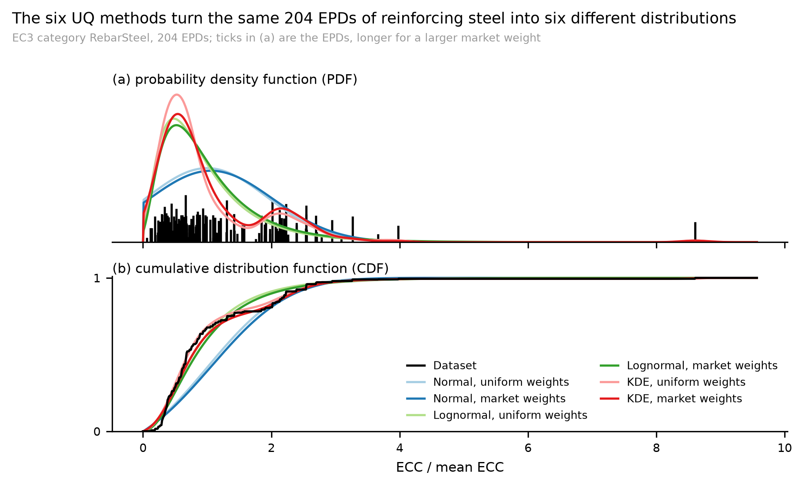

**Caption.** The six UQ methods fitted to the 204 EPDs of the EC3
category RebarSteel, each EPD divided by the category's unweighted mean
ECC. (a) Probability density function (PDF) of each fitted method; black ticks
are the EPDs, longer for a larger market weight. (b) Cumulative distribution
function (CDF) of each method, with the EPDs' empirical CDF in black.
Light shades: uniform weights; dark shades: market weights, which are drawn
because production volumes are not published.

- "Each of the six UQ methods turns the same 204 EPDs of reinforcing
  steel into a different probability distribution, and they disagree most about
  the upper tail, where a carbon budget is written."
- "The three probability estimation methods differ in how much shape they are
  free to take: a normal distribution fixes the skewness at zero, a lognormal
  ties it to the spread, and a kernel density estimate constrains neither --
  which is why only the kernel estimate reproduces the second group of
  EPDs near twice the mean."

Reinforcing steel rather than a synthetic dataset: a reader cannot picture
`dataset2569`, every structural engineer names rebar, it holds 204 EPDs
so the kernel estimate is what the paper recommends for it, and its second hump
near 2.1 makes the families visibly disagree. It is also the thread for the
worked example in section 5.

### Figure 2 -- where the real categories sit inside the synthetic cloud
`FIG2_MetricCoverage`

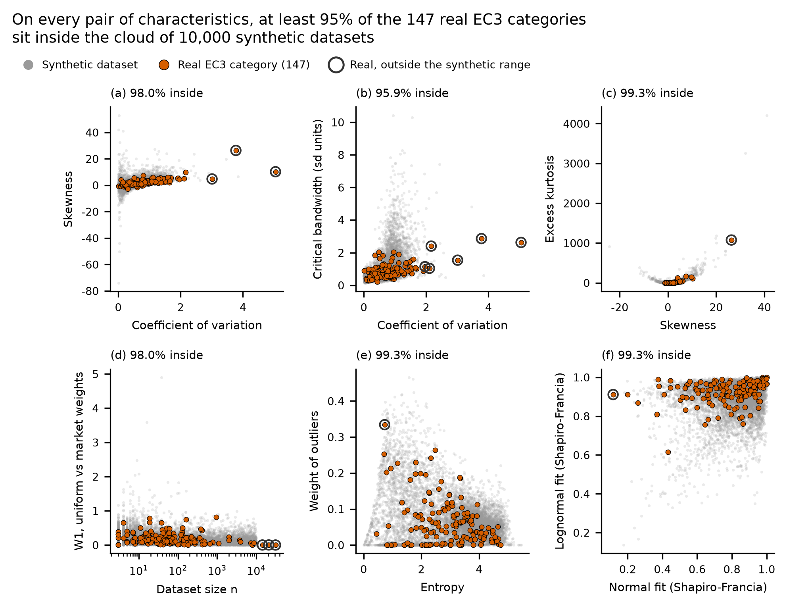

**Caption.** Six pairs of dataset characteristics for the 10,000 synthetic
datasets (blue) and the 147 real EC3 categories (orange), characteristics under
market weights, panels (a) to (f). A ring marks a real category outside the
synthetic range on that pair, judged on a 26 by 26 grid over the pair's joint
range; each panel title gives the share of real categories inside.

- "The 10,000 synthetic datasets span the real EC3 categories on every
  characteristic except two extremes: the three largest ready-mix classes exceed
  the corpus's maximum size, and Aggregates exceeds its maximum dispersion.
  Across the six panels, 15 of 882 category points fall outside the synthetic
  cloud."

  **This goes in the manuscript text beside the figure, not in the caption or
  on the figure** (author, 2026-10-07). The paragraph adds why neither gap
  matters: above 10,000 EPDs the results do not change (decision 137),
  and Aggregates is a contaminated EC3 category whose removal moves no headline
  result (decision 138). `TABLE_MetricCoverage.csv`,
  `TABLE_CoverageFigureStats.csv`.
- "Generating datasets rather than relying on the categories EC3 happens to hold
  is what lets this study measure accuracy against a known answer, and it is why
  the findings generalize past the 147 categories available."

**The text beside the figure must say why these six pairs** (not the caption,
which only names what each panel plots). They are the leading
characteristics of the principal components of the full characteristic set,
paired so each panel shows two that are *not* redundant with one another, plus
two pairs of direct interest: dataset size against the effect of weighting, and
the two goodness-of-fit statistics against each other. The coefficient of
variation appears in two panels because it loads on two different components.
Without that sentence the pairing looks arbitrary.

### Figure 3 -- the centerpiece
`FIG3_ClaimScorecard`

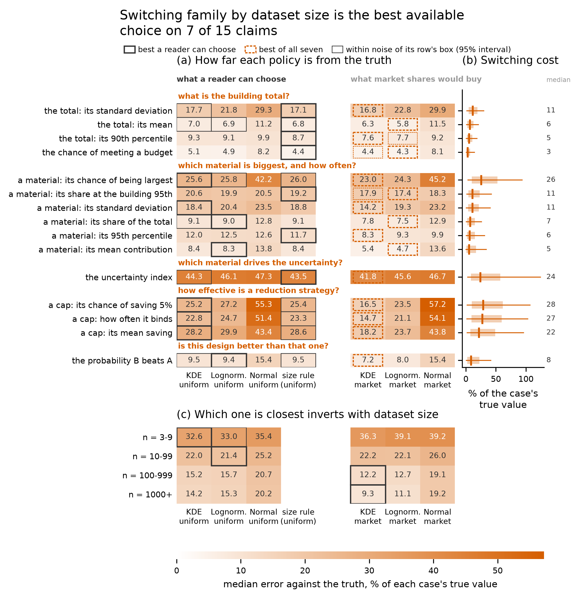

**Caption.** (a) Median error against the true distribution, as a percentage of
each case's own true value, for fifteen claims a probabilistic LCA makes (rows,
grouped by the question a reader asks) under seven policies: three UQ families
with uniform weights and the size rule (left block), and the same three families
with market weights (right block). 2,500 synthetic pLCAs of four materials each;
the design comparison uses 2,500 design pairs. Solid box: lowest of the left
block. Dashed box: lowest of all seven, where it lies in the right block. Thin
box: a cell whose paired 95 percent bootstrap interval of difference from its
row's box reaches zero (2,000 resamples of pLCA groups or design pairs). (b)
how much the claim moves between two methods for one case, as a percentage of
that case's true value; whisker 10th to 90th percentile, box interquartile
range, line and right-hand number the median. (c) The mean over the
seven per-material claims of the same median error, by the material's own
dataset size, six fixed methods.

- "On a typical building, the best method a practitioner can choose is still
  off by 17 percent of the quantity being claimed, pooled over fifteen claims,
  and the three reasonable methods sit within one point of each other."
- "Fitting a normal distribution is the one choice that carries a real penalty,
  raising the typical error by half and by two thirds on the question of which
  material contributes most."
- "How much the answer moves when you pick a different method depends on which
  claim is being made: for a typical building it moves the chance of meeting a
  budget by 3 percent and which material is largest by 26, and for one building
  in ten by 14 and 94."
- "Which method is closest to the truth inverts at about a hundred EPDs
  on both axes at once, from a lognormal or kernel estimate with uniform weights
  below to a kernel estimate with market weights above."

**The cells now show the MEDIAN OF PER-UNIT RATIOS (decision 253) and so does
the lower panel**, which shares their color scale; the box on the right is the
same statistic's distribution, each per-building difference between two methods
divided by that building's own true value. Whisker 10th to 90th percentile,
filled box the interquartile range, dark line and the number in the right-hand
column the median. **The title's count moved from 10 of 15 to 7 of 15** because
the boxes are now read off the median.

    claim                                   p10   p25  median   p75    p90
    a cap: its chance of saving 5 pct       1.9   9.7    28.4  61.4  106.7
    a material: its chance of being largest 3.2   9.8    25.6  52.5   93.5
    the uncertainty index                   2.7   8.6    24.1  57.1  123.9
    a material: its mean contribution       0.0   0.9     5.4  17.0   33.8
    the chance of meeting a budget          0.3   1.1     2.9   7.0   14.1

**AND ITS RATIO-OF-MEANS TWIN GOES TO THE SUPPLEMENT** (author, 2026-10-06):
`SUPP7_ClaimScorecardMeanForm`, drawn by the same cell with its cells, lower
panel and box all on total misstated carbon over total true carbon. That is the
number for a carbon budget or a building stock; the main figure is the number
for one building. Its title count is 10 of 15, the main figure's 7 of 15.

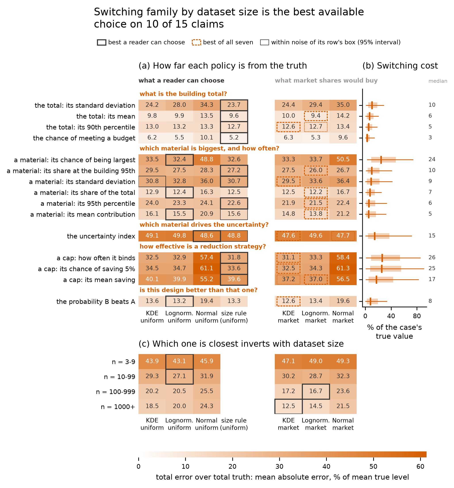

**The bar is right skewed on every claim**, so the honest sentence is not "the
choice moves a material's estimated contribution by 12 percent": for a typical
building it moves it by 5 and for one in ten by more than 34.

### Figure 4 -- the rule, and what market-share data would buy. CHOSEN: ZOOM PLUS SPREAD
`FIG4_MixedPolicy_SpreadZoom` in the main text; `SUPP9_MixedPolicy`, panels
(a) ratio of means and (b) median, in the supplement

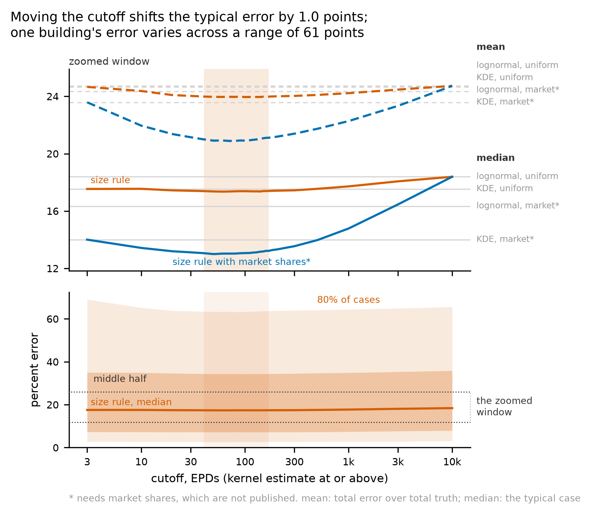

**Caption.** Error of the size rule (kernel density estimate at or above the
cutoff, three-parameter lognormal below, uniform weights; orange) and of the
same rule given the true market shares above the cutoff (blue), pooled over
fifteen claims, against the cutoff from 3 to 10,000 EPDs. Top, zoomed:
solid lines the median of per-case ratios, dashed lines the ratio of means; gray
lines the four fixed methods on each statistic. Bottom, at true scale: the size
rule's per-case error, middle half and middle 80 percent shaded; the dotted box
is the top panel's window. Vertical shading: 40 to 170 EPDs. 2,500
synthetic pLCAs.

Chosen by the author over a single-statistic curve (A, B) and the spread alone
(C), because it keeps the story legible and the uncertainty on the page. The
**top panel** zooms on four lines -- the size rule and the size rule given true
market shares, each as a median (solid) and a mean (dashed) -- with the four pure
methods as reference lines on both statistics. The **bottom panel** is the size
rule's per-case error at true scale, the middle half and the middle 80 percent,
with a box marking where the top panel's window sits.

- "Switching distribution family by dataset size beats either family alone
  anywhere from 40 to 170 EPDs, on both the typical case and the
  average."
- "Moving the cutoff shifts the typical error by about one point across the
  whole sweep, while one building's error ranges over about 60 points; the
  uncertainty no choice of method removes dwarfs the choice."
- "Knowing the true market share of every product would cut the typical error
  from 17.4 to 13.0 percent and the average from 24.0 to 20.9."

**The band, under both statistics** (`TABLE_MixedPolicyThresholdBothStats.csv`,
6,000 resamples, its own fixed-seed stream): ratio of means 40 to 170, the
published band reproduced; median of ratios wider and containing it. Both
degenerate ends -- a kernel estimate everywhere and a lognormal everywhere --
are distinguishably worse under both. **Print 40 to 170.**

**Supplement: the same curve on each statistic alone.**

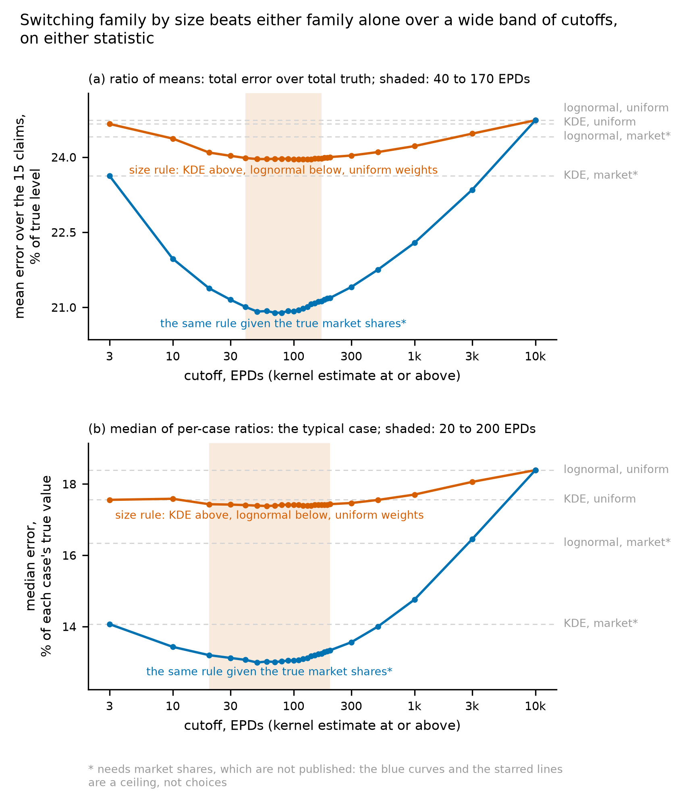

### Figure 5 -- which method is closest, by category size
`FIG5_WhenToUseWhich`

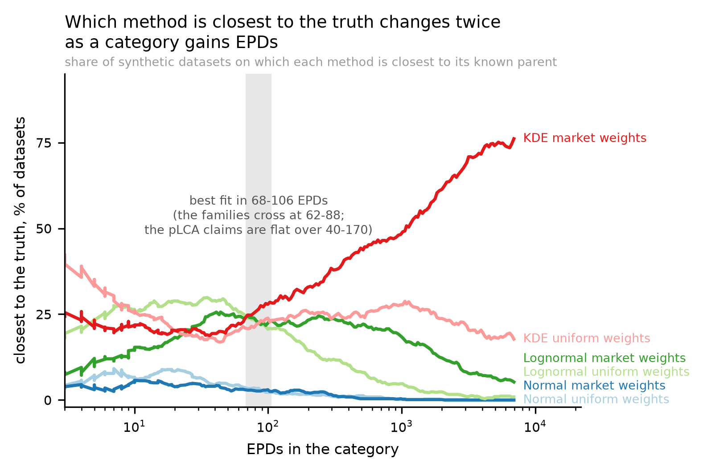

**Caption.** Share of synthetic datasets on which each of the six UQ methods
is closest to the market-weighted parent (W1), in a window of 800 datasets
sliding along dataset size. Gray band: 68 to 106 EPDs, the fit-level
cutoffs indistinguishable from the best. 10,000 synthetic datasets.

- "No single UQ method is closest to the truth across the range of dataset sizes
  real ECC categories span, and which one leads changes twice."
- "The kernel estimate overtakes the three-parameter lognormal at 68 to 106
  EPDs on goodness of fit, and that crossing is much less sharp once the
  fit is carried through to a probabilistic LCA claim."

**Kept, by author decision 2026-10-06**: it makes the point that closeness of
fit does not translate into probabilistic LCA findings in a way a practitioner
could check, which is the case for following the size rule rather than trying
to judge each category. That is the paper's framing for takeaways 8 and 11.

### Figure 6 -- where real buildings sit on the safe-lead axis. CHOSEN: SORTED DOTS
`FIG6_BuildingDominance`

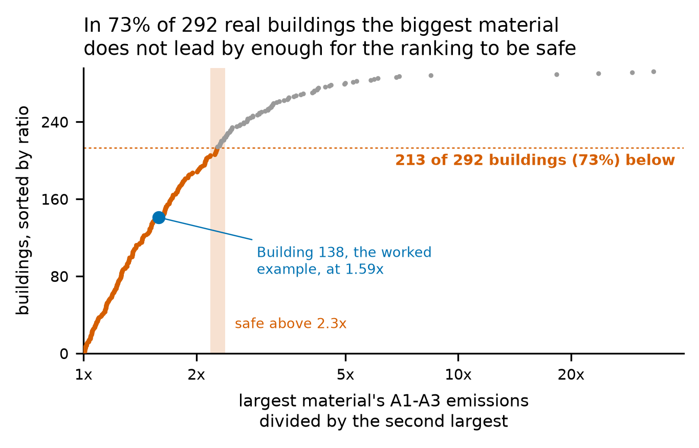

**Caption.** The 292 North American buildings of Benke et al. (2025), A1-A3,
sorted by the ratio of the largest material's emissions to the second largest
(log axis). Shaded band: 2.18 to 2.39, the 95 percent interval of the ratio at
which the chance that the choice of UQ method changes the leading material falls
to 1 percent, calibrated on four synthetic materials; orange points lie below
its center, 2.28. Building 138 is marked.

Design C of three, chosen by the author: every one of the 292 buildings as a
dot sorted by its top-two ratio, nothing binned, the threshold shaded as its
interval (2.18 to 2.39; parametric 2.28, monotone 2.33), Building 138 marked at
1.59x. The staircase of Marsh et al. (in press) at 1.02 is not plotted; it is
mentioned in the text beside the figure.

- "In 73% of 292 real North American buildings the largest material does
  not lead the next by the factor of about 2.3 that the ranking needs to be safe
  under a typical material spread."
- "The median real building sits at 1.65 times, with quartiles of 1.24 and 2.33;
  the one staircase the literature had previously supplied sits at 1.02."

**Building 138's note goes in the case-study text, not the caption** (author,
2026-10-07). It sits at 1.59x and its ranking does not change under any method
(section 5), which is what the calibration predicts at that lead, so it neither
confirms nor corrects the 73 percent. 73 percent is the share of buildings NOT
protected by a large lead, not the share whose ranking flips. The share is 69.9
percent below the interval's low end and 76.4 below its high end.

**The data.** Benke et al. (2025), A1-A3, frozen into
`data/raw/building_top2_benke2025.csv` by `audits/building_dominance.py` so the
figure redraws from a clean clone (the pattern decision 31 set). The threshold
is calibrated at four materials and these buildings hold a median of 37.

### Figure 7 -- when market shares start to help. CHOSEN: BOX PLUS STRIP
`FIG7_WeightingBySize`

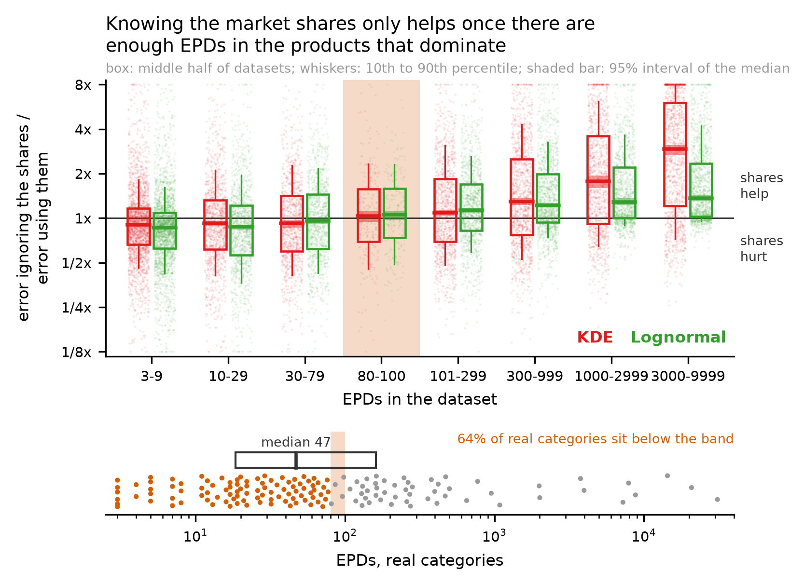

**Caption.** For each synthetic dataset, the W1 of a fit with uniform weights
divided by the W1 of the same family fitted with the true market shares, both
against the market-weighted parent, by dataset-size band (log2 axis; points
beyond 1/8x and 8x drawn at the limit). Kernel density estimate red,
three-parameter lognormal green. Box: interquartile range; whiskers: 10th to
90th percentile; heavy line: median; shaded bar: 95 percent bootstrap interval
of the median (2,000 resamples of datasets). Shaded band: 80 to 100
EPDs. Below: the dataset sizes of the 147 real EC3 categories, orange
below 80, with their median and interquartile range.

Design B of three, chosen by the author, with "shares help" and "shares hurt"
beside the line at 1x. It shades 80 to 100 EPDs and draws no line at 80
(decisions 222, 225). The y quantity is per dataset: the error ignoring the true
shares divided by the error using them, on a log axis.

    n          KDE helped / median ratio     Lognormal helped / median ratio
    3-9          38.5 pct   0.90x              32.8 pct   0.86x
    30-79        45.2       0.92x              46.9       0.96x
    80-100       52.3       1.03x              54.3       1.05x
    1000-2999    71.1       1.78x              75.7       1.28x
    3000-9999    80.6       2.92x              81.4       1.36x

- "Applying a known market share makes the fit worse rather than better below 80
  to 100 EPDs, and the crossing is the same for a kernel estimate and a
  three-parameter lognormal, so it is not a property of the kernel bandwidth."
- "Above the band the kernel estimate gains far more from known shares than the
  lognormal: above 3,000 EPDs its median error falls to a third."
- "The median real EC3 category holds 47 EPDs and 64 percent hold fewer
  than 80, so for most real materials a market-share estimate would not help
  even if one existed."

### Figure 8 -- why the rigid families lose
`FIG8_ShapePlane`

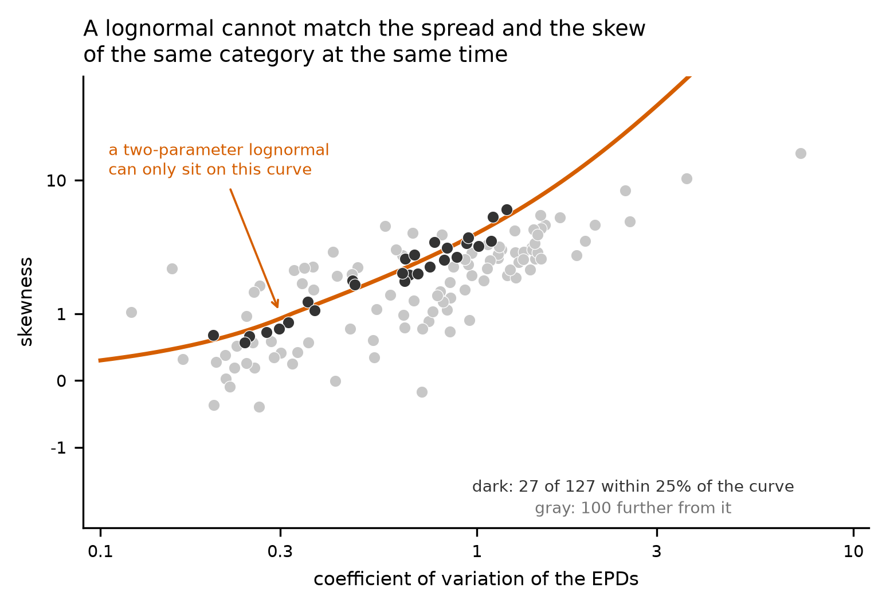

**Caption.** Skewness against coefficient of variation, uniform weights, for
the 127 real EC3 categories with at least ten EPDs (log x axis;
symmetric-log y axis, linear between -1 and 1). Orange curve: skewness = CV^3 +
3 CV, the only combinations a two-parameter lognormal can take. Dark points: the
27 categories whose skewness is within 25 percent of the curve; gray: the other
100.

- "A two-parameter lognormal has no freedom to choose its shape: once its spread
  is matched to the data its skewness is fixed at CV^3 + 3 CV, so every dataset
  it can represent exactly lies on a single curve."
- "Only 27 of 127 real ECC categories sit within 25 percent of that curve, and
  the median category is 0.58 times as skewed as a lognormal of its spread
  requires, so the family ecoinvent most commonly uses is systematically the
  wrong shape for this data."

If it is cut, the algebra and the 21.3 percent survive as two sentences and lose
little: the equation is the finding and the figure illustrates it.

### Cut

**`FIG_W1DistanceAndRank`** (the draft's Figures 2 and 3) scores every method
against the variable-weighted empirical CDF *of the data it was fitted to*, so
"market weighting improves fit" is close to true by construction. Cut outright,
not to the supplement.

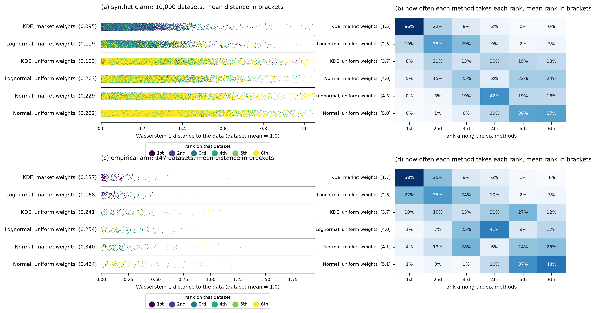

**`FIG_W1VsSurvivors_*`** (the draft's Figure 4) is twenty-one marginal panels
worth about two quantities, and is in-sample.

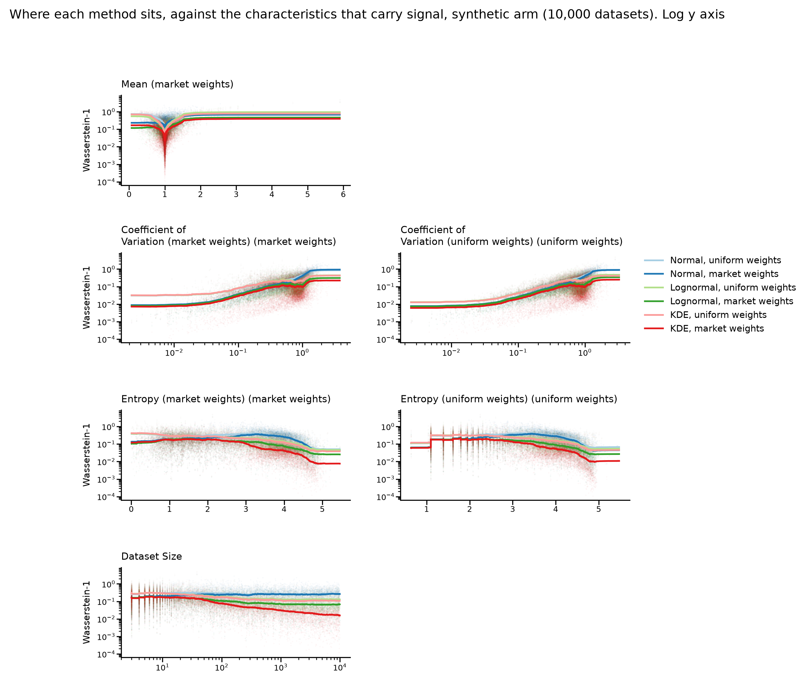

**`FIG_ScatterPlot_UQResults_Subset`** (the draft's Figure 5) is method against
method, which the run against the true parents supersedes: it can show that two
methods disagree and never which is right.

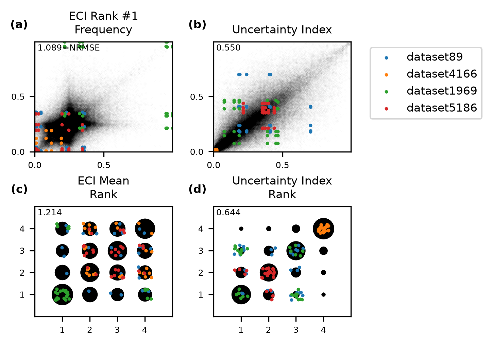

**The three-pLCA case study** (the draft's Figures 6 and 7): two of its three
groups are extremes selected out of 2,500.

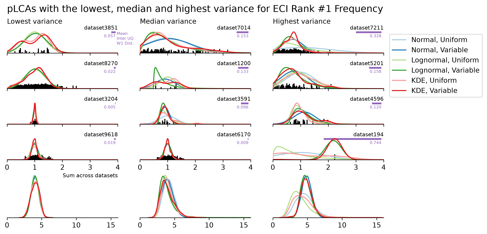

Everything else to the supplement.

---

## 5. The worked example, run

> **Building 138 of Benke et al. (2025): a new multifamily residential
> building in Oregon, 16,550 square metres, six to ten storeys.** A1-A3
> emissions of 403 kgCO2e per m2 of floor across 39 materials. Its seven
> largest, mapped to EC3 categories, carry 87.8 percent of that:
>
>     material             kgCO2e/m2   kg/m2   kgCO2e/kg   EC3 category
>     ready-mix LW 5000       151.4    411.2     0.37      ReadyMix [5000-5999 psi]
>     ready-mix LW 3000        95.3    335.7     0.28      ReadyMix [3000-3999 psi]
>     rebar                    47.8     25.0     1.91      RebarSteel
>     gypsum board             35.9    148.8     0.24      Gypsum
>     clay brick               10.1     34.9     0.29      Brick
>     ready-mix LW 4000         8.6     26.1     0.33      ReadyMix [4000-4999 psi]
>     insulated glass           5.1      3.8     1.34      InsulatingGlazingUnits
>
> Its top-two ratio is **1.59** -- an emissions ratio, 151.4 over 95.3 -- against
> a median of 1.65 across the 292 buildings, so it is an ordinary building and
> not a chosen one.

**Intensity is emissions, not mass**, as the author required: rebar is 25 kg/m2
and the third-largest contributor, because its coefficient is about six times
concrete's. Each material's intensity in the pLCA is Benke's own A1-A3
emissions per m2. Every dataset has an unweighted mean of 1.0, so the DATA's
mean contribution equals that intensity. A fitted model's mean need not: under
a normal fit, truncation at zero raises rebar's mean contribution from 47.8 to
59.2 and brick's from 10.1 to 16.4, which is why the normal moves the total in
item 3. The other 32 materials, 12.2 percent, enter the total as a fixed
amount. The run uses every method and the size rule on common random numbers,
at the building's real intensities. **There is no true parent for a real
category, so this measures how far the methods disagree about one building,
never how wrong they are.**

The three ready-mix classes hold 14,366, 20,814 and 31,025 EPDs,
above the corpus maximum of 9,978. That does not weaken the case study: the
size rule assigns them a kernel estimate however large they are, and decision
137 found the kernel estimate's advantage is already unanimous at 4,000 to
9,999 EPDs, with all three classes behaving like that band.

**What it found** (`TABLE_Building138.csv`, `TABLE_Building138Curves.csv.gz`;
the cell has its own fixed-seed stream, decision 254):

1. **The ranking is safe.** Every one of the seven policies names ready-mix 5000
   psi as the largest contributor, in 85.7 to 87.7 percent of iterations, even
   though its lead is only 1.59x. The calibration predicts this: at 1.59x
   agreement is expected about 90 to 95 percent of the time. Concrete strength
   classes are also tighter than the corpus's typical material, so a
   concrete-led building plausibly sits on the safe side of the 2.3x threshold.
   That is a suggestion from one building, not a correction to Figure 6.
2. **Which material drives the uncertainty depends on the method.** Rebar under
   six policies (42.6 percent of the variance under the size rule, 45.2 under a
   kernel estimate with market weights); ready-mix 5000 under the
   uniform-weighted normal, 34.8 against rebar's 34.3 -- effectively a tie.
   The kernel estimates put rebar well ahead because they keep its long right
   tail; the normal flattens rebar's distribution.
3. A normal fit moves the building's median total by about 7 percent: 423 to
   425 kgCO2e/m2 against 395 to 399 for every other policy.

**The figure: a ridgeline of every material's fitted contribution under all
seven policies, beside the uncertainty index per method.** The shared kgCO2e
axis shows which material leads; the dots show that the uncertainty does not
follow the same order. 
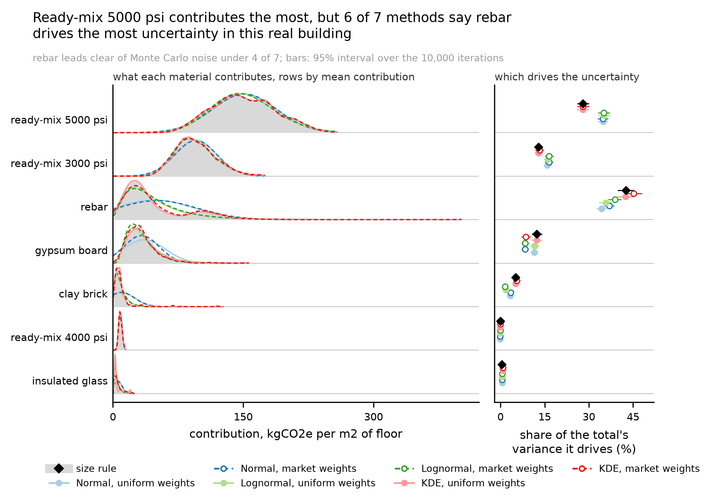

**Caption.** Building 138 of Benke et al. (2025), a multifamily residential
building in Oregon: its seven largest materials, mapped to EC3 categories, rows
in order of mean contribution. Left: each material's contribution in kgCO2e per
m2 of floor under each fitted method (solid lines and filled points, light
shades: uniform weights; dashed lines and open points, dark shades: market
weights) and under the size rule (gray fill, black diamonds). Right: the uncertainty index, each
material's share of the total's variance, under every policy, with its 95
percent interval from 1,000 bootstrap resamples of the 10,000 Monte Carlo
iterations. The other 32 materials, 12.2 percent of A1-A3, enter as a fixed
amount.

**Chosen by the author: by contribution** (`FIG9_Building138`). The
uncertainty-index ordering is in `archive/figures/`.

**The honest caveats.** The concrete is lightweight and the categories split by
strength only, so the three concrete mappings are approximate. Market weights
on the empirical arm are simulated (decision 190), so the two market-weighted
methods describe a share model. Every accuracy claim stays on the synthetic arm.

## 6. The graphical abstract. CHOSEN: THREE PANELS, TIGHTENED
`FIG_GraphicalAbstract`

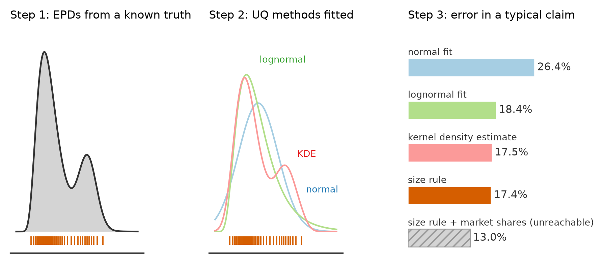

**Caption.** Left: a known distribution and EPDs sampled from it. Middle: a
normal, a lognormal and a kernel density estimate fitted to those EPDs
(illustrative). Right: the pooled median error over fifteen claims for a normal,
a three-parameter lognormal and a kernel density estimate fitted with uniform
weights, the size rule, and the size rule given every product's market share,
hatched because those shares are not published.

Design A of three, chosen by the author ("I like the idea") and tightened
("too wordy"): a known truth with EPDs sampled from it, the fitted methods, and
the error in a typical claim -- 26% for a normal fit, 17% for the size rule,
13% for the size rule given every market share, which is hatched and labeled
unreachable because nobody publishes those shares. B (the bars alone) and C (the
rule as a number line) were too simple and are in `archive/figures/`. The bars
are the pooled median of per-unit ratios (decision 253), read from the tables.

## 7. What needs an author decision

**The two items this section carried are settled.** The median form is the
median of per-unit ratios (decision 253), implemented in every scorecard cell,
rank, box and figure panel. Building 138 is run at its real intensities only;
the equal-intensity run was dropped by the author (section 5).

### 1. Every figure design is settled

Figure 4: zoom plus spread (`FIG4_MixedPolicy_SpreadZoom`), with the two
single-statistic versions in the supplement. Figure 6: sorted dots. Figure 7:
box plus strip. Building 138: the ridgeline by contribution. The graphical
abstract: three panels, tightened. Figure 5 stays. Every unchosen design is in
`archive/figures/` with its reason in `archive/README.md`.

### 2. Both statistics are reported, and the emphasis is settled

**Settled 2026-10-06**: the median of ratios in the main scorecard (what one
building sees), the ratio of means in the supplement (total misstated carbon
over total true carbon, for a budget or a stock).

**The emphasis is section 1's thesis, confirmed by the author**: a large share
of the uncertainty survives any choice of method; avoid the normal; the size
rule is the best choice a reader has but buys little over a kernel estimate
everywhere; market-share data is worth far more than any choice of curve. **The
paper is not a method-recommendation paper**, which was the draft's story ("KDE
is best") and would oversell a fraction of a point.

### 3. The cutoff band survives both statistics

Measured, not assumed: 40 to 170 on the ratio of means (reproduced from a fresh
stream), 20 to 200 on the median of ratios, best cutoff 130 and 60
respectively. **Print 40 to 170**, the range that holds under both (author,
2026-10-07). Figure 4 draws both statistics and shades 40 to 170.

### 4. Smaller

- **Decision 65's prohibition** on comparing cross-validated scores across
  weighting schemes has lost its premise since decision 190 (decision 252).

## 8. Reference material

- **Quote the tables, not the decision log.** Eleven places where the two
  disagreed were corrected on 2026-10-05 and the log was the stale side in every
  one (decision 252).
- **`reports/WRITING_STYLE.md`** is binding on the prose: nine principles, the
  voice convention, the controlled vocabulary, the rules for numbers, and a test
  to run before any section is handed over.
- **`reports/MANUSCRIPT_discrepancies.md`** carries every place the draft and the
  code disagree, 189 entries.
- **The advisor stopped editing partway through** and said he wants to see how
  this version responds before reading more. The unreviewed final third is the
  real test, because it is the part no reviewer has already repaired.

---

## 9. What the next window picks up first

**Updated 2026-10-07 at the close of the review window.** The narrative is final
pending the author's own read. The review (`reports/REVIEW_MANUSCRIPT_NARRATIVE.md`)
ran and all eleven findings are applied, with these author decisions: print the
cutoff band as 40 to 170 and shade it on Figure 4; quote pooled errors to one
decimal; quote takeaway 11 from `TABLE_FitVersusClaim.csv`; put the coverage
statement in the text beside Figure 2; keep `FIG_Building138` in the main text;
no equal-intensity Building 138 run; "the most common", not "the default", for
ecoinvent's lognormal; and **a caption is only the short text below a figure
saying what is plotted** (`FIGURE_STYLE.md`, corrected the same day). Decision
256.

### 1. THE FIGURE PASS -- DONE 2026-10-07, see `reports/REPORT_FIGURE_PASS.md`

The nine figures are numbered `FIG1_` to `FIG9_`, each has a caption under its
entry in section 4, and Figures 3, 7 and 9 carry new intervals. No point
estimate in this file moved. **Three sentences in this file are now qualified by
those intervals, and the prose window must carry the qualification**:

- Takeaway 3 and Figure 3: the size rule is the best of the four choosable
  policies on 7 of 15 claims, and on 4 of those 7 no other choosable policy is
  within noise (`TABLE_ClaimScorecardIntervals.csv`).
- Section 5 item 2 and Figure 9: rebar drives the most uncertainty under 6 of 7
  policies, and clear of Monte Carlo noise under 4 -- the three kernel-estimate
  policies and the market-weighted lognormal. Under both normals and the
  uniform-weighted lognormal the top two are within noise
  (`TABLE_Building138UIInterval.csv`).
- Takeaway 8 and Figure 5 say the kernel estimate "overtakes the lognormal on
  fit between 68 and 106 EPDs". On the figure, 68 to 106 is the band of
  fit-level CUTOFFS indistinguishable from the best; the families themselves
  cross at 62 to 88. The prose should name which it means (decision 142 records
  the two as different quantities).

The original brief follows, unchanged.

Decision 235 deferred three per-figure tasks until the selection was fixed. It
is fixed. Do them once, on these ten figures and no others:

    #   stem                          generator                          status 2026-10-07
    1   FIG_PDFandCDFofUQMethods      notebook 2 cell 22                 never calls figstyle.apply()
    2   FIG_MetricCoverage            notebook 1 cell 43                 never calls figstyle.apply()
    3   FIG_ClaimScorecard            notebook 3 cell 109                text-overlap flag set
    4   FIG_MixedPolicy_SpreadZoom    notebook 3 cell 114 (fig4-median)  band redrawn 2026-10-07
    5   FIG_WhenToUseWhich            notebook 4 cell 32                 text-overlap flag set
    6   FIG_BuildingDominance         notebook 3 cell 113
    7   FIG_WeightingBySize           notebook 2 cell 84
    8   FIG_ShapePlane                notebook 1 cell 56
    9   FIG_Building138               notebook 3 cell 117
    GA  FIG_GraphicalAbstract         notebook 3 cell 118

Status is from `outputs/tables/audits/TABLE_FigureStyleCompliance.csv`, which
does not yet cover cells 114, 117 and 118; re-run `python audits/figure_manifest.py`
first. Cell numbers shift when cells are added, so find each by its stem.

**a. Number them.** `figstyle.savefig` takes a stem, so a number is one word
per cell (decision 235). Archive each old file to `archive/figures/` with its
reason in `archive/README.md`, as Stage 3 did, so
`tests/test_figure_manifest.py` finds no orphan. Then update every reference:
section 4 of this file, the figure list in `README.md`, and any cell that reads
a figure file. [Done: the supplement is SUPP1 to SUPP12; see
`reports/REPORT_FIGURE_PASS.md` section 2b. Original text: the supplement figures keep their stems until the
supplement list is decided.

**b. Bring each up to `FIGURE_STYLE.md`.** Run its whole checklist on each
figure, at final width, by looking at the rendered PNG rather than the code.
Then draft a CAPTION for each under its entry in section 4: what is plotted,
panels, units, what marks and shading mean, data source and size. **Nothing
argumentative goes in a caption.** The author approved every current design on
2026-10-07 ("the figures look great"), so this is compliance and polish, not
redesign. Show any visible change before committing it.

**c. Intervals where a figure's comparison needs one.** Decide per figure, and
write down why for each figure that gets none. The test: does the text beside
the figure compare two plotted values close enough that noise could reverse
them? Likely candidates: Figure 3's pooled cells and boxes (bootstrap over pLCA
groups, the resampling unit fixed by decision 110), Figure 7's per-band medians,
Figure 5's crossing. Figure 4 already carries its band test. Every interval is
computed in a `# TABLE` cell that reads only from disk and seeds its own
generator from a literal, marked `# re-slice generator` (decision 254), and is
written to a table before any figure draws it.

**Constraints.** No point estimate in this file may move. If one does, stop and
report which number, by how much and why. Redraw with
`audits/render_figures.py`: scratch first (`--out`), compare every rewritten
table against `outputs/` byte for byte, then `--into-outputs`. Revert files
whose only change is a gzip or PDF timestamp. Run `tests/test_notebooks.py`,
`tests/test_render_figures.py` and `tests/test_figure_manifest.py` before every
commit, and push and verify the remote at the end.

**Close.** Write `reports/REPORT_FIGURE_PASS.md` to the stage report
specification in `CLAUDE.md`, with every figure embedded and its caption
beneath, then hand the author a review prompt for a fresh window.

### 2. THEN THE PROSE, in a separate window

Following section 3's arc, `reports/WRITING_STYLE.md`, the Discussion table in
`CLAUDE.md` and `reports/MANUSCRIPT_discrepancies.md`. It needs the
advisor-marked draft at an absolute path OUTSIDE the repository, supplied by
the author; the file is never copied inside (`reports/START_HERE.md` section 3).

**Any table change from here is a re-slice, not a run** (decision 254):

    python audits/render_figures.py 03_CompareUQ_PerformPLCA --tables --into-outputs

### 3. SMALLER, CARRIED

- The empirical arm's headline contradicts the draft: cross-validated over the
  127 categories reaching n = 10, a three-parameter lognormal is closest on 53.6
  percent against the kernel estimate's 26.0 (decision 252). The paper must say
  it rather than assert agreement between the arms.
- Decision 65's prohibition has lost its premise (decision 252); open question.
