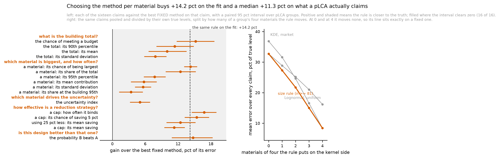

# Stage 2j: let the method vary by material

**Branch** `stage-2j-per-material`, off `699fb7b` on `stage-2h-robustness`.
**Corpus** `corpus_2026-09-25` throughout. **Empirical weight rule**
`rho = 0.5`. **Threshold** 81 declarations. Every table this stage writes
carries those three as columns, so no later reader has to reconstruct them
from file timestamps.

---

## The first page

**THE STAGE WAS BUILT TO REPORT A NULL AND DID NOT GET ONE.** Letting the UQ
method vary by material, on the study's own one-number rule, is the closest of
the seven policies on **all sixteen** claims a probabilistic LCA makes, and its
improvement over the best FIXED policy on each claim clears zero on all sixteen
with a paired interval. The median improvement is **11.3 percent** of that
fixed policy's own error, running from **3.4 percent** on a material's share at
the building's 95th percentile to **16.8 percent** on how often a specification
cap binds.

**THE RULE IS THE STUDY'S OWN AND NOTHING WAS RE-DERIVED.** At or above 81
declarations, a kernel estimate with market weights; below 81, a
three-parameter lognormal with uniform weights. Nothing is refitted: the policy
is a new key on each dataset's existing fitted-model dictionary pointing at
whichever of the six models the rule selects.

**AND IT ANSWERS THE QUESTION THE STAGE EXISTED FOR.** Stage 2h found that a
goodness-of-fit advantage is heavily attenuated by the time it reaches a
decision -- the kernel estimate overtakes the lognormal on FIT at about 81
declarations and does not pull clear on the CLAIMS until roughly ten times that
-- and identified the mechanism: a probabilistic LCA picks ONE method for all
four of its materials, so one material's advantage is averaged against three
neighbours drawn at random. **When the method varies by material there is
nothing to average against, and the attenuation very largely disappears**: the
same rule is worth **+14.2 percent** on the fit and a median **+11.3 percent**
on the claims.

**FOUR THINGS QUALIFY IT AND THE PAPER MUST CARRY ALL FOUR.**

1. **In the one configuration where the rule does nothing, its above-threshold
   choice is wrong on the LEVEL claims.** In the 172 groups of 2,500 -- 6.9
   percent here and about 1.7 percent of real buildings -- where all
   four materials clear the threshold, the rule picks the kernel estimate with
   market weights for every material, and on nine of the fifteen claims that
   split can score the market-weighted LOGNORMAL is closer -- by **39.5
   percent** on the building total's mean, 23.0 on a material's share at the
   building's 95th percentile and 20.1 on its mean contribution, three
   intervals that exclude zero. The six claims the kernel estimate wins are
   shape and frequency claims and the control fires on all six: gain exactly
   0.00 with an interval of exactly [0.00, 0.00]. The mirror does not hold: in
   the 119 groups entirely below the threshold the rule IS the best fixed
   policy on 11 of 15 claims and its largest deficit is 4.7 percent. Section
   6 has it in full, including the two things that bound how much it matters.

2. **On the ARGMAX it is not the best.** Asked which material is the largest
   contributor, the size rule names the truth's answer **48.9 percent** of the
   time against the kernel-with-market-weights policy's **52.5** -- while on
   the continuous version of the same quantity, the error in a material's
   chance of being largest, it is **14.3 percent better** than the best fixed
   policy. The two readings of one question disagree, which is the argmax
   fragility this project has recorded three times.
3. **It is the most accurate policy per decision and NOT the least biased at
   building scale.** Its error on a single building's mean total is **8.5
   percent**, the lowest of the seven, and its BIAS is **-2.9 percent** against
   the kernel-with-market-weights policy's **+0.9**. A blend of a low-biased
   and a high-biased family inherits a middling bias, and bias adds across the
   materials of a building while noise cancels.
4. **It captures about a fifth of what a per-material choice could buy.**
   Against an unreachable per-material oracle -- whichever of the six is
   closest on each unit, which needs the answer in order to choose -- the rule
   recovers a median **22.8 percent** of the distance, range 7.3 to 32.1
   percent. The oracle is a minimum over six noisy errors and is optimistic by
   construction, so that is a floor on how much is left rather than a target.

**NOTHING ALREADY ON DISK MOVED.** The stage runs its own truth pass and its
own design comparison rather than extending the existing ones, because a win
share, a `best_method` and a `stakes` are properties of the SET of policies
compared and adding a seventh would have changed every one of them in the
six-method tables the paper reports. Re-running notebook 3 end to end
reproduced every existing table content-identically; the only bytes that
differ are gzip and JSON timestamps.

**WHAT NEEDS AN AUTHOR DECISION.** Whether the paper recommends the size rule
as a policy, and whether Stage 3 adds it as a seventh column to the scorecard
figure. Section 10 states the case both ways and says what the second question
costs.

---

## 1. The rule, and what it actually does

    at or above 81 declarations   kernel estimate, market weights
    below 81 declarations         three-parameter lognormal, uniform weights

81 is the practitioner threshold of decision 142, calibrated on the superseded
corpus and reproduced unchanged on this one with the band of equally good
choices at 68 to 106 (decision 198). Both the family and the weighting switch
at the same line because decision 161 found both orderings invert at about 100
declarations. There is no second selector and the interface cannot express one:
`mixedpolicy.select_method` takes exactly one required argument, the dataset's
size, and a test asserts that.

Of the 10,000 synthetic datasets the rule assigns the kernel estimate with
market weights to **5,220** and the three-parameter lognormal with uniform
weights to **4,780**.

**NOTHING IS REFITTED.** `mixedpolicy.add_mixed` puts a new key on each
dataset's existing model dictionary pointing at the selected model object
itself, so the object SAMPLED under the mixed policy is bit-for-bit the object
that fixed policy samples. Two consequences are checked rather than asserted:

- In the **119** pLCA groups whose four materials all sit below the threshold,
  the mixed policy's rows and the lognormal-with-uniform-weights rows differ by
  **0.00e+00** on every output. In the **172** groups entirely above it, the
  same against the kernel with market weights: **0.00e+00**.
- The six fixed policies come back identical from a truth run whether or not
  the seventh is present, which is what licenses reading them as controls.

**HOW OFTEN THE RULE ACTS.** Of 2,500 pLCA groups of four materials, **88.4
percent straddle** the threshold, 4.8 percent sit entirely below it and 6.9
percent entirely above. Materials above the threshold per group: 119 groups
with none, 573 with one, 949 with two, 687 with three, 172 with all four.

**So what.** A practitioner following this rule changes what they do for about
half their materials, and in nine buildings out of ten they end up using two
different methods in one model. That is the thing to check is acceptable before
recommending it: it is a rule you can apply one material at a time without
knowing anything about the others, but the model it produces is not internally
uniform.

    Reproduce: outputs/tables/TABLE_MixedPolicyComposition.csv
               notebook 3, the cell headed "THE RULE, APPLIED"

## 2. What the rule does to the FIT

Measured against `w1_market`, the distance to the market-weighted TRUE parent,
which is the population a probabilistic LCA of what gets built is a statement
about and the same target the truth run below uses. The mixed policy's score
for a dataset is the score already recorded for whichever fixed method the rule
picks, so this is a SELECTION out of the six-method table notebook 2 writes and
cannot disagree with it.

Sorted by what each policy costs over the oracle, which is the policy question;
the mean W1 column is not monotone in it, because a policy can be typically
good and occasionally terrible.

    policy                       mean W1   cost over the      worst single
                                           per-dataset        dataset
                                           oracle, pct
    size rule (n >= 81)           0.1756          42.98            15.8x
    KDE, market weights           0.2047          63.29            41.1x
    Lognormal, market weights     0.2058         103.02            33.4x
    KDE, uniform weights          0.2100         145.74            62.7x
    Lognormal, uniform weights    0.2077         165.50            61.3x
    Normal, market weights        0.3148         324.57            38.4x
    Normal, uniform weights       0.3071         384.93           111.6x

**The rule beats the best fixed policy by +14.2 percent of its error, interval
+12.4 to +16.1 percent**, on a bootstrap that resamples datasets and is paired
because every policy is scored on the same dataset against the same parent.

**This half is a CONFIRMATION, not a new finding, and the paper must say so.**
The 42.98 percent reproduces the minimum of the policy curve Stage 2f and 2h
already published to five significant figures; that curve's grid does not
contain 81 and its nearest point is 84, and no dataset size falls between, so
the two are the same number. What is new is everything below this line.

**A precision about what is in sample.** The threshold 81 was chosen to
minimize exactly this curve on this corpus, so 42.98 percent is an in-sample
optimum -- though a weak one, since everything from 68 to 106 is
indistinguishable from it. **The claim-level results in section 3 are not**:
they are a different criterion, and the threshold was never tuned on them.

By size band, where the rule matches one of its two components exactly in every
band that does not straddle 81:

    band        Lognormal, uniform   KDE, market    size rule
    3-9                    0.3712        0.4321       0.3712
    10-99                  0.1947        0.2510       0.1956
    100-999                0.1363        0.0975       0.0975
    1000+                  0.1285        0.0383       0.0383

**So what.** Somebody who counts their EPDs and switches method at about eighty
gets a curve that is close to the better of the two families everywhere,
instead of being badly wrong at one end. The worst single category they can end
up with is 16 times the best achievable rather than 33 or 41.

    Reproduce: outputs/tables/TABLE_MixedPolicyFit.csv
               outputs/tables/TABLE_MixedPolicyFitByBand.csv

## 3. What the rule does to the sixteen claims

2,500 pLCA groups of four materials, run twice on the same uniform variates --
once with the fitted models and once with the datasets' TRUE parents -- so the
difference is the error the model causes and contains no Monte Carlo noise at
all. All seven policies share the variates. Same sixteen claims and the same
single definition as the study's own scorecard: the mean absolute error against
the truth PER UNIT, divided by the mean TRUE LEVEL of the same quantity.

Every gain below is against the **best fixed policy on that claim**, which is
the comparator a reader would otherwise use and therefore the hard test, with a
paired cluster bootstrap over pLCA groups. Positive means the size rule is
closer to the truth.

    claim                                    gain, pct   95 pct interval
    a cap: how often it binds                    16.76    14.49 to 19.00
    a cap: its chance of saving 5 pct            15.41    13.21 to 17.65
    the chance of meeting a budget               15.20    11.74 to 18.63
    the probability B beats A                    14.75    10.85 to 18.30
    a material: its chance of being largest      14.27    13.09 to 15.49
    a material: its share of the total           12.43     9.73 to 15.22
    using 25 pct less: its mean saving           12.43     9.88 to 15.18
    the total: its 90th percentile               11.39     8.06 to 14.87
    a cap: its mean saving                       11.29     9.49 to 13.22
    the total: its mean                           9.99     6.60 to 13.55
    the total: its standard deviation             7.86     5.82 to  9.87
    a material: its 95th percentile               7.72     5.73 to  9.72
    a material: its mean contribution             5.75     3.38 to  8.10
    a material: its standard deviation            5.61     4.13 to  7.07
    the uncertainty index                         5.04     3.21 to  6.87
    a material: its share at the building 95th    3.41     1.21 to  5.57

**Sixteen of sixteen clear zero, and the size rule is the closest of the seven
policies on sixteen of sixteen.**

**THE COMPARISON WITH THE FIT IS THE FINDING.** The same rule is worth +14.2
percent on the fit and a median +11.3 percent here. Stage 2h's decision 166
recorded that a fit threshold of about 81 declarations becomes a claim
threshold near 1,000, a factor of more than ten, and named the mechanism: one
material's fit advantage averaged against three neighbours picked at random.
**Under a per-material policy all four materials get their better method, so
there is nothing to average against and the advantage very largely survives.**
That is the experiment decision 166 called the most valuable one left, and it
comes out the way that decision predicted it would.

**So what.** Improving the method for one material of four buys a practitioner
much less than the goodness-of-fit table suggests. Improving it for all four --
which is what a per-material rule does -- buys nearly the whole of it.

    Reproduce: outputs/tables/TABLE_MixedPolicyGain.csv
               outputs/tables/TABLE_MixedPolicyScorecard.csv

### Both numerators, and for the size rule all sixteen differ

`total_error` is the error in ONE decision, which is what every number above
reports and what a designer choosing between two options carries.
`portfolio_error` is the error in the AVERAGE claim over many decisions, which
is the right quantity for a stock model. Stage 2h found five of the sixteen
scorecard rows reporting the second while claiming the first; here both are
reported for all sixteen, and **they differ on every one**, by a factor of 1.37
on the total's standard deviation to unbounded on the four where the signed
errors cancel exactly. For the size rule, as a percentage of the true level:

    claim                                    per unit   per portfolio
    the total: its mean                          8.48            2.85
    the total: its standard deviation           22.33           16.30
    the total: its 90th percentile              11.10            5.85
    the chance of meeting a budget               4.49            1.05
    a material: its mean contribution           12.97            2.85
    a material: its standard deviation          27.86           15.30
    a material: its 95th percentile             19.86            7.29
    a material: its share of the total          10.70            0.00
    a material: its share at the building 95th  25.14            0.00
    a material: its chance of being largest     27.78            0.00
    the uncertainty index                       45.32            0.01
    a cap: how often it binds                   25.91            3.24
    a cap: its mean saving                      32.82           11.59
    a cap: its chance of saving 5 pct           27.51            4.20
    using 25 pct less: its mean saving          10.70            0.00
    the probability B beats A                   10.94            1.75

**The four zeros are exact and are not accuracy.** A share and a rank frequency
sum to one across the four materials of a group, so the signed errors cancel by
construction and the portfolio figure is identically zero however wrong each
individual number is. Quoting it there as "the method is right" is precisely
the misreading Stage 2h's numerator correction exists to prevent, and the same
trap applies to the size rule.

## 4. Three of the four qualifications

The fourth -- that the rule's above-threshold choice is wrong on the level
claims in groups where every material is large -- is in section 6, beside the
split that exposed it.

### 4.1 The argmax says something different from the continuous metric

Asked which material is the largest contributor -- an argmax over four nearly
equal rank-1 frequencies -- the policies name the truth's answer:

    KDE, market weights           52.5 pct
    Lognormal, market weights     50.7
    size rule (n >= 81)           48.9
    KDE, uniform weights          36.9
    Normal, market weights        36.8
    Lognormal, uniform weights    33.6
    Normal, uniform weights       23.1

**The size rule is third**, behind both market-weighted fixed policies. On the
CONTINUOUS version of the same question -- the mean absolute error in a
material's chance of being the largest contributor -- it is first, at 0.0695
against 0.0810 for the best fixed policy, a 14.3 percent improvement.

The two are not in contradiction and the paper should say which it means. An
argmax over four near-ties is decided by hundredths; a policy that is closer on
average to every material's frequency can still land on the wrong side of a tie
slightly more often. This project has recorded that fragility three times
already -- the flip rate retired in decision 102, the 3.67 percent argmax noise
floor of decision 105, and the rank metric recovering worst of seven in
decision 143 -- and this is the fourth.

**So what.** If the question is "how confident am I that this material is the
biggest", the size rule answers it better. If the question is "just tell me
which one", a kernel estimate with market weights on everything is very
slightly better, and both are right about half the time, because with four
materials of equal use intensity the ranking is as fragile as it can be made.

### 4.2 Most accurate per decision, and not the least biased per building

Error in a single building's mean total, as a percentage of the true total, and
the SIGNED bias beside it:

    policy                       abs error   bias      bias at the total's 90th
    size rule (n >= 81)               8.48   -2.85                      -5.85
    Lognormal, market weights         9.43   -3.76                      -8.44
    KDE, uniform weights              9.84   -1.58                      -5.00
    Lognormal, uniform weights        9.85   -5.23                      -9.08
    KDE, market weights               9.97   +0.92                      -2.98
    Normal, uniform weights          13.49   +6.97                      -2.34
    Normal, market weights           14.19   +7.67                      -1.99

**The size rule has the smallest error on any one building and the third
smallest bias.** Decision 122b is why that distinction matters: bias adds across
the materials of a building while the random part falls as one over the square
root of the count, so a policy that is unbiased per material stays unbiased at
any building size while a biased one does not. The size rule is a blend of a
family that runs low (the lognormal, -5.5 percent per material) and one that
runs near zero (the kernel estimate, -1.7 to +1.0 percent), and it inherits a
middling bias of -3.0 percent per material.

**So what.** For one building, follow the rule. For a portfolio or a stock
model where many buildings are summed and what matters is not being
systematically off, a kernel estimate with market weights on everything is the
safer choice even though it is worse on each individual building.

### 4.3 It captures about a fifth of what per-material choice could buy

Against a per-material ORACLE -- whichever of the six fixed policies is closest
to the truth on each unit, which needs the answer in order to choose and is
therefore a bound and never a policy -- the size rule closes a median **22.8
percent** of the distance between the best fixed policy and that bound, with a
range of 7.3 percent (a material's share at the building's 95th percentile) to
32.1 percent (the chance of meeting a budget).

**The oracle is optimistic by construction** and the number must be read as a
floor on what is left rather than as a target: it is a minimum over six
correlated but noisy errors, and a minimum over noise looks better than any
rule could be. What it does establish is that the study's single-threshold rule
is not close to exhausting what varying the method by material can do, and that
the remaining headroom cannot be reached by any selector this project has found
-- every other characteristic was tested across two stages and none yields a
usable threshold (decisions 88 and 139).

    Reproduce: outputs/tables/TABLE_MixedPolicyCeiling.csv

## 5. The design comparison, where the study's cleanest null lives

Statement 5: is option B better than option A, where two designs share three
materials and differ in the fourth, with the shared materials on the same
variates in both options. 2,500 pairs, six claimed savings, all seven policies
on one set of draws.

Per-pair absolute error in the stated probability that B beats A:

    size rule (n >= 81)          0.0691
    KDE, market weights          0.0811
    Lognormal, uniform weights   0.0825
    KDE, uniform weights         0.0837
    Lognormal, market weights    0.0864
    Normal, uniform weights      0.1198
    Normal, market weights       0.1231

And the share of individual comparisons on which a policy lands on the opposite
side of a half from the truth -- the decision a designer actually takes:

    B claims to save            0 pct   2 pct   5 pct  10 pct  20 pct
    size rule (n >= 81)         24.40   23.04   17.76    6.12    0.04
    Lognormal, market weights   26.96   24.60   20.28    8.04    0.28
    KDE, market weights         27.60   25.36   20.40    8.16    0.16
    Lognormal, uniform weights  31.56   29.52   22.12    6.80    0.04
    KDE, uniform weights        33.32   31.72   23.00    6.80    0.04
    Normal, market weights      48.36   42.64   30.04   10.48    0.12
    Normal, uniform weights     67.84   54.24   28.00    7.08    0.04

**The size rule is the best of the seven at every saving.** The 0 percent
column is the control: the truth is a coin flip there, so a wrong-side rate
near a half means nothing and the normal's 67.8 percent is its known
optimistic lean landing on the wrong side more often than chance.

**Stage 2h's rule survives unchanged.** A substitution claimed to save more
than about 10 percent of the building is called correctly by any of these
policies about 19 times in 20, and below 5 percent none of them is reliable.
What the size rule changes is the middle: at a claimed 5 percent saving it is
wrong on 17.8 percent of comparisons against 20.3 for the best fixed policy.

**So what.** Choosing the method per material does not rescue a close design
comparison and no method does. It shaves about two and a half points off the
error rate in the region where the comparison is genuinely uncertain.

    Reproduce: outputs/tables/TABLE_MixedPolicySwap.csv.gz

## 6. Why the gain is the size it is: the claim belongs to the group

A probabilistic LCA claim is a property of the four materials together, so
improving one of them cannot improve the claim by more than that material's
share of it. Splitting by **how many of a group's four materials the rule puts
on the kernel side** is the direct test, and it carries its own control: at 0
and at 4 the mixed policy IS one of the two fixed policies, so its numbers must
coincide with that policy's exactly.

Pooled relative error over every claim that belongs to a pLCA group, as a
percentage of each claim's own true level, lower being closer to the truth:

    materials of four              Lognormal,    KDE,     size     gain over
    above the threshold   groups     uniform    market    rule    best fixed
    0 of 4                   119       32.70     36.82   32.70         0.00
    1 of 4                   573       28.87     31.60   27.31         5.39
    2 of 4                   949       25.17     24.62   21.72        11.78
    3 of 4                   687       21.01     16.57   15.00         9.49
    4 of 4                   172       16.17      8.40    8.40         0.00

**The two zeros are exact and are the control.** The notebook prints the same
check directly: over the 119 groups entirely below the threshold the mixed
rows differ from the lognormal-with-uniform-weights rows by **0.00e+00** on
every output, and over the 172 entirely above it from the kernel with market
weights by **0.00e+00**.

**Everything the rule buys is in the middle**, and the peak is at two materials
of four, which is also the commonest case: 949 of 2,500 groups. The same split
by the smallest dataset in the group says it again -- **11.2 percent** where
the smallest material has 3 to 9 declarations (1,722 groups), **10.2 percent**
at 10 to 99 (630), and **0.00 percent** at 100 to 999 (140), because a group
whose smallest material clears 100 has all four above the threshold and the
rule does nothing.

**So what.** The rule pays exactly when a building mixes a well-documented
material with a sparsely documented one, which is almost every real building:
concrete and steel have hundreds of declarations, and the finishes beside them
have a handful.

    Reproduce: outputs/tables/TABLE_MixedPolicyPooled.csv
               outputs/tables/TABLE_MixedPolicyByComposition.csv

### THE QUALIFICATION THIS SPLIT EXPOSES, and it is the stage's sharpest one

At 4 of 4 the rule picks the kernel estimate with market weights for every
material. Pooled over all sixteen claims that is exactly the best fixed policy.
**Claim by claim it is not.** The split scores fifteen of the sixteen claims
rather than all of them: the design comparison's unit is a design PAIR from its
own resampling, so it has no pLCA group whose composition could be read, and
section 9 is why that exclusion is enforced rather than intended. Of those
fifteen, the
best fixed policy is the kernel estimate with market weights on six -- where
the gain is exactly 0.00 with an interval of exactly [0.00, 0.00], the control
firing again -- and the **market-weighted LOGNORMAL on the other nine**, where
the rule is behind by:

    the total: its mean                          -39.5 pct   [-59.8, -21.2]
    a material: its share at the building 95th   -23.0       [-37.6,  -9.1]
    a material: its mean contribution            -20.1       [-30.1, -11.2]
    the total: its 90th percentile               -14.8       [-39.7,  +4.1]
    a material: its 95th percentile              -14.0       [-34.5,  +1.5]
    the uncertainty index                         -6.6       [-19.7,  +6.0]
    using 25 pct less: its mean saving            -5.3       [-12.9,  +2.5]
    a material: its share of the total            -5.3       [-13.0,  +2.3]
    the chance of meeting a budget                -3.3       [-18.4, +11.1]

Three of those intervals exclude zero, and all three are LEVEL claims -- a
mean, a share, a share at the tail. The six the kernel estimate wins are shape
and frequency claims: a spread, a rank frequency, how often and how well a
specification cap works.

**So the rule's ABOVE-threshold choice is right on shape and wrong on level in
the one configuration where the rule does nothing else.** The mirror does not
hold: at 0 of 4, where the rule is the lognormal with uniform weights, it IS
the best fixed policy on 11 of 15 claims and its largest deficit on the other
four is 4.7 percent, with no interval excluding zero.

**Two things bound how much this matters.** The cell is **172 of 2,500 groups**,
6.9 percent, on a corpus that allocates datasets equally across four size
bands. **On the real EC3 arm 53 of the 147 categories -- 36.1 percent -- hold
81 declarations or more**, measured just now from
`outputs/tables/TABLE_EmpiricalECCMetrics.xlsx`, so four independently chosen
materials all clearing the threshold would happen in about **1.7 percent** of
buildings. (Decision 163 quotes 31.3 percent for the share above n = 100; the
33.3 percent this arm now gives at that cutoff is the same quantity remeasured,
and 36.1 is at the rule's own threshold of 81.) And pooled across all sixteen
claims the rule still ties the best fixed policy in that cell rather than
losing.

**So what.** If every material in a design is well documented, a practitioner
who wants the building's expected total should use a lognormal with market
weights, and one who wants the spread or the ranking should use a kernel
estimate. **That is not the second SELECTOR decisions 88 and 139 refused**,
which would have been a second characteristic of the data; it is a
recommendation indexed by which question you are asking. It is still a second
thing to remember, and the honest statement is that the size rule is not
optimal in that corner and that the corner is rare.

## 7. The figure

**Left.** Each of the sixteen claims a probabilistic LCA makes, scored against
the best FIXED policy on that claim, as a percentage of that policy's own
error, with a paired 95 percent interval over pLCA groups. Every one of the
sixteen is positive and every interval clears zero. The dashed line at **+14
pct** is what the same rule is worth on the goodness-of-fit criterion, so the
distance between it and each dot is the attenuation between a fit result and a
decision result: the median claim sits at **+11.3 pct**, which is most of the
way. The largest gains are on how often a specification cap binds (+16.8),
whether it delivers a 5 percent saving (+15.4) and the chance of meeting a
budget (+15.2); the smallest is a material's share at the building's 95th
percentile (+3.4).

**Right.** The same sixteen claims pooled and divided by their own true levels,
split by how many of a group's four materials the rule puts on the kernel side.
At 0 the rule is the three-parameter lognormal with uniform weights and at 4 it
is the kernel estimate with market weights, so at both ends its line lies
exactly on a fixed one -- **32.70 and 32.70 percent at the left end, 8.40 and
8.40 at the right** -- and that coincidence is the panel's control rather than
a coincidence. Everything the rule buys is in the middle, peaking at two
materials of four, which is also the commonest composition: 949 of 2,500
groups.

**If the image does not render:** the left panel is sixteen horizontal
dot-and-interval rows grouped under the five questions a reader of a
probabilistic LCA asks, spanning +3.4 to +16.8 percent with a dashed reference
at +14.2; the right panel is three lines falling from about 33-37 percent at
zero materials to 8-16 percent at four, with the size rule's line on the lower
envelope throughout and coincident with a grey line at each end.

---

## 8. Numbers that moved

**IN THE STUDY'S EXISTING TABLES: NONE, AND THAT IS CHECKED RATHER THAN
INTENDED.** Notebook 3 was re-run end to end after the Stage 2j cells were
added. Every table that existed before is **content-identical**: the ten files
git reports as modified are nine `.csv.gz` files whose decompressed bytes match
exactly and whose only difference is the gzip header timestamp, plus
`TABLE_PLCAResults_runmeta.json`, whose only changed line is `written_utc`. No
figure that existed before changed. No fixture changed. No test changed its
expectation.

That is a consequence of the design rather than luck: the Stage 2j cells sit at
the END of the notebook, they consume no randomness before any existing cell,
and they run their own truth pass instead of extending the existing one.

**IN THIS STAGE'S OWN OUTPUT, between its full runs:** the two
group-composition tables and the figure, because of the defects in section 9.
`TABLE_MixedPolicyFit.csv`, `...FitByBand.csv`, `...Composition.csv`,
`...Scorecard.csv`, `...Gain.csv` and `...Ceiling.csv` did not change at all,
and the four large row-level tables are content-identical, because the fix
touched only the join that attaches a group's composition to an error row.

**WHAT THE STAGE ADDS:** twelve new tables and one new figure, all named
`TABLE_MixedPolicy*` and `CompareUQMethods_FIG_MixedPolicy.png`.

## 9. Two defects this stage found in its own runs

### The one that mattered: a control that should have read zero read 1.96 pct

**A CONTROL THAT SHOULD HAVE READ ZERO READ 1.96 PERCENT.** In a pLCA group
whose four materials all sit above the threshold, the size rule IS the
kernel-with-market-weights policy, so its gain against that policy must be
exactly zero. The first full run's pooled composition table reported 1.96
percent.

**The cause.** The composition split joins each error row to the pLCA group it
came from, on the cluster id. The design comparison's cluster is a design PAIR
drawn from its own resampling, and its ids run 0 to 2,499 exactly as the pLCA
groups' do, so every design pair was handed the composition of the
same-numbered pLCA group and the pooled figures -- which pool all sixteen
claims -- mixed them in.

**What was and was not affected.** The per-material claims were never affected,
because their clusters really are pLCA groups; the fit table, the scorecard,
the gain table and the ceiling table do not use the composition at all. What
was wrong is the pooled composition table and the design-comparison rows of the
by-composition table.

**The fix and its guard.** `claim_errors` now records `cluster_kind` and
`attach_composition` joins only rows whose cluster really is a pLCA group;
everything else comes back with the composition columns empty and is dropped by
any split that uses them. Two tests: one plants the id collision and asserts
the design rows stay unjoined, the other plants a group the rule cannot act on
and asserts the gain is exactly zero. The notebook now prints that control on
every run.

**The lesson, which is this project's own and is worth restating.** The defect
was invisible in every aggregate and visible only in a cell whose correct value
was known in advance to be zero. A split that carries its own control is worth
more than a split that does not, and the endpoints of the `n_above` split were
added for exactly that reason before the number was looked at.

### The one that only cost time: a level label that was '0.0' and not '0'

The second full run raised `IndexError` in the figure cell, the last cell of
the notebook, and wrote no figure. The pooled table carries three different
splits in one `level` column -- a count, a boolean and a size band -- so the
column is text; the count reaches it through a column that can be missing, so
it is a float on the way in and lands as `'0.0'`. The figure matched the
literals `'0'` to `'4'`, found nothing, and indexed an empty frame. It now
sorts the level numerically and formats the tick labels as integers, which does
not care about the spelling.

**Nothing else in that run was affected** -- every table it wrote is the one
reported here -- and the figure was then produced by
`audits/render_figures.py`, which executes the notebook's own bytes against the
tables on disk in about seven seconds. Three things follow that belong in the
record rather than in a footnote: the tables and the figure in this report come
from the same run; the figure cell was iterated six times through the renderer
rather than through six eighty-minute runs, which is what decision 56's
narrowing exists for; and **the committed notebook was then run end to end once
more, with no error in any cell, and reproduced every table in this report
content-identically -- the figure included, byte for byte, which is also the
proof that the renderer is a faithful executor of the notebook's own bytes
rather than a second author of figures.**

## 10. What is still open

### Carried forward from Stage 2h

| Item | State after this stage |
|---|---|
| **The corpus's joint modality-and-dispersion structure** | **STILL OPEN**, untouched here. Decision 203 settled `mode_share_alpha` at 10 and made the shortfall a stated limitation with numbers on both sides; the hump-spacing fix has still not been re-measured against the settled weight rule. This stage deliberately did not reopen it: decision 200 suggested Stage 2j should, and the Stage 2j prompt correctly ruled that a generation question does not belong in a stage about method selection |
| **An upper truncation of each fitted model** | **CLOSED by decision 199.** Not adopted; stated in the discussion as a remedy a reader can apply, with `families.TruncatedAbove` and `cap_models` left in the code, tested and unused |
| **Which of the two error definitions each published sentence means** | **STILL OPEN and now wider.** This stage adds sixteen more rows in both forms. The decision is nowhere but in the stage reports; Stage 3 owns making it in the figures and the manuscript session owns it in the text |
| **`flip.FLIP_THRESHOLDS` calibrated on the superseded corpus** | **RESOLVED before this stage ran**, by author decision at the close of Stage 2h: 0.0018, 0.011 and 0.025 became 0.0029, 0.015 and 0.032, all three now inside their own recomputed intervals, and notebook 1 was re-run. `reports/START_HERE.md` and the prompt file's configuration block both still said it was open and are corrected in this stage's commits |
| **Every figure brought to the style guide; the figure manifest; the non-ASCII minus in older figures** | Stage 3. This stage's own figure is built through `figstyle` and is ASCII |
| **The corpus's characteristic list omits the modality measure the paper should report** | Still open, owned by whichever stage next re-runs notebook 2 |
| **British spellings in files earlier stages wrote** | Still open, owned by the deposit tidy-up |
| **A real-building anchor** | Stage 2i, closed by decision; the anchor is the citation to Marsh, Lewis, Hattam and Allen (in press) |

### Opened here

| Item | |
|---|---|
| **WHETHER THE PAPER RECOMMENDS THE SIZE RULE AS A POLICY. Author decision.** The case for: it is the closest of the seven on all sixteen claims, by a median 11.3 percent, it is a rule a practitioner can follow one material at a time, and it needs no machinery the study does not already have. The case against: it is third on the argmax, its building-scale bias is worse than a kernel estimate with market weights, and it asks a reader to run two different methods inside one model |
| **WHETHER STAGE 3 ADDS IT AS A SEVENTH COLUMN TO THE SCORECARD FIGURE. Author decision, and it is not free.** Adding it changes `best_method` on all sixteen rows to the size rule and changes `stakes` on every row, so every sentence the paper currently writes about which of six methods is best would have to be re-read. The alternative is to keep the six-method scorecard as the study's comparison of METHODS and show the size rule in its own figure as a POLICY, which is what this stage produced |
| **No test compares `flip.FLIP_THRESHOLDS` with the value the notebook recomputes.** Notebook 3 prints both on every run, so a future drift is visible to a reader of the output and to nothing else. Carried from the Stage 3 prompt, which lists it |
| **The per-material oracle is a minimum over six noisy errors and is reported as a floor.** A less optimistic ceiling -- for instance a cross-fitted oracle -- would say more precisely how much headroom is left. Not attempted here, and not owned by any stage |

### Known and accepted

The mixed policy is scored against the market-weighted true parent, which
exists only on the synthetic arm; the real categories have no known truth, so
this stage says nothing about them directly. Every material carries a use
intensity of 1.0, which makes a ranking as fragile as it can be made, so the
argmax figures in section 4.1 are an upper bound on how often a policy gets a
ranking wrong and the continuous figures do not have that dependence. The
design comparison uses 2,500 pairs, matching the study's own. The paired
bootstrap resamples pLCA groups at 2,000 resamples.

## 11. Inputs and outputs

**Corpus** `corpus_2026-09-25`, the regenerated one, for every number in this
report. **Empirical weight rule** `rho = 0.5`, the ported rule. Neither was
touched.

**Read.** The synthetic corpus and the true parents recovered from it by
replaying the generator; `outputs/tables/TABLE_MethodScores.csv` from notebook
2 for the fit half.

**Written, all new.**

| File | What |
|---|---|
| `TABLE_MixedPolicyComposition.csv` | per pLCA group: how many materials the rule puts on each side, the smallest and largest dataset, and whether the group straddles the threshold |
| `TABLE_MixedPolicyFit.csv` | the seven policies on the fit: mean and median W1 to the market parent, cost over the per-dataset oracle, worst single dataset, and the head-to-head with ties reported separately |
| `TABLE_MixedPolicyFitByBand.csv` | the same mean W1 by dataset size band |
| `TABLE_MixedPolicyTruth.csv.gz` | one row per (group, material, policy): every output, the true value and the error. 70,000 rows |
| `TABLE_MixedPolicyBuilding.csv.gz` | one row per (group, policy): the building total's mean, spread, two quantiles and the compliance statement, against the truth |
| `TABLE_MixedPolicyIntervention.csv.gz` | one row per (group, material, policy): what a specification cap and a quantity reduction deliver, against the truth |
| `TABLE_MixedPolicySwap.csv.gz` | one row per (design pair, claimed saving, policy): the probability B beats A, against the truth |
| `TABLE_MixedPolicyScorecard.csv` | the sixteen claims by the seven policies, both numerators, on the same divisor as the study's own scorecard |
| `TABLE_MixedPolicyGain.csv` | per claim: the size rule against the best fixed policy on that claim, with a paired cluster-bootstrap interval |
| `TABLE_MixedPolicyCeiling.csv` | per claim: the best fixed policy, the unreachable per-material oracle, the size rule, and the fraction of the distance it closes |
| `TABLE_MixedPolicyPooled.csv` | pooled relative error over every claim that belongs to a pLCA group, by three splits of the group's composition |
| `TABLE_MixedPolicyByComposition.csv` | the per-claim gain computed separately within each level of two of those splits |
| `CompareUQMethods_FIG_MixedPolicy.png` | the stage's figure |

**Code.** `src/mixedpolicy.py`, new, and `tests/test_mixedpolicy.py`, 23 tests.
Eight cells at the end of `notebooks/03_CompareUQ_PerformPLCA.ipynb`. Nothing
else in `src/` changed.

**Commands.** The whole stage is one notebook run, and it was run three times:
once to produce the results, once after the composition fix in section 9, and
once more to verify that the committed notebook executes end to end with no
error.

    cd notebooks && python -m nbconvert --to notebook --execute \
      --ExecutePreprocessor.kernel_name=compareuq \
      --output-dir=/tmp/nbrun --output=out.ipynb \
      03_CompareUQ_PerformPLCA.ipynb

78 minutes, of which the Stage 2j block is about 16. **The figure alone
re-renders in about seven seconds from the tables on disk**, which is how it
was iterated:

    python audits/render_figures.py 03_CompareUQ_PerformPLCA \
      --only "what letting the method vary" --into-outputs

## 12. What the next stage picks up first

**Stage 3, figures.** Two things from here, in this order.

1. **Decide the scorecard question in section 10 before drawing anything**,
   because it changes what every scorecard sentence in the paper says.
2. **Carry the display vocabulary into the rest of the figures.** Only the
   scorecard cell and this stage's cell use `fitting.display_method`; every
   other figure in the repository still draws the retired weighting labels, and
   the scorecard cell's own comment block still uses "sampled market shares",
   which was retired in favour of "market weights". That is Stage 3's caption
   sweep and this stage did not touch it.

**And one thing this stage did to the prompt file, which it owns.** The
configuration block's `flip.FLIP_THRESHOLDS` entry and the paragraph under it,
and the Stage 3 section's list of stale items, all said the constant was
waiting on an author decision. It was taken at the close of Stage 2h. All three
are corrected, along with `reports/START_HERE.md`, which named the prompt file
by its pre-reorganization filename and still described the stage output as a
handoff.
