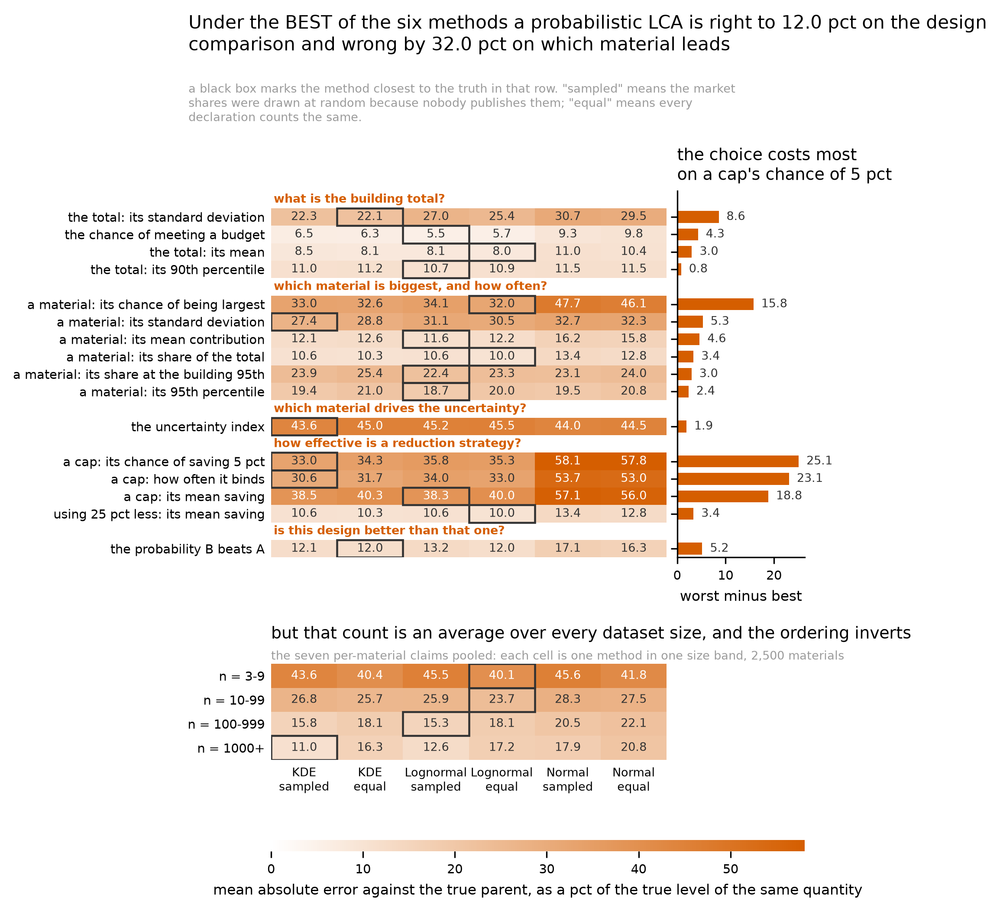

# Stage 3: figures

**Corpus `corpus_2026-09-25`. Empirical weight rule `WEIGHT_RHO = 0.5`.** Every
number below ran on those two and nothing else; where a figure or an audit was
re-run, it was re-run on them. Branch `stage-3-figures`, from `97acefd`.

---

## What changed

**A figure round on notebooks 1 and 2 is now 1.6 seconds instead of 30 or 35
minutes.**
`audits/render_figures.py` refused notebooks 1 and 2 outright, and two tests
skipped saying so. There were two blockers, not one: neither notebook defined
`OUT`, and their figure cells read fitted models and frames out of kernel
memory. Both are cleared, and **notebooks 1, 2 and 4 are now fully
renderable -- every one of their figure cells draws from a table on disk.**

**NOTEBOOK 3 IS NOT, AND IT NEVER WAS.** Nine of its thirteen figure cells
reach for a frame or a helper that a compute cell in between defines. It looked
clear because every use of it had passed `--only` and rendered a cell that
happened to be self-sufficient. 28 of 37 figure cells across the four notebooks
pass; `python audits/figure_manifest.py` names the nine.

**It moved nothing, and that is checked rather than claimed.** Notebook 1 re-ran
end to end: all 147 x 24 empirical characteristic values are bit identical to
the committed table, and four of its five figure PNGs are byte identical. The
fifth changed one axis label. Notebook 2's synthetic score table is bit
identical over 10,000 rows and 39 columns.

**Figures 2 and 3 are one figure**, `FIG_W1DistanceAndRank`: the W1 strip on the
left, the rank-frequency heatmap on the right, a row per arm. **Figure 4 is
rebuilt** to the four characteristics Stage 2f's reduction kept, uniform and
market weights side by side in a row, log y axis, rows ordered by importance
read from the reduction table. **The three-curve alternative you asked to
compare it against is beside it**, `FIG_WeightingGap_*`.

**The scorecard has its seventh column** and the rule is closest of the four
options a reader has on 10 of 16 claims.

**Five figures had no generator anywhere** and are in `archive/` with reasons.
Four tests now fail on a duplicate filename, an orphan, a retired weighting word
in a filename, or a PNG with no vector sibling.

## What needs a decision

**Nothing.** The figure numbering is DEFERRED by your decision of 2026-10-01: it
depends on which figures the manuscript ends up including, so it is one of the
last things done rather than something to settle now. Section 5 is a sketch to
argue with later, not a question.

---

## 1. The two blockers, and the control that says the split was safe

Where a figure needed something never persisted -- the example parents, the six
fitted densities, the KS and W2 scores, every empirical fit -- the cell is split
into a compute half that writes a table and a figure half that draws it. Eight
new tables carry what used to live only in memory.

**The split preserves the random stream exactly, which is why no number moved.**
Notebook 1's example figures draw from the main Generator and
`corpus.make_combos` later takes the pLCA groupings from that same stream, so
moving a draw would have moved every pLCA number. The compute halves consume
what the single cells consumed, in the same order; the figure halves consume
nothing.

**So what.** Moving a label on a figure used to cost half an hour, so labels did
not get moved. A single figure now redraws in **1.6 seconds**.

    python -m pytest tests/test_render_figures.py tests/test_notebooks.py -q
    python audits/render_figures.py 01_CompareUQ_CreateData --out /tmp/figs
    python audits/render_figures.py 02_CompareUQ_AnalyzeData --out /tmp/figs

## 2. The scorecard's seventh column, and the two counts it carries

The feasible rule -- uniform weights throughout, kernel estimate above the
cutoff and three-parameter lognormal below -- is now a column on
`FIG_ClaimScorecard`, never the known-share rule (decision 211).

**It is closest of ALL SEVEN on 2 of 16 claims and closest of the FOUR A READER
CAN CHOOSE on 10 of 16.** Both are true and they are different questions. The
three market-weighted columns need product-level shares nobody publishes, so
they carry an asterisk and one footnote, and the figure draws two boxes: black
for the best of seven, dashed for the best of the four.

**AND NEITHER IS DECISION 217'S "9 of 16", which the paper must not confuse
them with.** That one counts the claims where the rule's gain over the best
uniform-weighted method has a PAIRED interval excluding zero; mine is a plain
argmin. They differ on exactly one claim -- a material's standard deviation,
where the rule is closest by 0.52 percent on an interval running -0.37 to +1.46
-- so 10 of 16 are argmin wins and 9 of those 16 are wins the interval
supports.

Pooled over the sixteen claims: the rule 23.25 percent of true level, the
kernel estimate with uniform weights 23.92, the three-parameter lognormal with
uniform weights 23.96, and the kernel estimate with market weights -- which
nobody can use -- 22.89.

**So what.** A reader with a pile of EPDs and nothing else can count them and
pick a curve, and on most of what a probabilistic LCA reports that beats any
single method they could have fixed on instead.

    python -c "import pandas as pd; d=pd.read_csv('outputs/tables/TABLE_ClaimScorecardWithRule.csv'); print(d[d['rank']==1].method.value_counts())"
    python audits/render_figures.py 03_CompareUQ_PerformPLCA --only "every claim"

*Each cell is the mean absolute error against the true parent per unit, as a
percentage of the true level of the same quantity. Under the best of the seven
a probabilistic LCA is right to 12.6 percent on the design comparison and wrong
by 32.4 percent on which material leads. Corpus `corpus_2026-09-25`,
`WEIGHT_RHO = 0.5`.*

## 3. The hump-spacing measurement, which nobody had made

Both levers built for the joint modality-and-dispersion gap --
`separation_dispersion_frac` and `shoulder_frac` -- were still at 0.0, and every
earlier measurement of either was taken under the mismatched weight rules, on
the superseded corpus, or bundled with `mode_share_alpha`. Each is now measured
ALONE against the shipped configuration on 1,000-dataset drafts, judged against
the **weight-draw noise of 0.006 to 0.015**:

    candidate               multimodal  both  multi|dispersed  objective  weighting
    shipped                     0.200  0.013            0.147     0.2281     0.1722
    + separation                0.233  0.022            0.191     0.2730     0.1520
    + shoulder                  0.167  0.019            0.167     0.2214     0.1420
    the real arm                0.246  0.054            0.212         --         --

**Separation closes most of the conditional gap, 0.147 to 0.191 against a real
0.212, and costs 0.045 on the objective, which is three to seven times the
noise.** Shoulder is free on the objective, -0.0067, buys about half the joint
gap, and gives up the multimodal marginal, 0.200 to 0.167.

**And the old trade is confirmed gone.** Both candidates IMPROVE the weighting
margin, 0.1722 to 0.1520 and 0.1420, where every pre-port measurement had
widening cost it. Decision 193 is confirmed on a lever it was not measured on.

**Recommendation: do not regenerate.** Neither lever closes the gap and both
have a price, so decision 203 stands. What is new is that the limitation now
rests on a direct measurement of the two levers built for it.

**A defect found doing it.** The audit reused any existing draft directory, and
the `current` draft had been generated under the SUPERSEDED configuration --
`cv_log10_mean` 0.129 against 0.329, `min_q1_over_iqr` 0.5 against 0.2 -- so
every candidate was being compared against the wrong baseline while the table
said `current`. It now refuses a draft whose recorded configuration differs from
the one asked for.

    python audits/corpus_joint_structure.py 1000 --only current,shipped_plus_separation,shipped_plus_shoulder

## 4. The stale audits, re-run

All six re-ran on the current corpus -- the generator sweep was already re-run
in Stage 2h (decision 200), so five ran here. **Every ordering held and every
level moved**, which is what an absolute distance does when the corpus gets more
dispersed. **Four decision entries need their numbers updated and one needs
narrowing:**

| audit | what it says now | what the decision log says |
|---|---|---|
| upper truncation (182) | worst runaway fit **4.95** times the data's spread, **1.85** at a 2x cap, and the cap still costs nothing against the truth: `Lognormal, Variable` 0.19924 uncapped against 0.19913 capped, kernel and normal unmoved | 5.4 and 1.8 |
| judgment arm (184) | six data-driven methods span 0.0756 to 0.1140 on the design comparison; a correctly centered pedigree model at matched spread reads **0.0886** and holds 0.0886 to 0.1136 over a six-fold spread range; the realistic one-declaration case 0.1612 to 0.2722; uniform **0.2349** and triangular **0.2228**, so the shape finding is 2.5-fold not 2.1 | 0.097, 0.206, 0.198 |
| certification credit (187) | at a 10 pct credit with 75 pct confidence the truth earns it on **12.7 pct** of 3,000 cases, two methods disagree on **19.4**, best wrong on **7.5**, worst on **13.0**; the six disagree on 59.1 pct of designs within 0.05 of the line and 5.1 pct beyond 0.25; **a normal is worst on 9 of 15** tier-and-confidence cells | 17.4, 18.2, 8.8, 12.5, and 8 of 15 |
| bandwidth sweep (188) | unchanged: the arms disagree about held-out likelihood, Scott winning 64.0 pct under market weights, and agree about W1, Silverman 0.0716 against Scott's 0.1244 | -- |

**The one that NARROWS a decision is the bandwidth through the pLCA (195).**
Averaged over the five outputs Scott is still worst under both weightings --
29.23 against Silverman's 28.24 and the shipped rule's 28.51 under uniform
weights, 30.06 against 28.89 and 28.93 under market weights -- so the shipped
rule stands. **What does not survive is "Scott is worst on every one of the five
outputs":** under uniform weights it is now best on two, a material's standard
deviation at 31.091 against 31.035 and the uncertainty index at 49.412 against
49.428. And **the guard no longer buys anything under market weights**, where
that decision records it buying 0.15 of a point; it costs 0.04 there and 0.28
under uniform weights. The control fires: the four parametric methods move
0.0000 points across the three rules.

A displacement applied to every material alike still cancels to the last digit,
which is decision 184's own control, and one drawn per material does not.

    bash -c 'for a in upper_truncation bandwidth_rules judgment_arm credit_design bandwidth_downstream; do python audits/$a.py; done'

## 4b. The caption sweep, and the one stale number it found

Every figure title in the four notebooks was checked for a hard-coded number.
**There is exactly one and it was wrong on one of the two arms it describes.**
The rolling-average supplement titled its left panel "rolling mean, 250 datasets
each side"; `comparison.curve_window` scales to the arm and returns 501 on the
synthetic arm -- where 250 each side came from -- and **15 on the empirical
one**, so that panel claimed a window thirty-three times the one drawn. It now
reads the window from the data.

**So what.** Every other figure title computes its numbers from the table
beneath it, which is why this took minutes rather than the afternoon the Stage
2h caption did. What remains at risk is the captions in the MANUSCRIPT, which
this repository does not hold.

    python -c "import sys; sys.path.insert(0,'src'); import comparison; print(comparison.curve_window(147), comparison.curve_window(10000))"

## 5. A sketch of the numbering, for later

**DEFERRED, 2026-10-01.** Renumbering waits on which figures the manuscript
includes, which is a manuscript decision and one of the last to be taken. This
is recorded so the work is not repeated, not to be acted on.

**Six main-text figures**, in the order the results section takes.

| new | current stem | what it says |
|---|---|---|
| FIG1 | `FIG_PDFandCDFofUQMethods` | what the six methods are |
| FIG2 | `FIG_W1DistanceAndRank` | how far each sits from the data, and how often it wins (the merge) |
| FIG3 | `FIG_WhenToUseWhich` | which method is closest, against category size |
| FIG4 | `FIG_W1VsSurvivors_Synthetic` | where each method sits against the characteristics that carry signal |
| FIG5 | `FIG_ClaimScorecard` | every claim, all seven policies, against the truth |
| FIG6 | `FIG_MixedPolicy` | how much the cutoff matters, and what market shares are worth |

`FIG_WeightingDrivers` is the obvious seventh if you want one.
`FIG_WeightingGap_*` is the alternative to FIG4 -- three curves instead of six
-- and both are drawn so you can choose; I would keep FIG4 and put the gap
version in the supplement, because the levels are what a reader needs first.

Everything else becomes `SUPP<N>_*`. The full list, with the generator of every
one, is `outputs/tables/audits/TABLE_FigureManifest.csv`.

**The cost of deferring is near zero.** `figstyle.savefig` takes a stem rather
than a path, so applying any numbering later is a one-line change per figure
cell, the duplicate-name check makes a collision impossible, and the test that
forbids an orphan will catch any file the rename leaves behind.

    python audits/figure_manifest.py

## 6. Numbers that moved

| what | before | after | why |
|---|---|---|---|
| `flip.prose_crossing` at 5 pct | 0.02 against 0.01 | 0.015 against 0.014 | decision 175's rule rendered two values 7.5 percent apart as a factor of two, because 0.0150 sits on a rounding boundary. The printed spread may now be at most twice the real one. Both of decision 175's own published examples are unchanged |
| `flip.prose_crossing` at 10 pct | 0.032 against 0.031 | 0.0316 against 0.0314 | same guard |
| upper-truncation worst fitted spread | 5.4 | 4.95 | re-run on the current corpus |
| upper truncation at 2x | 1.8 | 1.85 | same |
| judgment arm, pedigree at matched spread | 0.097 | 0.0886 | same |
| judgment arm, uniform / triangular | 0.206 / 0.198 | 0.2349 / 0.2228 | same |
| the credit: truth earns it | 17.4 pct | 12.7 pct | same |
| the credit: methods disagree | 18.2 pct | 19.4 pct | same |
| the credit: normal is worst on | 8 of 15 cells | 9 of 15 | same |
| bandwidth through the pLCA, mean over five outputs | 25.47 / 24.82 guarded | 28.51 / 28.93 | same |
| `TABLE_MethodCurves` | 96.4 MB csv.gz | 44.4 MB parquet | container only; every float still float64 and every row verified element by element before the CSV was removed |
| `TABLE_MethodWinShare` | 22.8 MB | 6.7 MB | same |
| `audits/judgment_arm.py` column `centre` | `centre` | `center` | the US spelling sweep; the table is regenerated under the new name |
| `TABLE_MethodCurves` characteristics | 21 | 23 | the notebook held TWO definitions of its characteristic set and the curves table was built from the one that misses `modality_index_fitted`, the measure decision 134 added and decision 82 says to report. One definition now, and the per-characteristic supplement gains two pages. Nothing already in the table changes |

**Nothing else moved**, and every place it could have is checked rather than
asserted. After notebook 2's full run: the empirical characteristic table is bit
identical at 147 by 24, the synthetic score table at 10,000 by 39, the empirical
score table at 147 by 30, and `TABLE_MethodScores` over all 60,882 rows -- the
882 that first read as different are the empirical arm's absent
`parent_scheme`, NaN compared against itself as a string. The method summary,
the policy comparison, the regret table and the size crossover are identical
too.

## 7. What is still open

| item | |
|---|---|
| **31 of 37 marked figure cells do not call `figstyle.apply()`**, so they follow the palette, the type sizes and the spine rules of whatever they were written with. The ASCII-minus requirement is now met at notebook level, which was the correctness half; the rest is a redesign of 31 figures and is a Stage 4 or manuscript-session job. `outputs/tables/audits/TABLE_FigureStyleCompliance.csv` names them |
| **Nine of notebook 3's thirteen figure cells cannot be rendered on their own**, so a figure change there still costs a three-hour run. `outputs/tables/audits/TABLE_FigureRendererSafety.csv` names them and what each needs; four of the nine need only `dct_resultlabels` and a frame that is already on disk |
| **"Report every aggregate in a figure with its confidence interval" is NOT done.** The scorecard's table carries them and the cutoff curve draws them; the merged distance-and-rank figure prints a mean W1 per method with no interval, and so do the bandwidth figure and the two strip supplements. A static sweep lists thirteen candidate cells, several of which are scatters of every dataset and need none. The command below prints the list; deciding which of them is really an aggregate is a figure-by-figure judgment and is Stage 4's |
| **`FIG_MetricCoverage` still needs its claim restated in the text** from the rebuilt table: the figure is current, the sentence in the manuscript is not |

    python audits/figure_manifest.py

## 8. Inputs and outputs

**Read:** `corpus_2026-09-25`; the frozen EC3 extract; every table under
`outputs/tables/`.

**Written:** eleven new tables backing figure cells that used to read kernel
state, `TABLE_ClaimScorecardWithRule`, and three audit tables -- the figure
manifest, the style compliance list and the renderer-safety list. A `.pdf`
beside every PNG a re-run notebook wrote.

**Code:** `figstyle.savefig` with the duplicate-name guard; `metricset.rescore`;
the prose-rounding guard in `flip`; `audits/figure_manifest.py`; the stale-draft
guard in `audits/corpus_joint_structure.py`; `tests/test_figure_manifest.py` and
three new tests in `test_notebooks.py` and `test_flip.py`. The README's output
and runtime sections are corrected: it said notebook 3 takes about an hour and
that notebook 2 has a smoke configuration, and neither was true.

**Reproduce:** notebooks 1, 2 and 3 in order, about 30, 35 and 195 minutes.

## 9. What Stage 4 picks up first

1. **Re-run notebook 3 end to end.** Stage 2j left two measurements for the next
   full run -- the feasible rule's group-composition split, and `MixedBackwards`
   as a control that should lose to both recommended rules -- and the pLCA
   scatter figure's highlighted points were dropped this stage, which shifts the
   illustrative sampling in `FIG_PLCAVisualizeUQFits` and nothing else.
2. **The README and the deposit**, which is Stage 4's own work, now with a
   figure manifest to put in it. **Renumbering is NOT Stage 4's**: it waits on
   the manuscript's figure selection.
